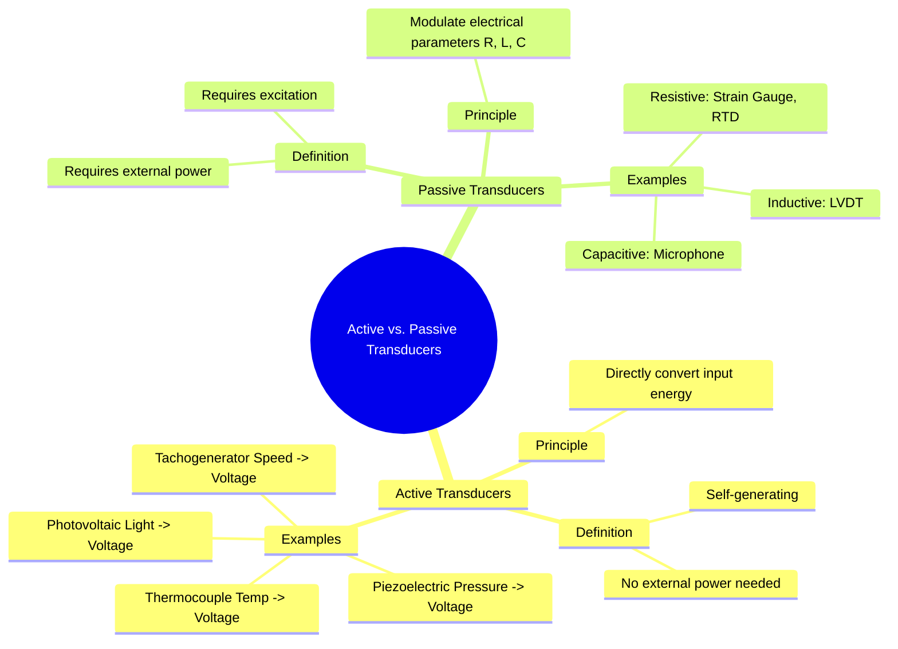

---
tags:
  - transducer
  - active-transducer
  - passive-transducer
  - transducer-classification
  - electrical-measurements
  - gate
created: 2025-10-18
aliases:
  - Active Transducers
  - Passive Transducers
  - Self-Generating Transducers
subject: "[[Electrical & Electronic Measurements]]"
parent: "[[Definition and Classification of Transducers]]"
modified: 2026-08-04T09:05:37
---
### Active and Passive Transducers
#active-transducer #passive-transducer #transducer-classification

> A fundamental method for classifying transducers is based on whether they require an external power source for their operation. This divides them into two main categories: **Active Transducers**, which are self-generating, and **Passive Transducers**, which require an external power supply or excitation signal.

---
#### Active Transducers (Self-Generating)
#active-transducer

Active transducers operate on the principle of energy conversion. They directly convert the energy of the input physical quantity (measurand) into an electrical signal (voltage or current) without the need for an external electrical source. They are essentially energy converters.

*   **Characteristics:**
    *   No external power supply (excitation) is needed.
    *   They are self-generating devices.
    *   The output energy is derived from the input measurand.
    *   They often have low energy output, and their signals may require amplification.

*   **Examples:**
    *   **[[Thermoelectric Transducers (Thermocouple)]]:** Converts thermal energy (temperature difference) directly into a small electromotive force (voltage) based on the Seebeck effect.
    *   **[[Piezoelectric Transducers]]:** Converts mechanical energy (pressure, vibration, or force) into an electrical charge or voltage.
    *   **Photovoltaic Cell (Solar Cell):** Converts light (radiant energy) directly into a voltage.
    *   **Tachogenerator:** A small generator that converts rotational speed (mechanical energy) into a proportional DC or AC voltage.

---
#### Passive Transducers (Externally Powered)
#passive-transducer

Passive transducers do not generate their own electrical signal. Instead, they require an external power source to operate. They work by causing a change in a passive electrical property—**resistance (R), inductance (L), or capacitance (C)**—in response to the input measurand. This change in R, L, or C is then used to modulate the external excitation signal to produce the output.

*   **Characteristics:**
    *   An external power source (excitation) is essential for their operation.
    *   They act as energy modulators rather than energy converters.
    *   The output signal is obtained by measuring the change in the passive parameter.

*   **Examples:**
    *   **Resistive Transducers:**
        *   **[[Resistive Transducers|Strain Gauge]]:** Resistance changes in response to mechanical strain.
        *   **RTD / Thermistor:** Resistance changes with temperature.
        *   **Potentiometer:** Resistance changes with linear or angular displacement.
    *   **Inductive Transducers:**
        *   **[[Inductive Transducers (Linear Variable Differential Transformer - LVDT)|LVDT]]:** The mutual inductance between windings changes with the displacement of a magnetic core.
    *   **Capacitive Transducers:**
        *   **[[Capacitive Transducers]]:** The capacitance changes due to a change in the distance between plates, the area of plates, or the dielectric material (e.g., in a capacitive microphone or pressure sensor).

---
#### Comparison Summary

| Feature | Active Transducer | Passive Transducer |
| :--- | :--- | :--- |
| **Power Source** | Not required (self-generating). | External power source (excitation) is required. |
| **Principle** | Converts input energy directly into electrical output. | Input energy causes a change in a passive electrical parameter (R, L, or C). |
| **Circuitry** | Simpler, as no power source circuit is needed. | More complex, requires a power source and signal conditioning circuit (e.g., Wheatstone bridge). |
| **Output Signal** | Typically a low-level voltage or current. | Varies widely, can be a change in voltage, frequency, or resistance. |
| **Examples** | Thermocouple, Piezoelectric Crystal, Photovoltaic Cell. | Strain Gauge, LVDT, RTD, Thermistor, Capacitive Transducer. |

---
### Related Concepts
#topic/related-concepts

> [[Definition and Classification of Transducers]]

[[Resistive Transducers]]
[[Inductive Transducers (Linear Variable Differential Transformer - LVDT)]]
[[Capacitive Transducers]]
[[Piezoelectric Transducers]]
[[Thermoelectric Transducers (Thermocouple)]]
[[Transducers]]
