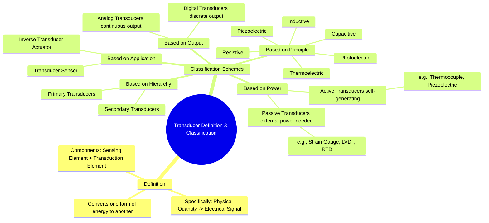

---
tags:
  - transducer
  - sensor
  - transducer-classification
  - electrical-measurements
  - gate
created: 2025-10-18
aliases:
  - Transducer Definition
  - Classification of Transducers
subject: "[[Electrical & Electronic Measurements]]"
parent:
  - Transducers 
modified: 2026-08-04T09:31:41
---
### Definition and Classification of Transducers
#transducer/definition #transducer/classification

> A **transducer** is a device that converts energy from one form to another. In the field of electrical measurements, a transducer is more specifically defined as a device that converts a physical quantity (the **measurand**) such as pressure, temperature, or displacement into a proportional electrical signal (voltage, current, or frequency).

A complete transducer often consists of two main parts:
1.  **Sensing Element (Sensor):** The part that responds to the physical quantity.
2.  **Transduction Element:** The part that converts the output of the sensing element into an electrical signal.

Transducers are essential for modern measurement and control systems, as they form the interface between the physical world and electronic circuits.

---
#### Classification of Transducers
#transducer/types

Transducers can be classified in several ways based on different criteria.

###### 1. Based on Power Requirement (Active vs. Passive)
#active-transducer #passive-transducer
*   **Active Transducers:** These are self-generating transducers that do not require an external power source for their operation. They derive the energy required for the output signal from the physical quantity being measured.
    *   **Examples:** Thermocouple (temperature to voltage), Piezoelectric Crystal (pressure to voltage), Photovoltaic Cell (light to voltage).
*   **Passive Transducers:** These transducers require an external power source (excitation) to operate. The physical quantity being measured causes a change in a passive electrical property of the transducer, such as resistance, inductance, or capacitance.
    *   **Examples:** Strain Gauge (change in resistance), LVDT (change in inductance), RTD/Thermistor (change in resistance), Capacitive microphone.

###### 2. Based on Principle of Transduction
#transduction-principle
This is the most common classification, based on how the physical quantity is converted into an electrical signal.
*   **Resistive Transducers:** The measurand causes a change in resistance. (e.g., [[Resistive Transducers|Strain Gauge, RTD, Thermistor]], Potentiometer).
*   **Inductive Transducers:** The measurand causes a change in self-inductance or mutual inductance. (e.g., [[Inductive Transducers (Linear Variable Differential Transformer - LVDT)|LVDT]], Proximity sensors).
*   **Capacitive Transducers:** The measurand causes a change in capacitance. (e.g., Capacitive microphone, Pressure sensor).
*   **Piezoelectric Transducers:** An applied force or pressure generates an electric charge. (e.g., Accelerometer, Ultrasonic sensors).
*   **Thermoelectric Transducers:** A temperature difference between two junctions of dissimilar metals generates a voltage. (e.g., Thermocouple).
*   **Photoelectric Transducers:** Light energy is converted into an electrical signal. (e.g., Photodiode, Phototransistor, LDR).

###### 3. Based on Application (Transducer vs. Inverse Transducer)
#inverse-transducer #actuator
*   **Transducer (Sensor):** The standard definition; converts a non-electrical quantity into an electrical one.
*   **Inverse Transducer (Actuator):** Converts an electrical signal into a non-electrical quantity. These are commonly used in control systems as final control elements.
    *   **Examples:** Loudspeaker (electrical to sound), Piezoelectric buzzer (electrical to vibration), Solenoid valve (electrical to mechanical motion), Electric Motor (electrical to rotation).

###### 4. Based on Nature of Output Signal (Analog vs. Digital)
#analog-transducer #digital-transducer
*   **Analog Transducers:** Produce an output signal that is a continuous function of the input measurand. Most transducers are of this type. (e.g., LVDT, Thermocouple).
*   **Digital Transducers:** Produce a digital output signal directly, in the form of pulses. (e.g., Rotary Encoder, Digital Tachometer).

---
### Related Concepts
#topic/related-concepts

> [[Transducers]]

[[Resistive Transducers]]
[[Inductive Transducers (Linear Variable Differential Transformer - LVDT)]]
[[Capacitive Transducers]]
[[Piezoelectric Transducers]]
[[Thermoelectric Transducers (Thermocouple)]]
[[Electrical & Electronic Measurements]]
