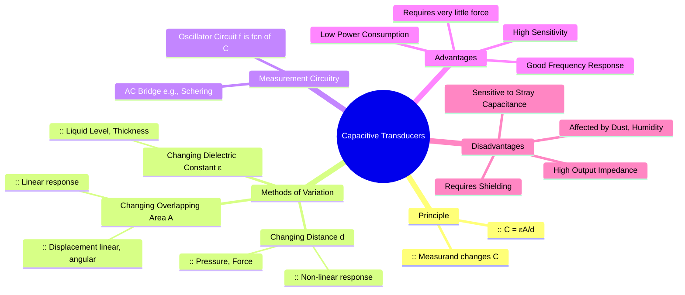

---
tags:
  - transducer
  - capacitive-transducer
  - displacement-sensor
  - pressure-sensor
  - electrical-measurements
  - gate
created: 2025-10-18
aliases:
  - Capacitive Transducer
  - Capacitance Transducer
subject: "[[Electrical & Electronic Measurements]]"
parent:
  - Transducers 
modified: 2026-08-04T09:15:57
---
### Capacitive Transducers
#capacitive-transducer

> A **capacitive transducer** is a passive transducer that operates on the principle that the capacitance of a parallel plate capacitor changes when one of its physical parameters is varied. The physical quantity to be measured (the measurand) is made to cause this change, which is then converted into an electrical signal.

---
#### Principle of Operation
#transduction-principle

The capacitance of a parallel plate capacitor is given by the formula:
$$\boxed{\quad C = \frac{\epsilon A}{d} = \frac{\epsilon_0 \epsilon_r A}{d} \quad}$$
where:
-   $C$ = Capacitance (in Farads)
-   $\epsilon_0$ = Permittivity of free space ($8.854 \times 10^{-12}$ F/m)
-   $\epsilon_r$ = Relative permittivity or dielectric constant of the material between the plates
-   $A$ = Overlapping area of the plates (in $m^2$)
-   $d$ = Distance between the plates (in m)

Any measurand that can be made to vary one of the three parameters—**distance ($d$), area ($A$), or dielectric constant ($\epsilon_r$)**—can be measured using a capacitive transducer. The change in capacitance is typically measured using an AC bridge (like a Schering bridge) or by making the capacitor part of an oscillator circuit (where the frequency changes with capacitance).

#### Methods of Changing Capacitance
#capacitance-variation-methods

###### 1. Change in Distance Between Plates ($d$)
#capacitance/distance-variation
This is a very common configuration for measuring displacement, force, or pressure. One plate is fixed, and the other is movable, attached to the element causing displacement (e.g., a diaphragm for pressure sensing).
-   **Output:** The relationship between capacitance and distance is **non-linear**.
-   **Sensitivity ($S$):** The sensitivity is the rate of change of capacitance with respect to distance.
    $$S = \frac{\partial C}{\partial d} = -\frac{\epsilon A}{d^2}$$
    The sensitivity is not constant and increases as the distance 'd' decreases. This non-linearity often requires signal conditioning.
-   **Application:** Measurement of small displacements, pressure measurement (diaphragm), capacitive microphones.

###### 2. Change in Overlapping Area of Plates ($A$)
#capacitance/area-variation
In this type, one plate is fixed while the other moves laterally, changing the effective overlapping area. This can be used for measuring linear or angular displacement.
-   For linear displacement ($x$): $A = l \cdot x$, where $l$ is the width.
    $$C = \frac{\epsilon l x}{d}$$
-   **Output:** The relationship between capacitance and displacement is **linear**.
-   **Sensitivity ($S$):** The sensitivity is constant.
    $$\boxed{\quad S = \frac{\partial C}{\partial x} = \frac{\epsilon l}{d} \quad}$$
-   **Application:** Measurement of moderate linear and angular displacements.

###### 3. Change in Dielectric Constant ($\epsilon_r$)
#capacitance/dielectric-variation
Here, the plates and their separation are fixed, but the dielectric material between them is changed or moved.
-   **Output:** The capacitance changes linearly with the change in the dielectric material. For example, in measuring the level of a non-conductive liquid ($\epsilon_r > 1$), the plates are immersed in the liquid. As the liquid level rises, it displaces the air ($\epsilon_r \approx 1$), causing an increase in the overall capacitance.
-   **Application:** Measurement of liquid levels, thickness of materials.

#### Advantages and Disadvantages
#advantages-disadvantages

**Advantages:**
*   **High Sensitivity:** Can detect very small changes in the measurand.
*   **Low Power Consumption:** Requires very little power to operate.
*   **Low Loading Effect:** Requires very little force to move the movable plate.
*   **Good Frequency Response:** Can be used for dynamic measurements.

**Disadvantages:**
*   **High Output Impedance:** Requires special high-impedance measurement circuits and is sensitive to loading effects.
*   **Susceptible to Stray Capacitance:** The capacitance of connecting cables and nearby objects can introduce significant errors. This necessitates careful shielding and the use of guard rings.
*   **Environmental Effects:** Performance can be affected by dirt, dust, or humidity, which alter the dielectric properties.
*   The output can be non-linear, especially for the distance-varying type.

---
### Related Concepts
#topic/related-concepts

> [[Schering Bridge (for Dielectric Loss Measurement)]]

[[Transducers]]
[[Inductive Transducers (Linear Variable Differential Transformer - LVDT)]]
[[AC Bridges]]
[[Oscillators]]
[[Pressure Measurement]]
[[Displacement Measurement]]
[[Electrical & Electronic Measurements]]
