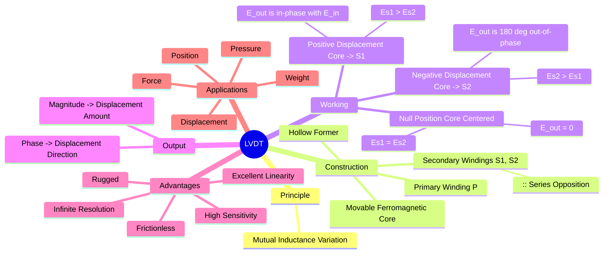

---
tags:
  - transducer
  - inductive-transducer
  - lvdt
  - displacement-sensor
  - electrical-measurements
  - gate
created: 2025-10-18
aliases:
  - LVDT
  - Linear Variable Differential Transformer
subject: "[[Electrical & Electronic Measurements]]"
parent:
  - Transducers 
modified: 2026-08-04T09:49:08
---
### Inductive Transducers (Linear Variable Differential Transformer - LVDT)
#inductive-transducer #lvdt #displacement-sensor

> **Inductive transducers** are passive transducers that work on the principle of changing the inductance of a coil to measure a physical quantity. The most common and important inductive transducer for measuring linear displacement is the **Linear Variable Differential Transformer (LVDT)**. It is a highly accurate and reliable electromechanical device that converts rectilinear motion of an object into a corresponding electrical signal.

---
#### Principle of Operation
#lvdt/principle #mutual-inductance

The LVDT works on the principle of **mutual induction**. The position of a movable ferromagnetic core determines the flux linkage between a primary winding and two secondary windings. As the core moves, the mutual inductance between the primary and each secondary changes, which in turn changes the voltage induced in each secondary winding.

#### Construction
#lvdt/construction
An LVDT consists of:
*   **One Primary Winding ($P$):** Placed at the center of a hollow cylindrical former. It is energized by an AC source (typically 1-10 kHz).
*   **Two Secondary Windings ($S_1$ and $S_2$):** Identical in all respects (number of turns, dimensions), placed symmetrically on either side of the primary winding.
*   **Series Opposition Connection:** The two secondary windings are connected in series opposition (or series-bucking). This means the voltage induced in one winding opposes the voltage induced in the other. The net output voltage is the difference between the two. $E_0 = E_{S1} - E_{S2}$.
*   **Movable Ferromagnetic Core:** A high-permeability, nickel-iron core that is free to move axially inside the former. The object whose displacement is to be measured is attached to this core.

#### Working and Output Characteristics
#lvdt/working

1.  **Null Position (Zero Displacement):**
    When the core is perfectly centered, the magnetic flux from the primary links equally with both secondary windings ($S_1$ and $S_2$). The voltages induced in them ($E_{S1}$ and $E_{S2}$) are equal in magnitude but opposite in phase due to the series-bucking connection.
    $$|E_{S1}| = |E_{S2}| \implies \boxed{\quad E_0 = E_{S1} - E_{S2} = 0 \quad}$$
    This is the reference or null position.

2.  **Displacement Towards $S_1$ (Positive Displacement):**
    When the core moves from the null position towards $S_1$, the flux linkage with $S_1$ increases while the flux linkage with $S_2$ decreases. This results in $|E_{S1}| > |E_{S2}|$. The net output voltage $E_0$ is non-zero and is **in phase** with the primary voltage.

3.  **Displacement Towards $S_2$ (Negative Displacement):**
    When the core moves from the null position towards $S_2$, the flux linkage with $S_2$ increases while the flux linkage with $S_1$ decreases. This results in $|E_{S2}| > |E_{S1}|$. The net output voltage $E_0$ is non-zero and is **$180^\circ$ out of phase** with the primary voltage.

The **magnitude** of the output voltage is linearly proportional to the displacement of the core from the null position, and its **phase** indicates the direction of the displacement. A phase-sensitive demodulator is used to determine both the magnitude and direction.

#### Advantages and Disadvantages of LVDT
#lvdt/advantages #lvdt/disadvantages

**Advantages:**
*   **High Sensitivity & Linearity:** Provides a highly linear output over a significant range of displacement.
*   **Infinite Resolution:** As an analog device, it can detect infinitesimally small changes in core position.
*   **Low Friction & Hysteresis:** There is no mechanical contact between the core and the windings, leading to frictionless operation, no wear and tear, and a very long life.
*   **Ruggedness:** Can operate under high vibration and shock conditions.
*   **Stable Null Position:** The null position is extremely stable and repeatable.

**Disadvantages:**
*   Requires an AC excitation source and signal conditioning electronics (demodulator).
*   Can be affected by stray magnetic fields, often requiring shielding.
*   The dynamic response is limited by the mass of the core.
*   Temperature changes can affect the performance.

---
### Related Concepts
#topic/related-concepts

> [[Transducers]]

[[Definition and Classification of Transducers]]
[[Active and Passive Transducers]]
[[Resistive Transducers]]
[[Capacitive Transducers]]
[[Control Systems]] (as a position feedback sensor)
[[Electrical & Electronic Measurements]]
