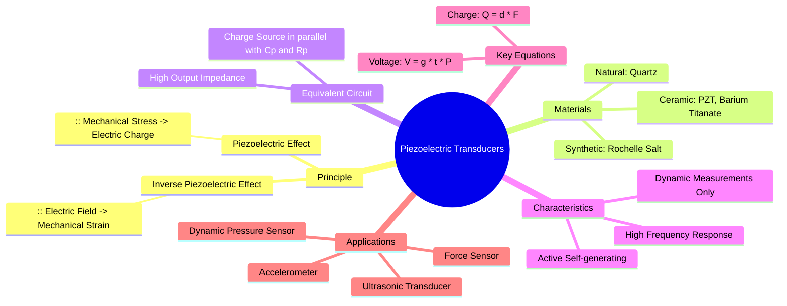

---
tags:
  - transducer
  - piezoelectric-transducer
  - active-transducer
  - force-sensor
  - pressure-sensor
  - accelerometer
  - electrical-measurements
  - gate
created: 2025-10-18
aliases:
  - Piezoelectric Sensor
  - Piezoelectric Effect
subject: "[[Electrical & Electronic Measurements]]"
parent:
  - Transducers 
modified: 2026-08-04T10:13:40
---
### Piezoelectric Transducers
#piezoelectric-transducer #active-transducer #piezoelectric-effect

> A **piezoelectric transducer** is an **active transducer** that utilizes the piezoelectric effect to convert mechanical energy (such as pressure, force, or acceleration) into an electrical signal (charge or voltage). They are widely used for measuring dynamic phenomena due to their excellent high-frequency response and self-generating nature.

---
#### Principle of Operation (Piezoelectric Effect)
#piezoelectric-effect #charge-generation

The operation is based on the **piezoelectric effect**, which is exhibited by certain natural crystals (like Quartz) and man-made ceramics (like PZT).
*   **Direct Piezoelectric Effect:** When a mechanical stress or force is applied to the material, it deforms, causing a displacement of charges within its crystalline structure. This results in the generation of an electric charge and a corresponding voltage across the material.
*   **Inverse Piezoelectric Effect:** Conversely, when an electric field is applied across the material, it undergoes mechanical deformation (changes its shape). This effect is used in actuators, such as ultrasonic emitters.

The output charge ($Q$) and voltage ($V$) are given by:
$$\boxed{\quad Q = d \cdot F \quad}$$
$$\boxed{\quad V = g \cdot t \cdot P \quad}$$
where:
-   $F$ is the applied force in Newtons.
-   $P$ is the applied pressure in $N/m^2$.
-   $t$ is the thickness of the crystal in meters.
-   $d$ is the **Charge Sensitivity** or piezoelectric coefficient (in Coulomb/Newton).
-   $g$ is the **Voltage Sensitivity** (in Volt-meter/Newton).
The two coefficients are related by $g = d/\epsilon$, where $\epsilon$ is the permittivity of the material.

#### Piezoelectric Materials
#piezoelectric-materials
-   **Natural Crystals:** Quartz (SiO₂) is highly stable and has a low leakage rate but offers low sensitivity (low 'd' coefficient).
-   **Synthetic Crystals:** Rochelle Salt has a very high 'd' coefficient but is sensitive to temperature and humidity.
-   **Ferroelectric Ceramics:** Barium Titanate (BaTiO₃) and Lead Zirconate Titanate (PZT) are the most commonly used materials. They have high sensitivity, can be manufactured in various shapes, and are robust.

#### Equivalent Circuit and Characteristics
#equivalent-circuit #dynamic-measurement
A piezoelectric sensor can be modeled as a charge source ($q_s$) in parallel with its own internal capacitance ($C_p$) and a very high leakage resistance ($R_p$).

**Key Characteristics:**
1.  **Dynamic Measurement Only:** The leakage resistance $R_p$ causes the generated charge to leak away over time. This means the transducer cannot hold a charge for a static (DC) input. Therefore, **piezoelectric transducers are only suitable for measuring dynamic or rapidly changing quantities.**
2.  **High Output Impedance:** Due to the parallel capacitor, the output impedance is very high, especially at low frequencies. This necessitates the use of special signal conditioning circuits like **charge amplifiers** or high-impedance voltage followers to avoid loading effects.
3.  **Active Transducer:** It is self-generating and does not require an external power source.

#### Applications
#piezoelectric-applications
-   **Accelerometers:** The most common application for measuring vibration. An inertial mass is attached to the crystal; acceleration causes the mass to exert a force ($F=ma$) on the crystal, producing a proportional output.
-   **Dynamic Pressure Sensors:** For measuring fast-changing pressures, such as in internal combustion engine cylinders or in shockwaves.
-   **Ultrasonic Transducers:** Used in medical imaging, non-destructive testing (NDT), and sonar. They use the inverse effect to generate sound waves and the direct effect to detect the echoes.
-   **Force and Strain Transducers:** Used in load cells and strain gauges for dynamic force/strain measurements.

---
### Related Concepts
#topic/related-concepts

> [[Active and Passive Transducers]]

[[Transducers]]
[[Definition and Classification of Transducers]]
[[Charge Amplifier]]
[[Vibration Measurement]]
[[Pressure Measurement]]
[[Electrical & Electronic Measurements]]
