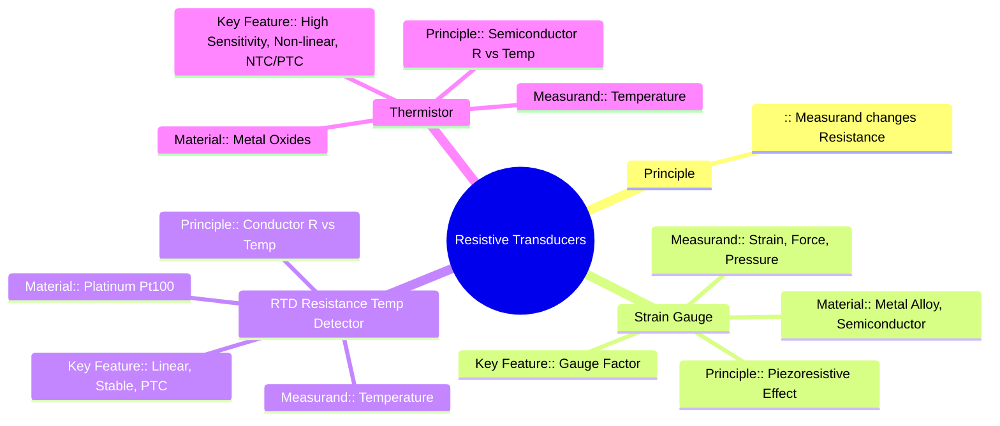

---
tags:
  - transducer
  - resistive-transducer
  - strain-gauge
  - rtd
  - thermistor
  - electrical-measurements
  - gate
created: 2025-10-18
aliases:
  - Resistive Transducers
  - Resistive Transducers (Strain Gauge, RTD, Thermistor)
subject: "[[Electrical & Electronic Measurements]]"
parent:
  - Transducers 
modified: 2026-08-04T10:25:06
---
### Resistive Transducers
#resistive-transducer

> **Resistive transducers** are a class of passive transducers where the physical quantity being measured (the measurand) causes a change in the electrical resistance of the sensing element. This change in resistance ($\Delta R$) is then measured, typically using a Wheatstone bridge, and correlated to the magnitude of the measurand. This category includes some of the most common sensors used in engineering.

---
#### 1. Strain Gauge
#strain-gauge #piezoresistive-effect

A strain gauge is a sensor whose resistance varies with applied mechanical strain. It is the fundamental element for measuring strain, and by extension, force, pressure, torque, and displacement.

*   **Principle (Piezoresistive Effect):** The operation is based on the principle that the resistance of a conductor changes when its length and cross-sectional area are altered by an external force.
    The resistance of a conductor is given by $R = \frac{\rho L}{A}$. When subjected to strain ($\epsilon = \Delta L/L$), the length ($L$), area ($A$), and resistivity ($\rho$) all change, resulting in a change in resistance $\Delta R$.

*   **Gauge Factor (G.F.):** The sensitivity of a strain gauge is defined by its Gauge Factor, which is the ratio of the fractional change in resistance to the fractional change in length (strain).
    $$\boxed{\quad G.F. = \frac{\Delta R / R}{\Delta L / L} = \frac{\Delta R / R}{\epsilon} \quad}$$
    The gauge factor can be derived as:
    $$G.F. = 1 + 2\nu + \frac{\Delta \rho / \rho}{\epsilon}$$
    where $\nu$ is Poisson's ratio and the term involving $\rho$ represents the piezoresistive effect.
    *   For **metal strain gauges** (e.g., Constantan), the G.F. is typically around **2**.
    *   For **semiconductor strain gauges**, the piezoresistive effect is very large, leading to G.F. values of **50 to 200**, making them much more sensitive but also more non-linear and temperature-dependent.

---
#### 2. Resistance Temperature Detector (RTD)
#rtd #temperature-sensor

An RTD is a temperature sensor that operates on the principle that the resistance of a pure metal changes with temperature in a predictable and repeatable manner.

*   **Principle:** The resistance of metals increases as temperature increases (Positive Temperature Coefficient, PTC). This relationship is nearly linear over a wide temperature range.
*   **Governing Equation:** The resistance $R_T$ at a temperature $T$ is given by:
    $$\boxed{\quad R_T = R_0 (1 + \alpha (T - T_0)) \quad}$$
    where:
    *   $R_0$ is the resistance at a reference temperature $T_0$ (usually $0^\circ C$).
    *   $\alpha$ is the temperature coefficient of resistance.
*   **Materials:** **Platinum** is the most common material (e.g., Pt100, which has $100\Omega$ at $0^\circ C$) due to its high stability, linearity, and wide operating range. Nickel and copper are also used.
*   **Characteristics:**
    *   **High Accuracy and Stability:** Very precise and repeatable.
    *   **Good Linearity:** Most linear of all temperature sensors.
    *   **Low Sensitivity:** Smaller change in resistance per degree Celsius compared to thermistors.
    *   **Slow Response Time.**

---
#### 3. Thermistor
#thermistor #temperature-sensor

A thermistor (thermal resistor) is a type of resistor whose resistance is highly dependent on temperature. They are made from semiconductor materials (metal oxides).

*   **Principle:** The resistance of a semiconductor changes exponentially with temperature.
*   **Types:**
    *   **NTC (Negative Temperature Coefficient):** Resistance *decreases* as temperature *increases*. This is the most common type.
    *   **PTC (Positive Temperature Coefficient):** Resistance *increases* as temperature *increases*, often sharply at a specific temperature (used as switches).
*   **Governing Equation (for NTC):** The resistance-temperature relationship is non-linear and is often described by the Steinhart-Hart equation or a simpler version:
    $$\boxed{\quad R_T = R_0 \exp \left[ \beta \left( \frac{1}{T} - \frac{1}{T_0} \right) \right] \quad}$$
    where $T$ and $T_0$ are absolute temperatures (in Kelvin) and $\beta$ is a material constant.
*   **Characteristics:**
    *   **High Sensitivity:** Large change in resistance for a small change in temperature.
    *   **Fast Response Time:** Due to their small size.
    *   **Non-linear:** Requires linearization for accurate measurements over a wide range.
    *   **Limited Temperature Range.**

---
### Related Concepts
#topic/related-concepts

> [[Transducers]]

[[Definition and Classification of Transducers]]
[[Active and Passive Transducers]]
[[Wheatstone Bridge and Sensitivity Analysis]]
[[Electrical and Electronic Measurements]]
[[Temperature Measurement]]
