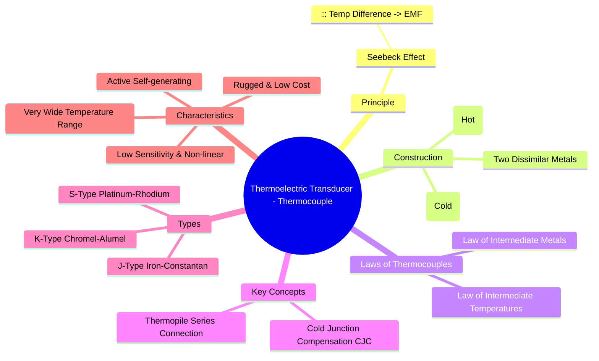

---
tags:
  - transducer
  - thermoelectric-transducer
  - thermocouple
  - temperature-sensor
  - active-transducer
  - electrical-measurements
  - gate
created: 2025-10-18
aliases:
  - Thermocouple
  - Seebeck Effect Sensor
subject: "[[Electrical & Electronic Measurements]]"
parent:
  - Transducers 
modified: 2026-08-04T10:39:14
---
### Thermoelectric Transducers (Thermocouple)
#thermoelectric-transducer #thermocouple #seebeck-effect

> A **thermoelectric transducer**, commonly known as a **thermocouple**, is an **active transducer** that converts thermal energy directly into electrical energy to measure temperature. It is one of the most widely used temperature sensors in industrial applications due to its simplicity, ruggedness, and very wide operating temperature range.

---
#### Principle of Operation (Seebeck Effect)
#seebeck-effect
The operation of a thermocouple is based on the **Seebeck Effect**. This effect states that when two wires of dissimilar metals are joined together at two junctions, and these junctions are maintained at different temperatures, a small, predictable electromotive force (EMF or voltage) is generated in the circuit.

The magnitude of the generated EMF ($E$) is a function of the temperature difference between the two junctions ($T_{hot} - T_{cold}$) and the properties of the two metals.
$$\boxed{\quad E \approx \alpha (T_{hot} - T_{cold}) \quad}$$
where $\alpha$ is the **Seebeck coefficient**. This relationship is generally **non-linear**, and standard calibration tables (e.g., from NIST) are used for accurate temperature measurement.

#### Construction and Working
#thermocouple/construction #thermocouple/working
A basic thermocouple consists of:
*   Two wires of different, specific metals (e.g., Iron and Constantan for J-type).
*   **Measuring Junction (Hot Junction):** The end where the two wires are joined (e.g., by welding). This junction is placed at the point where the temperature is to be measured ($T_{hot}$).
*   **Reference Junction (Cold Junction):** The other end where the wires are connected to a voltage measuring instrument. This junction must be kept at a known, stable temperature ($T_{cold}$).

The voltmeter measures the net EMF produced. Since this EMF depends on the temperature difference, the temperature of the reference junction must be known to accurately determine the temperature of the measuring junction.

#### Laws of Thermocouples
#thermocouple/laws
Two fundamental laws govern the practical application of thermocouples:

1.  **Law of Intermediate Metals:** Inserting a third dissimilar metal into the thermocouple circuit will not affect the net EMF, provided that the two new junctions created by the third metal are at the same temperature. This law is critical as it allows the connection of a measuring instrument (e.g., a voltmeter with copper terminals) into the circuit without introducing errors.

2.  **Law of Intermediate Temperatures:** If a thermocouple produces an EMF of $E_1$ with its junctions at temperatures $T_1$ and $T_2$, and an EMF of $E_2$ with junctions at $T_2$ and $T_3$, then it will produce an EMF of $E_3 = E_1 + E_2$ when its junctions are at $T_1$ and $T_3$. This law forms the basis for **Cold Junction Compensation**.

#### Cold Junction Compensation (CJC)
#cjc #cold-junction-compensation
Maintaining the reference junction at a physical ice bath ($0^\circ C$) is impractical. In modern instruments, the reference junction is at the ambient temperature of the device's terminals. CJC is a technique that measures this ambient temperature (using another sensor like a thermistor) and adds a corresponding correction voltage to the thermocouple's output. This electronically simulates the reference junction being held at $0^\circ C$, allowing for accurate measurements regardless of the ambient temperature.

#### Advantages and Disadvantages
#advantages-disadvantages
**Advantages:**
*   **Extremely Wide Temperature Range:** Can measure temperatures from cryogenic levels (~-200°C) to over 2500°C, depending on the type.
*   **Rugged and Simple:** Simple construction makes them durable and resistant to shock and vibration.
*   **Low Cost:** They are inexpensive compared to other sensors for the same range.
*   **Self-Powered:** As active transducers, they do not require an external power source.

**Disadvantages:**
*   **Low Sensitivity:** Output voltage is very small (in the order of microvolts per degree Celsius), making them susceptible to noise.
*   **Non-linear:** The voltage-temperature relationship is non-linear and requires signal conditioning or lookup tables for accurate conversion.
*   **Requires Reference Junction Compensation:** The need for CJC adds complexity to the measurement system.
*   **Least Stable:** Prone to drift over time compared to RTDs.

---
### Related Concepts
#topic/related-concepts

> [[Resistive Transducers]]

[[Active and Passive Transducers]]
[[Definition and Classification of Transducers]]
[[Temperature Measurement]]
[[Electrical & Electronic Measurements]]
[[Transducers]]
