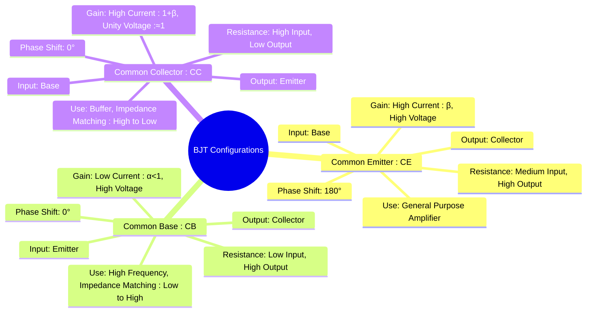

---
tags:
  - analog-electronics
  - bjt
  - amplifier-configurations
  - gate-ee
created: 2025-10-15
aliases:
  - CE CB CC Configurations
  - BJT Amplifier Configurations
  - BJT CE Configuration
  - BJT CB Configuration
  - BJT CC Configuration
subject: "[[Analog & Digital Electronics]]"
parent: "[[Bipolar Junction Transistor (BJT)]]"
modified: 2026-08-04T09:12:16
---
### BJT Configurations
#bjt-configurations

> A BJT is a three-terminal device. In amplifier circuits, one terminal is used for the input signal, one for the output signal, and the third is common to both the input and output circuits. This leads to three possible configurations: **Common Emitter (CE)**, **Common Base (CB)**, and **Common Collector (CC)**. Each configuration has distinct characteristics regarding gain, input/output resistance, and phase shift.

---
#### 1. Common Emitter (CE) Configuration
#common-emitter

This is the most widely used BJT amplifier configuration. The emitter terminal is common to both the input (applied to the base) and the output (taken from the collector).
*   **Current Gain ($A_i$):** High. The current gain is $\beta$.
    $$\boxed{\quad A_i = \frac{I_{out}}{I_{in}} = \frac{I_C}{I_B} = \beta \quad}$$
*   **Voltage Gain ($A_v$):** High. A small change in base voltage produces a large change in collector voltage.
*   **Input Resistance ($R_{in}$):** Medium (typically in the range of 1 kΩ to 5 kΩ).
*   **Output Resistance ($R_{out}$):** High (typically 40 kΩ to 50 kΩ).
*   **Phase Shift:** There is a **180° phase shift** between the input voltage and the output voltage.
*   **Power Gain:** Highest of all three configurations, as both voltage and current are amplified.
*   **Application:** Used as a general-purpose voltage amplifier due to its high voltage and current gains.

#### 2. Common Base (CB) Configuration
#common-base

The base terminal is common to both the input (applied to the emitter) and the output (taken from the collector).
*   **Current Gain ($A_i$):** Less than unity. The current gain is $\alpha$.
    $$\boxed{\quad A_i = \frac{I_{out}}{I_{in}} = \frac{I_C}{I_E} = \alpha \quad (\alpha < 1) \quad}$$
*   **Voltage Gain ($A_v$):** High (comparable to CE, but non-inverting).
*   **Input Resistance ($R_{in}$):** Very Low (typically 20 Ω to 100 Ω).
*   **Output Resistance ($R_{out}$):** Very High (can be in the MΩ range).
*   **Phase Shift:** **0°** phase shift between input and output.
*   **Application:**
    *   **High-frequency amplifiers:** It has better frequency response than CE.
    *   **Impedance matching:** Used to match a low impedance source to a high impedance load.
    *   Used as a current buffer or current follower.

#### 3. Common Collector (CC) Configuration (Emitter Follower)
#common-collector #emitter-follower

The collector terminal is common to both the input (applied to the base) and the output (taken from the emitter). This configuration is almost universally known as the **Emitter Follower**.
*   **Current Gain ($A_i$):** High.
    $$\boxed{\quad A_i = \frac{I_{out}}{I_{in}} = \frac{I_E}{I_B} = 1 + \beta \quad}$$
*   **Voltage Gain ($A_v$):** Approximately unity. The output (emitter) voltage "follows" the input (base) voltage, hence the name.
    $$\boxed{\quad A_v = \frac{V_{out}}{V_{in}} \approx 1 \quad}$$
*   **Input Resistance ($R_{in}$):** Very High (can be hundreds of kΩ).
*   **Output Resistance ($R_{out}$):** Very Low (typically less than 100 Ω).
*   **Phase Shift:** **0°** phase shift between input and output.
*   **Application:**
    *   **Impedance matching:** Used to connect a high impedance source to a low impedance load (e.g., driving a speaker or a coaxial cable).
    *   **Buffer amplifier:** It isolates the source from the load.

#### Summary of Characteristics

| Characteristic | Common Emitter (CE) | Common Base (CB) | Common Collector (CC) |
| :--- | :--- | :--- | :--- |
| **Voltage Gain ($A_v$)** | High | High | Low (≈1) |
| **Current Gain ($A_i$)** | High ($\beta$) | Low ($\alpha < 1$) | High ($1+\beta$) |
| **Power Gain** | Highest | High | Medium |
| **Input Resistance ($R_{in}$)** | Medium | Very Low | Very High |
| **Output Resistance ($R_{out}$)**| High | Very High | Very Low |
| **Phase Shift** | 180° | 0° | 0° |
| **Main Application** | Voltage Amplifier | High Freq. Amplifier | Buffer, Impedance Matching |

---
### Related Concepts
#related-concepts

> [[Bipolar Junction Transistor (BJT)]]

[[BJT Biasing and Thermal Stability]]
[[Small Signal Analysis of BJT Amplifiers]]
[[Amplifiers]]