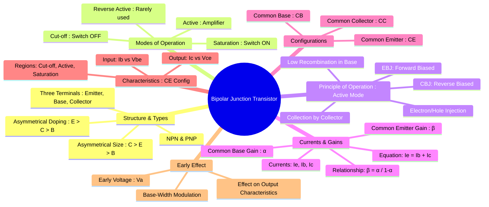

---
tags:
  - analog-electronics
  - semiconductor-devices
  - transistors
  - bjt
  - gate-ee
created: 2025-10-15
aliases:
  - BJT
  - Bipolar Transistor
  - BJT Structure
  - BJT Operation
  - BJT Characteristics
  - Structure, Operation and Characteristics of BJT
  - Bipolar Junction Transistors
  - Modes of Operation of BJT
  - PNP BJT
  - NPN BJT
  - Current-Controlled Current Source
subject: "[[Analog & Digital Electronics]]"
parent: Semiconductor Devices and Circuits
modified: 2026-08-04T09:11:26
---
### Bipolar Junction Transistor (BJT)
#bjt #transistor #current-controlled-device

> The **Bipolar Junction Transistor (BJT)** is a three-terminal semiconductor device consisting of two back-to-back P-N junctions. It is a **current-controlled current source**, where a small current at the base terminal controls a much larger current between the collector and emitter terminals. BJTs are fundamental building blocks for amplifiers and electronic switches.

---
#### Structure and Types
#bjt-structure

![[Types BJT - NPN & PNP.png]]

[[Bipolar Junction Transistors (BJTs).jpeg|See alternate diagram]]

A BJT is formed by sandwiching one type of semiconductor between two layers of the opposite type. This creates two types of BJTs: **NPN** and **PNP**.
*   **Terminals:** Emitter (E), Base (B), and Collector (C).
*   **Asymmetrical Construction:** For a BJT to function effectively as an amplifier, its construction is asymmetrical:
    1.  **Doping Concentration:** **Emitter > Collector > Base**. The emitter is heavily doped to inject a large number of charge carriers. The base is lightly doped to minimize recombination. The collector has moderate doping.
    2.  **Physical Size:** **Collector > Emitter > Base**. The collector is the largest to dissipate the heat generated by collecting high-energy charge carriers. The base is extremely thin.

---
#### Modes of Operation
#bjt-modes

A BJT has four distinct modes of operation, determined by the biasing of its two junctions: the Emitter-Base Junction (EBJ) and the Collector-Base Junction (CBJ).

| Mode | Emitter-Base Junction (EBJ) | Collector-Base Junction (CBJ) | Application |
| :--- | :--- | :--- | :--- |
| **Active** | Forward Biased | Reverse Biased | **Amplifier** |
| **Saturation** | Forward Biased | Forward Biased | **Closed Switch (ON)** |
| **Cut-off** | Reverse Biased | Reverse Biased | **Open Switch (OFF)** |
| Reverse Active | Reverse Biased | Forward Biased | Rarely Used (swapped E/C) |

#### Operation in the Active Region (NPN Example)
#bjt-operation

For amplification, the BJT must be in the active region (EBJ forward-biased, CBJ reverse-biased).
1.  **Injection:** The forward-biased EBJ causes the heavily doped emitter to inject a large number of electrons into the thin, lightly doped base.
2.  **Transport:** Because the base is very thin, most of these injected electrons (~99%) do not recombine with the holes in the base. Instead, they diffuse across the base towards the collector.
3.  **Collection:** The reverse-biased CBJ creates a strong electric field that sweeps these electrons from the base into the collector, forming the collector current.
4.  **Base Current:** A small number of electrons recombine with holes in the base, and some holes are injected from the base into the emitter. These two effects constitute the small base current ($I_B$).

The fundamental relationship between the terminal currents is:
$$\boxed{\quad I_E = I_B + I_C \quad}$$

---
#### Current Gains ($\alpha$ , $\beta$ and $\gamma$)
#current-gain #alpha-beta

* **Common-Base Current Gain ($\alpha$):** The fraction of emitter current that is collected by the collector. It is always slightly less than 1 (typically 0.95 to 0.998).
    $$\boxed{\quad \alpha = \frac{I_C}{I_E} \quad}$$
* **Common-Emitter Current Gain ($\beta$):** The ratio of the collector current to the base current. This is the BJT's current amplification factor and is typically high (50 to 400).
    $$\boxed{\quad \beta = \frac{I_C}{I_B} \quad}$$
- **Common-Collector Current Gain ($\gamma$)**: The ratio of emitter current to base current. $$\boxed{\quad \gamma = \frac{I_E}{I_B} \quad}$$
---
#### Relationships between $\alpha$, $\beta$, and $\gamma$
#BJTs/current-gain/relationship 

The relationship between $\alpha$ and $\beta$ and $\gamma$ is crucial: $$\boxed{\quad \beta = \frac{\alpha}{1-\alpha} \quad \text{and} \quad \alpha = \frac{\beta}{\beta+1} \quad \text{and} \quad \gamma = 1+\beta \quad}$$

---
#### Common Emitter (CE) Characteristics
#ce-characteristics

The Common Emitter configuration is the most widely used.

> **Common** = *terminal shared by both input and output circuits.*

![[BJT NPN Input & Output Characteristics.png]]

* **Input Characteristics:** A plot of base current ($I_B$) vs. base-emitter voltage ($V_{BE}$) for a constant collector-emitter voltage ($V_{CE}$). It resembles the characteristic curve of a forward-biased diode.
* **Output Characteristics:** A plot of collector current ($I_C$) vs. collector-emitter voltage ($V_{CE}$) for various constant values of base current ($I_B$). This plot clearly shows the three main regions of operation:
    * **Active Region:** $I_C$ is strongly controlled by $I_B$ and is almost independent of $V_{CE}$. The curves are nearly flat.
    * **Saturation Region:** $V_{CE}$ is small (typically $V_{CE,sat} \approx 0.2V$), and $I_C$ is no longer controlled by $I_B$. The transistor acts like a closed switch.
    * **Cut-off Region:** $I_B = 0$, and only a very small leakage current ($I_{CEO}$) flows. The transistor acts like an open switch.
---
#### Early Effect (Base-Width Modulation)
#early-effect

In the active region, the output characteristic curves are not perfectly flat but have a slight upward slope. This is due to the **Early Effect**.
*   **Mechanism:** As the reverse-bias voltage $V_{CB}$ (and thus $V_{CE}$) increases, the width of the CBJ depletion region increases. This encroachment into the base region reduces the *effective* width of the base.
*   **Consequence:** A narrower base results in less recombination, causing a slight increase in the collector current $I_C$ with an increase in $V_{CE}$.
*   **Early Voltage ($V_A$):** When the sloped characteristic lines are extrapolated backward, they intersect the negative $V_{CE}$ axis at a single point, known as the **Early Voltage, $-V_A$**. This parameter is used to model the output resistance ($r_o$) of the transistor in small-signal analysis.
    $$r_o = \frac{V_A + V_{CE,Q}}{I_{C,Q}} \approx \frac{V_A}{I_{C,Q}}$$

---
### Related Concepts
#related-concepts

> [[BJT Biasing and Thermal Stability]]

[[BJT Configurations]]
[[Small Signal Analysis of BJT Amplifiers]]
[[P-N Junction Diode]]
[[Junction Field Effect Transistor (JFET)]]
[[Hybrid Parameters (h-parameters)]]
[[BJT Small-Signal Model]]
[[Common Collector Amplifier]]
