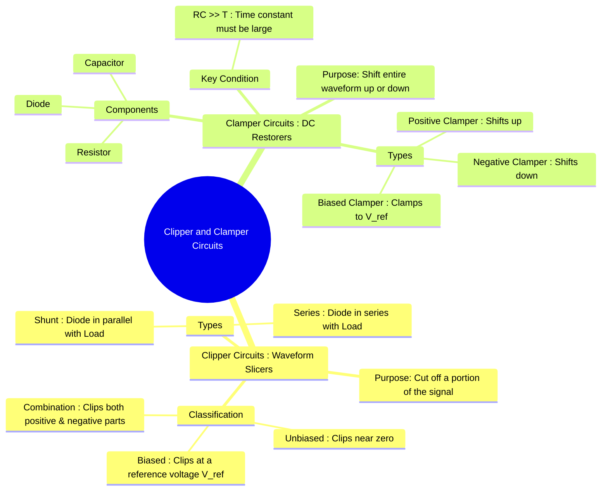

---
tags:
  - analog-electronics
  - wave-shaping
  - diode-circuits
  - gate-ee
created: 2025-10-15
aliases:
  - Clippers
  - Clampers
  - Limiters
  - Slicers
  - DC Restorers
  - Unbiased Shunt Clippers
  - Biased Shunt Clippers
  - Combination Clippers (Slicer)
  - Negative Clamper
  - Positive Clamper
  - Biased Clampers
subject: "[[Analog & Digital Electronics]]"
parent:
  - Semiconductor Devices and Circuits
modified: 2026-08-04T09:17:52
---
### Clipper and Clamper Circuits
#wave-shaping #diode-applications

> **Clipper** and **Clamper** circuits are wave-shaping circuits that use diodes and resistors (and capacitors for clampers) to alter the shape of an AC waveform. Clippers *remove* or *cut off* parts of the signal, while clampers *shift* the entire signal vertically by adding a DC level.
> 
> [[Different-Clipping-Circuits.jpg|See Different Types of Clipper Circuits]]
> [[Different-Clamping-Circuits.png|See Different Types of Clamper Circuits]]

---

#### Clipper Circuits (Limiters or Slicers)
#clipper-circuits #limiters

A clipper circuit removes a portion of a waveform that is either above or below a specified reference level, without distorting the remaining part. They are used for signal limiting and circuit protection. Shunt clippers are more common than series clippers.

##### 1. Unbiased Shunt Clippers
These use only a diode and a resistor, clipping the signal near zero volts (or the diode's forward drop, ~0.7V).

| Positive Clipper                         | Negative Clipper                         |
| ---------------------------------------- | ---------------------------------------- |
| ![[Positive Series & Shunt Clipper.png]] | ![[Negative Series & Shunt Clipper.png]] |

*   **Positive Clipper:** Clips the positive half of the input signal.
    *   **Operation:** During the positive half-cycle ($V_{in} > 0.7V$), the diode is forward-biased (ON) and acts like a short circuit (ideally) or a 0.7V source. The output $V_o$ is clamped at 0.7V. During the negative half-cycle, the diode is reverse-biased (OFF) and acts as an open circuit, so $V_o = V_{in}$.
*   **Negative Clipper:** Clips the negative half of the input signal.
    *   **Operation:** The diode is oriented in the opposite direction. It turns ON during the negative half-cycle when $V_{in} < -0.7V$, clamping the output at -0.7V. It is OFF during the positive half-cycle, making $V_o = V_{in}$.

##### 2. Biased Shunt Clippers
A DC voltage source ($V_{ref}$) is added in series with the diode to change the clipping level.

| Biased Positive Clipper          | Biased Negative Clipper          |
| -------------------------------- | -------------------------------- |
| ![[Biased Positive Clipper.png]] | ![[Biased Negative Clipper.png]] |

*   **Biased Positive Clipper:**
    *   **Operation:** The diode will turn ON and clip the output only when the input voltage is sufficient to overcome both the diode drop and the reference voltage.
    *   The clipping level is at $V_o = V_{ref} + 0.7V$. For $V_{in} > (V_{ref} + 0.7V)$, the output is clamped. Otherwise, $V_o = V_{in}$.
*   **Biased Negative Clipper:**
    *   **Operation:** The diode turns ON when $V_{in}$ becomes more negative than the reference voltage.
    *   The clipping level is at $V_o = -V_{ref} - 0.7V$. For $V_{in} < (-V_{ref} - 0.7V)$, the output is clamped. Otherwise, $V_o = V_{in}$.

##### 3. Combination Clipper (Slicer)
#combination-clipper #slicer 

![[Slicer Clipper.png]]

This circuit uses two biased diodes in parallel to clip both the positive and negative peaks, effectively "slicing" a portion of the input signal. It passes only the part of the waveform between two reference voltages.

#### Clamper Circuits (DC Restorers)
#clamper-circuits #dc-restorer

A clamper circuit adds a DC component to an AC signal, shifting the entire waveform up or down so that the positive or negative peak is "clamped" to a specific DC level.
> See [[Different-Clamping-Circuits.png|Different Types of Clamper Circuits]]

| Positive Clamper          | Negative Clamper          |
| ------------------------- | ------------------------- |
| ![[Positive Clamping.png]] | ![[Negative Clamping.png]] |

**Essential Components:** A capacitor (C), a diode (D), and a resistor (R).
**Crucial Condition:** The time constant $\tau = RC$ must be much larger than the time period of the input signal ($RC \gg T$). This ensures that the capacitor does not discharge significantly when the diode is OFF.

##### 1. Negative Clamper
This circuit shifts the waveform downwards, clamping the positive peak at or near 0V.

![[Negative Clamper.png]]

*   **Operation:**
    1.  **First Positive Half-Cycle:** The diode is forward-biased. The capacitor charges rapidly to the peak voltage of the input, $V_m$. Ideally, the output $V_o$ is 0V (or 0.7V for a practical diode).
    2.  **Subsequent Cycles:** When $V_{in}$ drops below $V_m$, the diode becomes reverse-biased. The capacitor now holds its charge and acts like a DC voltage source of value $V_m$. The output is given by KVL:
        $$\boxed{\quad V_o(t) = V_{in}(t) - V_m \quad}$$
    The output waveform is the same as the input but shifted down by $V_m$. Its positive peak is clamped at 0V, and its negative peak is at $-2V_m$.

##### 2. Positive Clamper
This circuit shifts the waveform upwards, clamping the negative peak at or near 0V. The diode is oriented in the opposite direction.

![[Positive Clamper.png]]

*   **Operation:**
    1.  **First Negative Half-Cycle:** The diode turns ON, and the capacitor charges to $-V_m$.
    2.  **Subsequent Cycles:** The diode turns OFF, and the capacitor acts as a DC source of value $V_m$. The output is given by:
        $$\boxed{\quad V_o(t) = V_{in}(t) + V_m \quad}$$
    The output waveform is shifted up by $V_m$. Its negative peak is clamped at 0V, and its positive peak is at $+2V_m$.

##### 3. Biased Clampers

#biased-clamper

A DC voltage source ($V_{ref}$) is added in series with the diode to clamp the peak to a level other than 0V. For a positive clamper, the negative peak would be clamped at $V_{ref}$ (assuming an ideal diode).

| Positive Biased Diode Clamper    | Negative Biased Diode Clamper    |
| -------------------------------- | -------------------------------- |
| ![[Positive Biased Clamper.png]] | ![[Negative Biased Clamper.png]] |

---
### Related Concepts
#related-concepts

> [[P-N Junction Diode]] (The fundamental component)

[[Rectifier Circuits]]
[[Zener Diode]] (Can be used in clippers to provide a very stable clipping level)