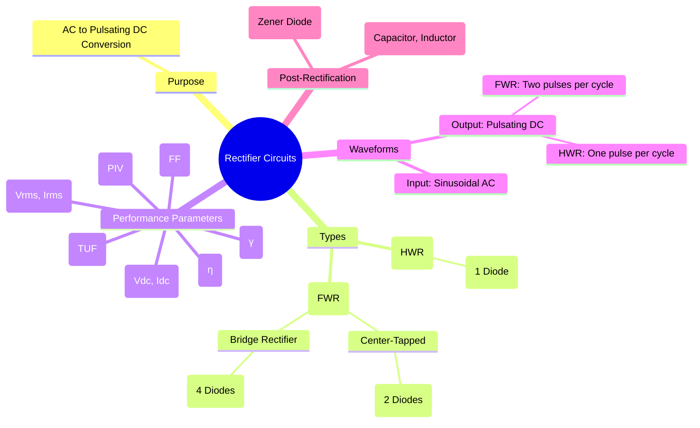

---
tags:
  - analog-electronics
  - power-electronics
  - rectifier
  - ac-dc-conversion
  - gate-ee
created: 2025-10-15
aliases:
  - Rectifiers
  - AC-DC Conversion
  - Rectifier Circuits (Half-wave, Full-wave, Bridge)
  - Bridge Rectifier
  - Center-Tapped Transformer Rectifier
  - Full-Wave Rectifier (FWR)
  - Half-Wave Rectifier (HWR)
  - "Rectifier Circuit : Performance Parameters"
subject: "[[Analog & Digital Electronics]]"
parent:
  - Semiconductor Devices and Circuits
modified: 2026-08-04T10:23:01
---
### Rectifier Circuits
#rectifier #ac-dc-conversion

> A **rectifier** is an electronic circuit that converts alternating current (AC), which periodically reverses direction, into direct current (DC), which flows in only one direction. The output of a simple rectifier is a pulsating DC, which is then typically smoothed by a [[Rectifier Smoothing Filters|filter]]. Rectifiers are the first stage in most DC power supplies.

---
#### Performance Parameters
#rectifier-parameters

To compare the performance of different rectifier circuits, several key parameters are used. Assume the input voltage is $v_i(t) = V_m \sin(\omega t)$.

1.  **DC (Average) Value ($V_{dc}$):** The average value of the output voltage.
    $V_{dc} = \frac{1}{T} \int_0^T v_o(t) dt$
2.  **RMS Value ($V_{rms}$):** The root-mean-square value of the output voltage.
    $V_{rms} = \sqrt{\frac{1}{T} \int_0^T v_o^2(t) dt}$
3.  **Ripple Factor ($\gamma$):** A measure of the purity of the DC output. It quantifies the amount of residual AC ripple in the rectified output. A lower value is better.
    $$\boxed{\quad \gamma = \frac{V_{ac,rms}}{V_{dc}} = \frac{\sqrt{V_{rms}^2 - V_{dc}^2}}{V_{dc}} = \sqrt{\left(\frac{V_{rms}}{V_{dc}}\right)^2 - 1} \quad}$$
4.  **Efficiency ($\eta$):** The ratio of the DC output power delivered to the load ($P_{dc}$) to the AC input power from the transformer secondary ($P_{ac}$).
    $$\boxed{\quad \eta = \frac{P_{dc}}{P_{ac}} = \frac{V_{dc}I_{dc}}{V_{rms}I_{rms}} = \frac{V_{dc}^2 / R_L}{V_{rms}^2 / R_L} \quad}$$
5.  **Peak Inverse Voltage (PIV):** The maximum reverse voltage that a diode must withstand without breaking down when it is in the non-conducting state.
6.  **Transformer Utilization Factor (TUF):** A measure of how effectively the transformer is being used. It's the ratio of the DC power delivered to the load to the AC power rating of the transformer secondary.

---
#### Half-Wave Rectifier (HWR)
#half-wave-rectifier

> See [[Half-Wave Rectifier]]

![[Half-Wave Rectifier CKT.jpg]]

<u>The simplest rectifier, using a single diode</u>. It allows only one half-cycle (positive or negative) of the AC waveform to pass, blocking the other.
*   **Operation:** The diode is forward-biased during the positive half-cycle and reverse-biased during the negative half-cycle.
*   **Key Parameters:**
    *   $V_{dc} = \frac{V_m}{\pi}$
    *   $V_{rms} = \frac{V_m}{2}$
    *   Ripple Factor ($\gamma$) = 1.21 (very high ripple)
    *   Efficiency ($\eta$) = 40.6% (low)
    *   **PIV = $V_m$**
    *   TUF = 0.287 (poor transformer utilization)
    *   Output Frequency = Input Frequency ($f_{out} = f_{in}$)
*   **Disadvantage:** Inefficient, high ripple content, and can cause DC saturation of the transformer core.

---
#### Full-Wave Rectifier (FWR)
#full-wave-rectifier

A full-wave rectifier converts both half-cycles of the input waveform into a pulsating DC output, making it more efficient than an HWR.

##### 1. Center-Tapped Transformer Rectifier

![[RF-center-tapped-full-wave-rectifier-4.jpg]]

*   **Operation:** Uses a transformer with a center-tapped secondary winding and two diodes. Diode D1 conducts during the positive half-cycle, and D2 conducts during the negative half-cycle.
*   **Key Parameters:**
    *   $V_{dc} = \frac{2V_m}{\pi}$
    *   $V_{rms} = \frac{V_m}{\sqrt{2}}$
    *   Ripple Factor ($\gamma$) = 0.482
    *   Efficiency ($\eta$) = 81.2%
    *   **PIV = $2V_m$** (A major drawback)
    *   TUF = 0.693
    *   Output Frequency = 2 x Input Frequency ($f_{out} = 2f_{in}$)

---
##### 2. Bridge Rectifier

![[simple-bridge-rectifier-circuit.png]]

*   **Operation:** Uses four diodes arranged in a bridge configuration. It avoids the need for a center-tapped transformer. During the positive half-cycle, diodes D1 and D2 conduct. During the negative half-cycle, diodes D3 and D4 conduct.
*   **Key Parameters:**
    *   $V_{dc} = \frac{2V_m}{\pi}$
    *   $V_{rms} = \frac{V_m}{\sqrt{2}}$
    *   Ripple Factor ($\gamma$) = 0.482
    *   Efficiency ($\eta$) = 81.2%
    *   **PIV = $V_m$** (Advantage over center-tapped FWR)
    *   TUF = 0.812 (Best utilization)
    *   Output Frequency = 2 x Input Frequency ($f_{out} = 2f_{in}$)
*   **Advantage:** The bridge rectifier is the most commonly used configuration due to its high TUF and lower PIV requirement.

---
#### Comparison of Rectifiers

| Parameter | Half-Wave Rectifier | Center-Tapped FWR | Bridge FWR |
| :--- | :--- | :--- | :--- |
| No. of Diodes | 1 | 2 | 4 |
| DC Voltage ($V_{dc}$) | $V_m/\pi$ | $2V_m/\pi$ | $2V_m/\pi$ |
| RMS Voltage ($V_{rms}$) | $V_m/2$ | $V_m/\sqrt{2}$ | $V_m/\sqrt{2}$ |
| Ripple Factor ($\gamma$) | 1.21 | 0.482 | 0.482 |
| Max. Efficiency ($\eta$) | 40.6% | 81.2% | 81.2% |
| **Peak Inverse Voltage (PIV)** | **$V_m$** | **$2V_m$** | **$V_m$** |
| Output Frequency ($f_{out}$) | $f_{in}$ | $2f_{in}$ | $2f_{in}$ |
| TUF | 0.287 | 0.693 | 0.812 |

---
### Related Concepts
#related-concepts

> [[Rectifier Smoothing Filters]]

[[P-N Junction Diode]]
[[Zener Diode]]
[[Power Electronics]]