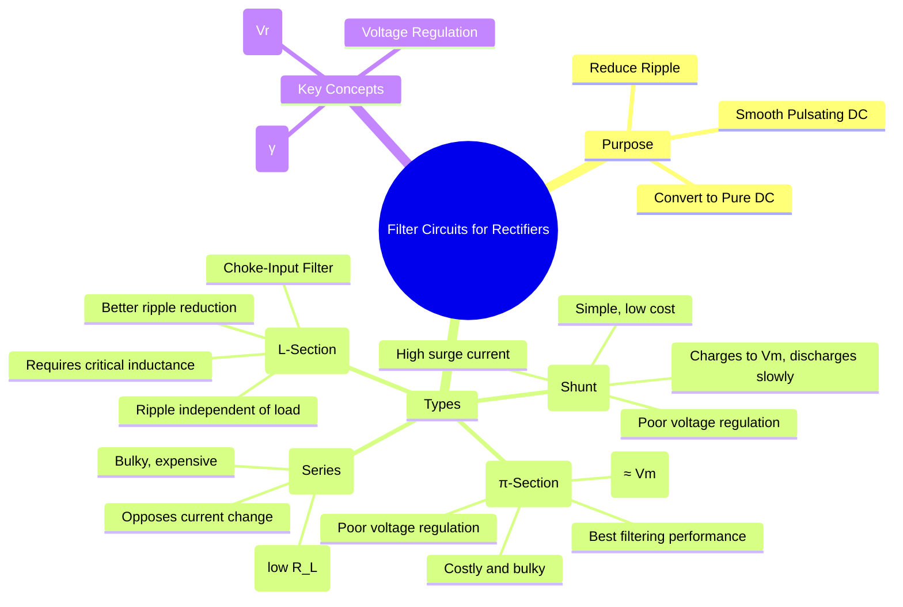

---
tags:
  - analog-electronics
  - power-electronics
  - filter-circuits
  - rectifier
  - gate-ee
created: 2025-10-15
aliases:
  - Rectifier Filters
  - Smoothing Circuits
  - Filter Circuits (Capacitor, Inductor, LC, π-section)
  - choke filter
subject: "[[Analog & Digital Electronics]]"
parent: "[[Rectifier Circuits]]"
modified: 2026-08-04T10:23:18
---
### Filter Circuits
#filter-circuits #ripple-reduction

> The output of a [[Rectifier Circuits|rectifier]] is a pulsating DC waveform containing a significant AC component, known as **ripple**. A **filter circuit** is used after the rectifier to smooth this output by removing the AC components, converting the pulsating DC into a more constant DC voltage. The primary goal is to minimize the **ripple factor ($\gamma$)**.

---
#### 1. Capacitor Filter (Shunt Filter)
#capacitor-filter

This is the simplest and most common type of filter, consisting of a capacitor connected in parallel (shunt) with the load resistor ($R_L$).

*   **Operation:**
    1.  During the rising part of the rectified voltage pulse, the diode is ON, and the capacitor charges up to the peak voltage, $V_m$.
    2.  As the rectified voltage starts to decrease, it falls below the capacitor's voltage. The diode becomes reverse-biased (turns OFF).
    3.  The capacitor then slowly discharges through the load resistor $R_L$ until the next voltage pulse rises high enough to turn the diode ON again.
*   **Analysis:** The output is a DC voltage with a sawtooth-like ripple. For a small ripple (i.e., a large time constant $\tau = R_L C \gg T_{ripple}$), the ripple factor ($\gamma$) can be approximated.
*   **Ripple Factor:**
    *   For a **Half-Wave Rectifier (HWR)**:
        $$\gamma = \frac{1}{2\sqrt{3} f_{in} R_L C}$$
    *   For a **Full-Wave Rectifier (FWR)**, the ripple frequency is $2f_{in}$:
        $$\boxed{\quad \gamma = \frac{V_{r(rms)}}{V_{dc}} \approx \frac{1}{4\sqrt{3} f_{in} R_L C} \quad}$$
*   **Pros:** Simple, low cost, small size, and provides a high DC output voltage (close to $V_m$).
*   **Cons:** Poor voltage regulation (output voltage drops significantly with increasing load current), and a large initial diode **surge current** is required to charge the capacitor.

#### 2. Inductor Filter (Series Filter)
#inductor-filter

An inductor is placed in series with the load. This filter is also known as a choke filter.

*   **Operation:** The inductor's fundamental property is to oppose any change in the current flowing through it. It stores energy in its magnetic field when the current is increasing and releases it when the current is decreasing, thereby smoothing the current waveform.
*   **Ripple Factor (for FWR):**
    $$\boxed{\quad \gamma = \frac{R_L}{3\sqrt{2} \omega L} = \frac{R_L}{3\sqrt{2} (2\pi f_{in}) L} \quad}$$
*   **Pros:** Good voltage regulation for varying loads compared to a capacitor filter.
*   **Cons:** Bulky, heavy, expensive (especially at low frequencies). It is most effective for heavy loads (small $R_L$). The DC output voltage is lower ($V_{dc} = 2V_m/\pi$).

#### 3. LC Filter (L-Section Filter)
#lc-filter #choke-input-filter

This filter combines the properties of an inductor and a capacitor to achieve much better ripple reduction. It consists of a series inductor (L) and a shunt capacitor (C).

*   **Operation:** The inductor (L) blocks the AC ripple and allows DC to pass, while the shunt capacitor (C) bypasses any remaining AC component to the ground, allowing only pure DC to reach the load ($R_L$).
*   **Ripple Factor (for FWR):**
    $$\boxed{\quad \gamma \approx \frac{1}{6\sqrt{2} \omega^2 LC} = \frac{0.471}{4\omega^2 LC} \quad}$$
*   **Key Features:**
    *   The ripple factor is independent of the load resistance $R_L$.
    *   It provides significantly better filtering than L or C alone.
    *   **Bleeder Resistor:** A resistor is often placed in parallel with the capacitor to ensure a minimum load current, preventing output voltage from soaring to $V_m$ at no-load and improving regulation.
    *   **Critical Inductance ($L_c$):** To maintain continuous current flow through the choke, its inductance must be greater than a critical value: $L \ge L_c = \frac{R_L}{3\omega}$.

#### 4. CLC Filter ($\pi$-Section Filter)
#pi-filter #clc-filter

This filter consists of a shunt capacitor (C1), a series inductor (L), and another shunt capacitor (C2), arranged in the shape of the Greek letter $\pi$.

*   **Operation:** It's essentially a capacitor-input filter followed by an LC filter section. C1 performs the bulk of the filtering, and the LC section further smooths the output.
*   **Ripple Factor (for FWR):** The ripple factor is approximately the product of the attenuation from the C1 filter and the LC filter stage.
    $$\boxed{\quad \gamma \approx \left(\frac{\sqrt{2}}{4 \omega C_1 R_L'}\right) \times \left(\frac{1}{4 \omega^2 L C_2}\right) \quad}$$
    Where $R_L'$ is the effective resistance seen by C1.
*   **Pros:** Provides the lowest ripple factor among passive filters. The DC output voltage is high, approaching $V_m$.
*   **Cons:** Higher cost, size, and weight. Like the simple capacitor filter, it has poor voltage regulation and high surge current due to the input capacitor C1.

---
### Related Concepts
#related-concepts

> [[Rectifier Circuits]]

[[Zener Diode]] (Used for the final voltage regulation stage)
[[Power Electronics]]