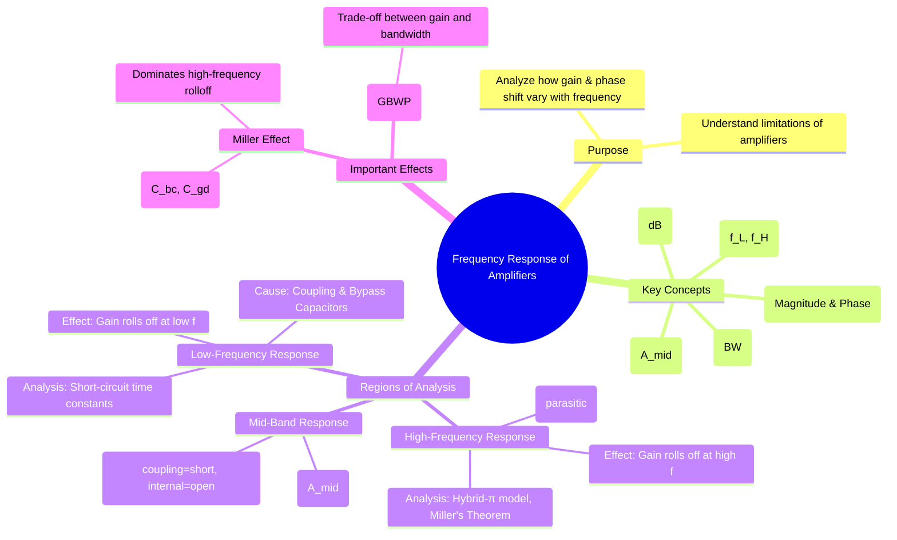

---
tags:
  - analog-electronics
  - amplifiers
  - frequency-response
  - bode-plot
  - gate-ee
created: 2025-10-15
aliases:
  - Amplifier Frequency Response
  - Bode Plot Analysis
subject: "[[Analog & Digital Electronics]]"
parent: Amplifiers
modified: 2026-08-04T09:44:28
---
### Frequency Response of Amplifiers
#frequency-response #bode-plot

> The **frequency response** of an amplifier is the measure of how its gain and phase shift change as a function of the input signal frequency. No amplifier provides the same gain at all frequencies. The response is typically visualized using a **Bode plot**, which plots the magnitude of the gain (in decibels, dB) and the phase shift against frequency on a logarithmic scale.

The gain in decibels is calculated as:
$$A_{dB} = 20 \log_{10} |A_v|$$

---
#### The Bode Plot and Key Definitions
#cutoff-frequency #bandwidth

An amplifier's frequency response is typically divided into three regions: low-frequency, mid-band, and high-frequency.
*   **Mid-Band Gain ($A_{mid}$):** The region where the amplifier's gain is maximum and relatively constant. In this range, coupling/bypass capacitors are assumed to be short circuits, and internal device capacitances are assumed to be open circuits.
*   **Cutoff Frequencies ($f_L$ and $f_H$):** These are the frequencies at which the amplifier's voltage gain drops to $1/\sqrt{2}$ (or 0.707) of its mid-band value. This corresponds to a **-3dB** drop from the mid-band gain. These are also known as **half-power frequencies**.
    $$\boxed{\quad \text{Gain at cutoff} = A_{mid} - 3 \text{ dB} \quad}$$
*   **Bandwidth (BW):** The range of frequencies over which the gain is at least 70.7% of its maximum value.
    $$\boxed{\quad BW = f_H - f_L \quad}$$

#### Low-Frequency Analysis
#low-frequency-response

The drop in gain at low frequencies is caused by the **external coupling and bypass capacitors** (e.g., input coupling capacitor $C_C$, output coupling capacitor, and emitter/source bypass capacitor $C_E$/$C_S$). As the frequency decreases, the reactance of these capacitors ($X_C = 1 / (2\pi fC)$) increases, causing them to no longer act as short circuits. This introduces voltage drops and reduces the overall gain.

*   **Analysis:** The lower cutoff frequency ($f_L$) is determined by the capacitor that causes the gain to drop first (i.e., the one with the highest pole frequency). We can find the individual pole frequency associated with each capacitor using the **short-circuit time constant method**:
    1.  Consider one capacitor (e.g., $C_C$).
    2.  Assume all other external capacitors are shorts and all internal capacitors are opens.
    3.  Calculate the Thevenin equivalent resistance ($R_{th}$) seen by this capacitor.
    4.  The pole frequency is $f_p = \frac{1}{2\pi R_{th} C}$.
    The overall $f_L$ is approximately the highest of these individual pole frequencies.

#### High-Frequency Analysis
#high-frequency-response #miller-effect

The drop in gain at high frequencies is caused by the **internal (parasitic) capacitances** of the active device (BJT or FET).
*   BJT: Junction capacitances $C_{be}$ (base-emitter) and $C_{bc}$ (base-collector).
*   MOSFET: Gate capacitances $C_{gs}$ (gate-source) and $C_{gd}$ (gate-drain).

As frequency increases, the reactance of these capacitors becomes small, providing a low-impedance path that shunts the signal current away from the output, thus reducing the gain.

*   **Miller's Theorem:** The feedback capacitance between the input and an inverting output (like $C_{bc}$ in CE or $C_{gd}$ in CS amplifiers) has a profound effect. Miller's theorem states that this feedback capacitance $C_f$ can be represented as two separate capacitances at the input and output.
    *   **Miller Input Capacitance:**
        $$\boxed{\quad C_{in(Miller)} = C_f (1 - A_v) \quad}$$
    *   **Miller Output Capacitance:**
        $$\boxed{\quad C_{out(Miller)} = C_f \left(1 - \frac{1}{A_v}\right) \quad}$$
    Since $A_v$ is large and negative for CE/CS amplifiers, $C_{in(Miller)}$ becomes a very large capacitance at the input, which dominates the high-frequency response. This creates a low-pass RC network that determines the upper cutoff frequency, $f_H$.

#### Gain-Bandwidth Product (GBWP)
#gain-bandwidth-product

For many amplifiers, particularly single-stage ones, the product of the mid-band gain and the bandwidth is approximately constant.
$$\boxed{\quad GBWP = |A_{mid}| \times BW \approx |A_{mid}| \times f_H \quad}$$
(This assumes $f_H \gg f_L$, so $BW \approx f_H$).
This represents a fundamental trade-off: to increase an amplifier's bandwidth, its gain must be reduced, and vice versa. This is a crucial parameter for operational amplifiers.

---
### Related Concepts
#related-concepts

> [[Small Signal Analysis of BJT Amplifiers]]

[[Small Signal Analysis of JFET/MOSFET Amplifiers (gm-rd model)]]
[[Feedback in Amplifiers]]
[[Ideal Op-Amp]]