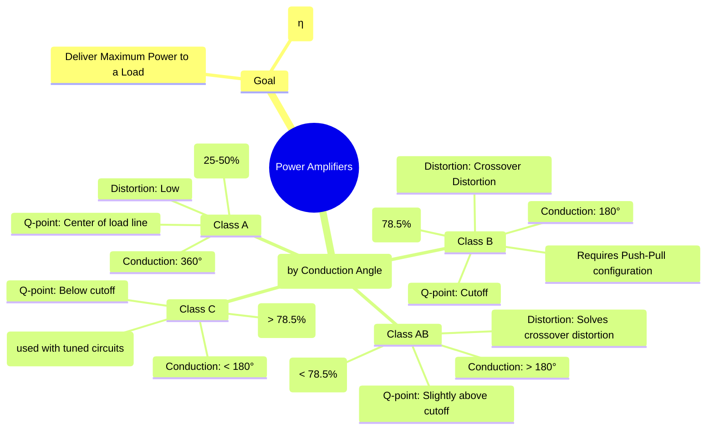

---
tags:
  - analog-electronics
  - amplifiers
  - power-amplifier
  - gate-ee
created: 2025-10-15
aliases:
  - Power Amps
  - Class A B AB C Amplifiers
subject: "[[Analog & Digital Electronics]]"
parent: Amplifiers
modified: 2026-07-23T12:24:57
---

---
### Power Amplifiers
#power-amplifier #efficiency

> **Power amplifiers** are large-signal amplifiers designed to deliver a significant amount of power to a load, such as a speaker or an antenna. Unlike small-signal voltage amplifiers where the primary concern is voltage gain, the key metrics for power amplifiers are **power efficiency ($\eta$)**, maximum power handling capability, and minimizing distortion.

Amplifiers are classified into different "classes" based on the portion of the input signal cycle for which the active device (transistor) is conducting. This is known as the **conduction angle**.

**Power Efficiency ($\eta$):** The ratio of the average AC power delivered to the load ($P_{L(ac)}$) to the average DC power drawn from the supply ($P_{S(dc)}$).
$$\boxed{\quad \eta = \frac{P_{L(ac)}}{P_{S(dc)}} \times 100\% \quad}$$

#### Class A Amplifier
#class-a-amplifier

The transistor conducts for the **full 360°** of the input signal cycle. The Q-point is biased at the center of the DC load line to allow for maximum symmetrical output swing.

*   **Characteristics:**
    *   **Distortion:** Lowest distortion, highest fidelity.
    *   **Efficiency:** Very poor.
        *   For a series-fed (direct-coupled) load: **$\eta_{max} = 25\%$**
        *   For a transformer-coupled load: **$\eta_{max} = 50\%$**
    *   **Power Dissipation:** The transistor dissipates the most power ($P_{D,Q} = V_{CEQ}I_{CQ}$) when there is **no input signal**.

#### Class B Amplifier
#class-b-amplifier #crossover-distortion

The transistor conducts for only **180°** (one half-cycle) of the input signal. The Q-point is located at cutoff.

*   **Characteristics:**
    *   **Push-Pull Configuration:** To amplify the full signal, two complementary transistors (e.g., NPN and PNP) are used in a push-pull arrangement. One handles the positive half-cycle, and the other handles the negative half-cycle.
    *   **Efficiency:** Much higher than Class A.
        $$\boxed{\quad \eta_{max} = \frac{\pi}{4} \approx 78.5\% \quad}$$
    *   **Crossover Distortion:** A significant drawback. At the zero-crossing point of the signal, both transistors are temporarily OFF because the input voltage is not sufficient to overcome the base-emitter turn-on voltage ($V_{BE,on} \approx 0.7V$). This creates a "dead zone" or distortion in the output waveform.
    *   **Power Dissipation:** Maximum power is dissipated in the transistors when the peak output voltage is $V_L = 2V_{CC}/\pi$.

#### Class AB Amplifier
#class-ab-amplifier

A compromise between Class A and Class B. The transistor conducts for **slightly more than 180°** but less than 360°.

*   **Characteristics:**
    *   **Q-point:** The Q-point is biased slightly above cutoff. This is typically achieved by using diodes or a $V_{BE}$ multiplier circuit to apply a small quiescent current to the transistors.
    *   **Advantage:** This small bias is sufficient to **eliminate the crossover distortion** found in Class B amplifiers.
    *   **Efficiency:** High, but slightly less than Class B (typically in the range of 50% to 78.5%).
    *   **Application:** It is the most common configuration for audio power amplifiers due to its good balance of high efficiency and low distortion.

#### Class C Amplifier
#class-c-amplifier

The transistor conducts for **less than 180°** of the input cycle. The Q-point is biased well below cutoff.

*   **Characteristics:**
    *   **Distortion:** Extremely high. The output current is a series of pulses, not a faithful reproduction of the input.
    *   **Efficiency:** The highest of all classes, can exceed 90%.
    *   **Application:** Unsuitable for audio applications. It is used in high-frequency applications like **radio frequency (RF) oscillators and transmitters**. A **tuned resonant circuit (LC tank)** is used as the load, which filters the output pulses and restores a sinusoidal waveform at the desired resonant frequency.

#### Summary

| Class | Conduction Angle | Q-point Location | Max. Efficiency | Key Feature / Application |
| :--- | :--- | :--- | :--- | :--- |
| **A** | 360° | Center of load line | 50% (transformer) | High fidelity, low distortion |
| **B** | 180° | At cutoff | 78.5% | Push-pull, Crossover distortion |
| **AB**| > 180° | Slightly above cutoff | < 78.5% | Solves crossover, Audio Amps |
| **C** | < 180° | Below cutoff | > 78.5% | High distortion, RF Tuned Amps |

---
### Related Concepts
#related-concepts

> [[Amplifiers]]

[[BJT Biasing and Thermal Stability]]
[[Bipolar Junction Transistor (BJT)]]