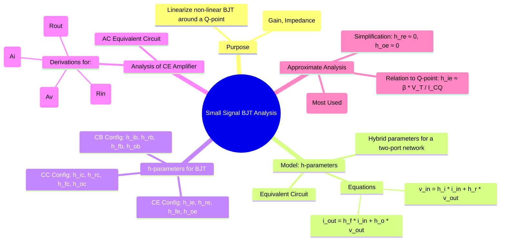

---
tags:
  - analog-electronics
  - bjt
  - amplifiers
  - small-signal-analysis
  - h-parameters
  - gate-ee
created: 2025-10-15
aliases:
  - BJT Small Signal Model
  - h-parameters
  - Hybrid Parameters
  - h-parameter model
subject: "[[Analog & Digital Electronics]]"
parent: Amplifiers
modified: 2026-08-04T10:31:07
---
### Small Signal Analysis of BJT Amplifiers
#small-signal-analysis #h-parameters

> **Small-signal analysis** is a technique used to analyze the AC behavior of a non-linear electronic circuit, like a BJT amplifier, around a stable DC operating point (the **Q-point**). By assuming the AC signals are small "perturbations," the non-linear device can be modeled as a linear circuit for AC analysis. The **h-parameter (hybrid parameter) model** is a common way to create this linear equivalent circuit for a BJT.

---
#### The Two-Port h-parameter Model
#two-port-network

A transistor can be modeled as a linear two-port "[[black box]]". The relationship between the input/output voltages and currents can be described by a set of [[hybrid parameters (h-parameters)]].

The defining equations are:
$$\begin{align}
v_1 &= h_i i_1 + h_r v_2 \\
i_2 &= h_f i_1 + h_o v_2
\end{align}$$
Where:
* $h_i = \frac{v_1}{i_1} \bigg|_{v_2=0}$ : **Input Impedance** with output shorted ($\Omega$).
* $h_r = \frac{v_1}{v_2} \bigg|_{i_1=0}$ : **Reverse Voltage Gain** with input open (dimensionless).
* $h_f = \frac{i_2}{i_1} \bigg|_{v_2=0}$ : **Forward Current Gain** with output shorted (dimensionless).
* $h_o = \frac{i_2}{v_2} \bigg|_{i_1=0}$ : **Output Admittance** with input open (Siemens).

#### BJT h-parameters for Common Emitter (CE) Configuration
The second subscript indicates the configuration (e.g., 'e' for common emitter).
* $h_{ie}$: Input resistance (Base-Emitter).
* $h_{re}$: Reverse voltage gain (effect of $V_{ce}$ on $V_{be}$). Very small.
* $h_{fe}$: Forward current gain ($\beta_{ac}$).
* $h_{oe}$: Output admittance (reciprocal of output resistance, related to Early effect). Very small.

The small-signal model can be calculated from the Q-point parameters:
$$\boxed{\quad h_{ie} \approx \beta \frac{V_T}{I_{CQ}} = \frac{\beta}{g_m} \quad\text{and}\quad h_{fe} = \beta_{ac} \quad}$$
where $V_T$ is the thermal voltage, $I_{CQ}$ is the quiescent collector current, and $g_m$ is the transconductance.

#### Analysis of a Common Emitter Amplifier
To analyze an amplifier, the BJT is replaced by its h-parameter model in the AC equivalent circuit (DC sources are grounded, capacitors are shorted).

For a CE amplifier with an effective AC load resistance $R_L = R_C || R_{Load}$ and source resistance $R_S$:
* **Current Gain ($A_i$):**
    $$\boxed{\quad A_i = \frac{I_L}{I_i} = \frac{-h_{fe}}{1 + h_{oe} R_L} \quad}$$
* **Voltage Gain ($A_v$):**
    $$\boxed{\quad A_v = \frac{V_o}{V_i} = \frac{-h_{fe} R_L}{h_{ie} + (h_{ie}h_{oe} - h_{re}h_{fe})R_L} \quad}$$
* **Input Resistance ($R_{in}$):** Resistance looking into the amplifier stage (excluding biasing resistors).
    $R_i = h_{ie} + h_{re}A_v R_L$. The total input resistance of the amplifier is $R_{in} = R_{B1} || R_{B2} || R_i$.
* **Output Resistance ($R_{out}$):** Resistance looking back into the collector terminal (excluding load).
    $R_o = \frac{1}{h_{oe} - \frac{h_{re}h_{fe}}{h_{ie}+R_S}}$. The total output resistance of the amplifier is $R_{out} = R_C || R_o$.

#### Approximate h-parameter Analysis
For quick and practical calculations (essential for GATE), we use the fact that $h_{re}$ and $h_{oe}$ are very small.
**Approximations:** $h_{re} \approx 0$ and $h_{oe} \approx 0$ ($1/h_{oe} \to \infty$).
This simplifies the model to an input resistor $h_{ie}$ and an output current source $h_{fe}i_b$.

The simplified formulas for a CE amplifier (with emitter resistor $R_E$ bypassed) become:

| Parameter | Approximate Formula |
| :--- | :--- |
| Current Gain ($A_i$) | $\approx -h_{fe}$ |
| Voltage Gain ($A_v$) | $\approx \frac{-h_{fe} R_L}{h_{ie}} = -g_m R_L$ |
| Input Resistance ($R_i$) | $\approx h_{ie}$ |
| Output Resistance ($R_o$) | $\approx \infty$ (So $R_{out} \approx R_C$) |

**Effect of Unbypassed Emitter Resistor ($R_E$):**
If $R_E$ is not bypassed by a capacitor, it provides series-current negative feedback, which significantly alters the characteristics:
* Voltage Gain: $A_v \approx \frac{-h_{fe} R_L}{h_{ie} + (1+h_{fe})R_E} \approx \frac{-R_L}{R_E}$ (if $(1+h_{fe})R_E \gg h_{ie}$)
* Input Resistance: $R_i \approx h_{ie} + (1+h_{fe})R_E$
* Output Resistance: Increases significantly.

---
### Related Concepts
#related-concepts

> [[BJT Configurations]]

[[BJT Biasing and Thermal Stability]]
[[Small Signal Analysis of JFET or MOSFET Amplifiers (gm-rd model)]]
[[Feedback in Amplifiers]]
[[Two-Port Networks]]

