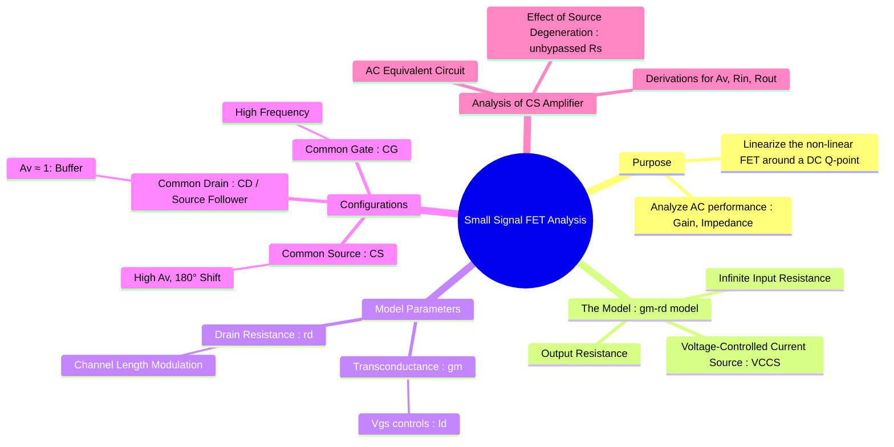

---
tags:
  - analog-electronics
  - fet
  - mosfet
  - amplifiers
  - small-signal-analysis
  - gate-ee
created: 2025-10-15
aliases:
  - FET Small Signal Model
  - MOSFET Small Signal Model
  - gm-rd model
subject: "[[Analog & Digital Electronics]]"
parent: Amplifiers
modified: 2026-08-04T10:31:22
---
### Small Signal Analysis of JFET/MOSFET Amplifiers
#small-signal-analysis #gm-rd-model

> **Small-signal analysis** for FETs linearizes the device's non-linear behavior around a DC Q-point, allowing for the analysis of its AC performance (gain, input/output resistance). The standard model used for both JFETs and MOSFETs in their saturation (active) region is the **`gm-rd` model**, also known as the hybrid-$\pi$ model for FETs.

---
#### The `gm-rd` Small-Signal Model
#fet-model

The model represents the AC behavior of the FET.
*   **Input:** An open circuit between the gate and source, representing the extremely high input impedance of the device.
*   **Output:** A voltage-controlled current source ($g_m v_{gs}$) in parallel with the small-signal drain resistance ($r_d$).
    *   $g_m v_{gs}$: This is the core of the model. The AC input voltage ($v_{gs}$) controls the AC output current.
    *   $r_d$: This resistance models the slight slope of the output characteristic curves in the saturation region, which is caused by channel-length modulation in MOSFETs. For an ideal device, $r_d$ would be infinite.

#### Calculating the Model Parameters
The values of $g_m$ and $r_d$ depend on the DC Q-point ($I_{DQ}$, $V_{GSQ}$).

1.  **Transconductance ($g_m$):** It is the change in drain current for a change in gate-source voltage at a constant $V_{DS}$.
    $$g_m = \frac{\partial I_D}{\partial V_{GS}}\bigg|_{Q-point}$$
    *   **For JFET:**
        $$\boxed{\quad g_m = g_{m0}\left(1 - \frac{V_{GSQ}}{V_P}\right) \quad \text{where } g_{m0} = \frac{2I_{DSS}}{|V_P|} \quad}$$
    *   **For MOSFET:**
        $$\boxed{\quad g_m = \sqrt{2k_n'\left(\frac{W}{L}\right)I_{DQ}} = k_n'\left(\frac{W}{L}\right)(V_{GSQ} - V_T) \quad}$$

2.  **AC Drain Resistance ($r_d$):** It is the reciprocal of the slope of the output characteristic curve.
    $$r_d = \frac{\partial V_{DS}}{\partial I_D}\bigg|_{Q-point}$$
    It is commonly modeled using the Early Voltage ($V_A$) or the channel-length modulation parameter ($\lambda$).
    $$\boxed{\quad r_d = \frac{V_A}{I_{DQ}} = \frac{1}{\lambda I_{DQ}} \quad}$$

#### Analysis of a Common Source (CS) Amplifier
The Common Source amplifier is the most common FET configuration, analogous to the BJT Common Emitter amplifier.
*   **Voltage Gain ($A_v$):** For an amplifier with drain resistance $R_D$ and AC load resistance $R_L$, the total effective load is $R_{L}' = R_D || R_L$.
    The output voltage is $v_o = - (g_m v_{gs}) \cdot (r_d || R_{L}')$. Since $v_{in} = v_{gs}$, the gain is:
    $$\boxed{\quad A_v = \frac{v_o}{v_{in}} = -g_m (r_d || R_D || R_L) \quad}$$
    If $r_d$ is very large ($r_d \gg R_D$), this simplifies to $A_v \approx -g_m (R_D || R_L)$. The negative sign indicates a **180° phase inversion**.
*   **Input Resistance ($R_{in}$):** Looking into the gate, the resistance is nearly infinite. The total input resistance of the amplifier is determined by the gate biasing resistors ($R_G$). For a voltage divider bias, $R_{in} = R_1 || R_2$.
*   **Output Resistance ($R_{out}$):** Looking back into the drain terminal of the amplifier (with the input source set to zero), we see the device's internal resistance $r_d$ in parallel with the drain resistor $R_D$.
    $$\boxed{\quad R_{out} = r_d || R_D \quad}$$

#### Effect of Unbypassed Source Resistor (Source Degeneration)
If a source resistor $R_S$ is present but not bypassed with a capacitor for AC signals, it introduces negative feedback.
*   **Voltage Gain:** The gain is reduced but becomes more stable and less dependent on the transistor's parameters.
    $$\boxed{\quad A_v = \frac{-g_m R_D}{1+g_m R_S} \quad}$$
    If $g_m R_S \gg 1$, the gain simplifies to $A_v \approx \frac{-R_D}{R_S}$, which is very stable.
*   **Input Resistance:** Remains unchanged ($R_{in} = R_G$).
*   **Output Resistance:** Increases significantly to $R_{out} = R_D || [r_d(1+g_m R_S)]$.

#### Other Configurations
*   **Common Drain (Source Follower):** Provides a voltage gain of approximately 1, very high input resistance, and very low output resistance. Used as a voltage buffer for impedance matching.
*   **Common Gate:** Provides a non-inverting voltage gain, very low input resistance, and high output resistance. Used in high-frequency applications.

---
### Related Concepts
#related-concepts

> [[Amplifiers]]

[[Junction Field Effect Transistor (JFET)]]
[[MOSFET]]
[[Small Signal Analysis of BJT Amplifiers]]
[[Feedback in Amplifiers]]