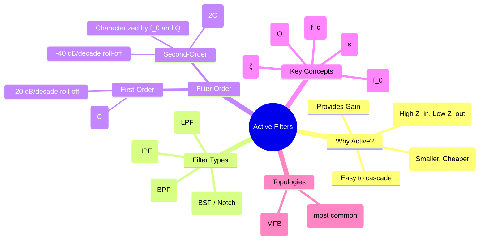

---
tags:
  - analog-electronics
  - op-amp
  - active-filter
  - signal-processing
  - gate-ee
created: 2025-10-15
aliases:
  - Active Filter
  - Op-Amp Filters
subject: "[[Analog & Digital Electronics]]"
parent:
  - Operational Amplifiers (Op-Amps)
modified: 2026-08-04T09:05:53
---
### Active Filters
#active-filter #op-amp

> An **active filter** is a type of analog filter that uses active components, such as operational amplifiers, in addition to passive components like resistors and capacitors. Unlike passive filters (which only use R, L, C), active filters can provide signal gain, have high input impedance and low output impedance to prevent loading effects, and can be easily cascaded. They also avoid the use of bulky and expensive inductors, especially at low frequencies.

---
#### First-Order Filters
#first-order-filter

A first-order filter has a single reactive element (a capacitor) and exhibits a roll-off rate of **-20 dB/decade** (or -6 dB/octave) beyond the cutoff frequency.

##### 1. First-Order Low-Pass Filter (LPF)
This filter passes low frequencies and attenuates high frequencies. A simple implementation uses an inverting op-amp configuration with a capacitor in parallel with the feedback resistor.

![[Active RC Low-Pass Filter (First Order).png]]

*   **Transfer Function:**
    $$H(s) = \frac{V_o(s)}{V_i(s)} = \frac{-R_f/R_1}{1+sR_fC}$$
*   **Cutoff Frequency ($f_c$):** The frequency at which the gain drops by 3 dB.
    $$\boxed{\quad f_c = \frac{1}{2\pi R_f C} \quad}$$

##### 2. First-Order High-Pass Filter (HPF)
This filter passes high frequencies and attenuates low frequencies. It can be formed by swapping the positions of the resistor and capacitor in the LPF design.
*   **Transfer Function:**
    $$H(s) = \frac{V_o(s)}{V_i(s)} = \frac{-sR_fC_1}{1+sR_1C_1}$$
*   **Cutoff Frequency ($f_c$):**
    $$\boxed{\quad f_c = \frac{1}{2\pi R_1 C_1} \quad}$$

#### Second-Order Filters
#second-order-filter

Second-order filters use two reactive elements to achieve a steeper roll-off rate of **-40 dB/decade**. Their response is characterized by a **natural frequency ($\omega_0$)** and a **Quality Factor (Q)**.

The standard form of a second-order low-pass transfer function is:
$$\boxed{\quad H(s) = \frac{A_0 \omega_0^2}{s^2 + s\frac{\omega_0}{Q} + \omega_0^2} \quad}$$
*   $A_0$: DC gain of the filter.
*   $\omega_0$: Natural (or center) frequency.
*   $Q$: Quality factor. It determines the "peaking" in the frequency response near $\omega_0$. A higher Q means a sharper, more peaked response.

##### Filter Responses (Approximations)
The value of Q determines the type of filter response:
*   **Butterworth (Maximally Flat):** $Q = 1/\sqrt{2} \approx 0.707$. Provides the flattest possible passband response.
*   **Chebyshev (Equal Ripple):** $Q > 0.707$. Provides a steeper roll-off but has ripples (gain variations) in the passband.
*   **Bessel (Linear Phase):** $Q < 0.707$. Provides a constant time delay for signals but has a slower roll-off.

##### Sallen-Key Topology
The Sallen-Key is a very popular non-inverting topology for second-order active filters. The following is a unity-gain Sallen-Key Low-Pass Filter.
*   **Analysis:** By analyzing the circuit, the transfer function can be derived and compared to the standard second-order form to find the natural frequency and Q factor.
*   **Natural Frequency:**
    $$\boxed{\quad \omega_0 = \frac{1}{\sqrt{R_1 R_2 C_1 C_2}} \quad}$$
*   **Quality Factor:**
    $$\boxed{\quad Q = \frac{\sqrt{R_1 R_2 C_1 C_2}}{C_2(R_1+R_2)} \quad}$$

#### Higher-Order Filters
Filters with orders greater than two (e.g., third-order with -60 dB/decade roll-off) are created by **cascading** first and second-order filter sections. For example, a third-order filter can be built by connecting a first-order filter in series with a second-order filter.

---
### Related Concepts
#related-concepts

> [[Op-Amp Circuits]]

[[Frequency Response of Amplifiers (Low-frequency and High-frequency analysis)]]
[[Ideal Op-Amp]]
[[Signal & Systems]]
[[Control Systems]]