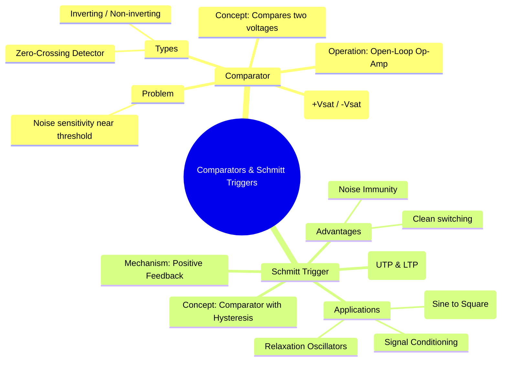

---
tags:
  - analog-electronics
  - op-amp
  - wave-shaping
  - comparator
  - schmitt-trigger
  - gate-ee
created: 2025-10-15
aliases:
  - Comparator
  - Schmitt Trigger
  - Hysteresis
subject: "[[Analog & Digital Electronics]]"
parent:
  - Operational Amplifiers (Op-Amps)
modified: 2026-08-04T09:23:17
---
### Comparators and Schmitt Triggers
#comparator #schmitt-trigger

> **Comparators** and **Schmitt Triggers** are fundamental op-amp circuits used to convert analog signals into digital-like binary outputs. A basic comparator switches its output based on a single voltage threshold, while a Schmitt trigger uses positive feedback to create two thresholds (**hysteresis**), providing immunity to noise.

---
#### Comparator (Open-Loop Op-Amp)
#open-loop-op-amp

A comparator is an op-amp circuit without negative feedback (i.e., in open-loop configuration). Due to the op-amp's extremely high open-loop gain ($A_{OL}$), any small difference between the input voltages ($v_d = v_+ - v_-$) will cause the output to swing to its saturation levels.

*   **Operation:**
    *   If $v_+ > v_-$, then $V_{out} = +V_{sat}$
    *   If $v_- > v_+$, then $V_{out} = -V_{sat}$
    A **zero-crossing detector** is a simple comparator where the reference voltage is 0V.

*   **Problem with Noise:** If the input signal is noisy and hovers around the reference voltage ($V_{ref}$), the noise can cause the input to cross the threshold multiple times. This leads to rapid, unwanted transitions at the output, known as **chattering**.

#### Schmitt Trigger (Comparator with Positive Feedback)
#hysteresis #positive-feedback

To overcome the noise sensitivity of a simple comparator, **positive feedback** is introduced to create a **Schmitt Trigger**. This circuit has two distinct switching thresholds: an **Upper Threshold Point (UTP)** and a **Lower Threshold Point (LTP)**. The range between these two points is the **hysteresis width ($V_H$)**.

The output of the Schmitt trigger depends not only on the input voltage but also on its current state.

##### Inverting Schmitt Trigger
In this configuration, the input signal is applied to the inverting terminal, and the positive feedback is applied to the non-inverting terminal.
*   **Analysis:** The threshold voltage at the non-inverting terminal ($v_+$) is set by the voltage divider formed by $R_1$ and $R_2$, but the source of this divider is the op-amp's own output, $V_{out}$.
    1.  When $V_{out} = +V_{sat}$, the input $V_{in}$ must rise above the **Upper Threshold Point (UTP)** to make $v_- > v_+$ and switch the output to low.
        $$\boxed{\quad V_{UTP} = +V_{sat} \frac{R_1}{R_1 + R_2} \quad}$$
    2.  When $V_{out} = -V_{sat}$, the input $V_{in}$ must fall below the **Lower Threshold Point (LTP)** to make $v_- < v_+$ and switch the output to high.
        $$\boxed{\quad V_{LTP} = -V_{sat} \frac{R_1}{R_1 + R_2} \quad}$$
*   **Hysteresis Voltage ($V_H$):** The width of the hysteresis loop. The input must traverse this entire voltage range to cause a switch in the opposite direction.
    $$\boxed{\quad V_H = V_{UTP} - V_{LTP} = (+V_{sat} - (-V_{sat}))\frac{R_1}{R_1 + R_2} \quad}$$
    This hysteresis provides noise immunity. If the noise amplitude is less than $V_H$, it cannot cause false triggering.

##### Transfer Characteristic (Hysteresis Loop)
The plot of $V_{out}$ vs $V_{in}$ for a Schmitt trigger forms a rectangular loop, which is the signature of hysteresis.

#### Applications
*   **Signal Conditioning:** Converts noisy or slowly changing signals into clean, sharp, digital-like signals.
*   **Sine to Square Wave Converter:** If a sinusoidal input with a peak voltage greater than UTP and LTP is applied, the output will be a square wave.
*   **Relaxation Oscillators:** The core component in astable multivibrators for generating square and triangular waves.
*   **Switch Debouncing:** Eliminates the chattering effect from mechanical switches.

---
### Related Concepts
#related-concepts

> [[Ideal Op-Amp]]

[[Waveform Generation - Multivibrators (Astable, Monostable)]]
[[Digital Electronics]] (acts as an analog-to-digital interface)