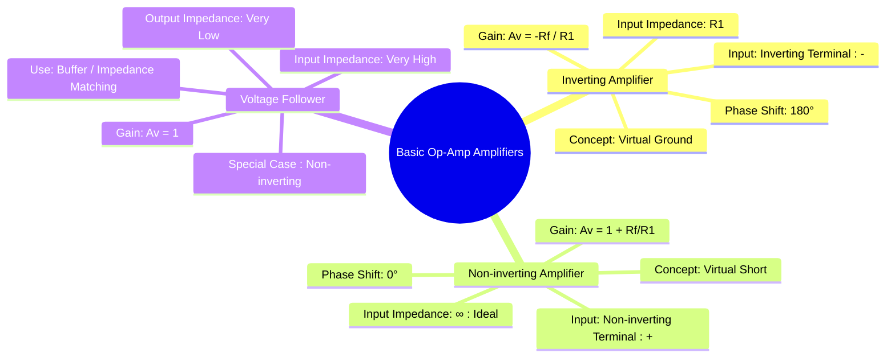

---
tags:
  - analog-electronics
  - op-amp
  - amplifiers
  - gate-ee
created: 2025-10-15
aliases:
  - Inverting Amplifier
  - Non-inverting Amplifier
  - Voltage Follower
subject: "[[Analog & Digital Electronics]]"
parent:
  - Operational Amplifiers (Op-Amps)
modified: 2026-07-23T12:23:43
---
### Op-Amp Applications: Inverting and Non-inverting Amplifiers
#op-amp-applications

> The inverting and non-inverting configurations are the two fundamental closed-loop amplifier circuits built using an operational amplifier. They rely on negative feedback to create a stable, predictable gain that is determined by external resistors rather than the op-amp's large and variable open-loop gain.

---
#### 1. The Inverting Amplifier
#inverting-amplifier

In this configuration, the input signal is applied to the inverting terminal (-) through an input resistor $R_1$, and the non-inverting terminal (+) is connected to ground. Negative feedback is provided by a resistor $R_f$ connected from the output to the inverting terminal.

**Analysis (using Golden Rules):**
1.  Since $v_+ = 0$ (grounded), then due to the virtual short, $v_- = 0$. This is a **virtual ground**.
2.  No current flows into the op-amp, so $i_- = 0$. Applying KCL at the $v_-$ node:
    $$I_{R1} = I_{Rf}$$
    $$\frac{V_{in} - v_-}{R_1} = \frac{v_- - V_{out}}{R_f}$$
    Substituting $v_- = 0$:
    $$\frac{V_{in}}{R_1} = \frac{-V_{out}}{R_f}$$
    Rearranging for the voltage gain ($A_v = V_{out} / V_{in}$):
    $$\boxed{\quad A_v = -\frac{R_f}{R_1} \quad}$$

*   **Gain:** The gain is set by the ratio of the feedback and input resistors. The negative sign indicates a **180° phase inversion**.
*   **Input Impedance ($R_{in}$):** The input impedance seen by the signal source is equal to the input resistor, $R_1$, because the inverting terminal is a virtual ground.
    $$\boxed{\quad R_{in} = R_1 \quad}$$

#### 2. The Non-inverting Amplifier
#non-inverting-amplifier

Here, the input signal is applied directly to the non-inverting terminal (+). The feedback network, consisting of $R_f$ and $R_1$, is connected to the inverting terminal (-), with $R_1$ going to ground.

**Analysis (using Golden Rules):**
1.  Due to the virtual short, the voltage at the inverting terminal equals the voltage at the non-inverting terminal: $v_- = v_+ = V_{in}$.
2.  No current flows into the op-amp ($i_- = 0$). The resistors $R_f$ and $R_1$ form a voltage divider for the output voltage, with the voltage at their junction being $v_-$.
    $$v_- = V_{out} \left( \frac{R_1}{R_1 + R_f} \right)$$
    Substituting $v_- = V_{in}$:
    $$V_{in} = V_{out} \left( \frac{R_1}{R_1 + R_f} \right)$$
    Rearranging for the voltage gain ($A_v = V_{out} / V_{in}$):
    $$\boxed{\quad A_v = \frac{R_1 + R_f}{R_1} = 1 + \frac{R_f}{R_1} \quad}$$

*   **Gain:** The gain is always positive (no phase inversion) and greater than or equal to 1.
*   **Input Impedance ($R_{in}$):** The input signal is applied directly to the non-inverting input, which has an ideally infinite impedance. Therefore, the input impedance of the non-inverting amplifier is extremely high.
    $$\boxed{\quad R_{in} \to \infty \quad}$$

#### 3. The Voltage Follower (Unity Gain Buffer)
#voltage-follower #buffer

The voltage follower is a special case of the non-inverting amplifier where the feedback resistor $R_f=0$ (a direct connection from output to inverting input) and $R_1 \to \infty$ (removed).
*   **Gain:** From the non-inverting gain formula:
    $$A_v = 1 + \frac{0}{R_1} = 1$$
    $$\boxed{\quad V_{out} = V_{in} \quad}$$
*   **Characteristics:** It provides a unity voltage gain with no phase inversion.
*   **Application:** Its primary use is as a **buffer**. Due to its very high input impedance and very low output impedance, it is ideal for connecting a high-impedance source to a low-impedance load, preventing the source from being "loaded down".

---
### Related Concepts
#related-concepts

> [[Ideal Op-Amp]]

[[Op-Amp Circuits]]
[[Feedback in Amplifiers]]
[[Instrumentation Amplifier]]