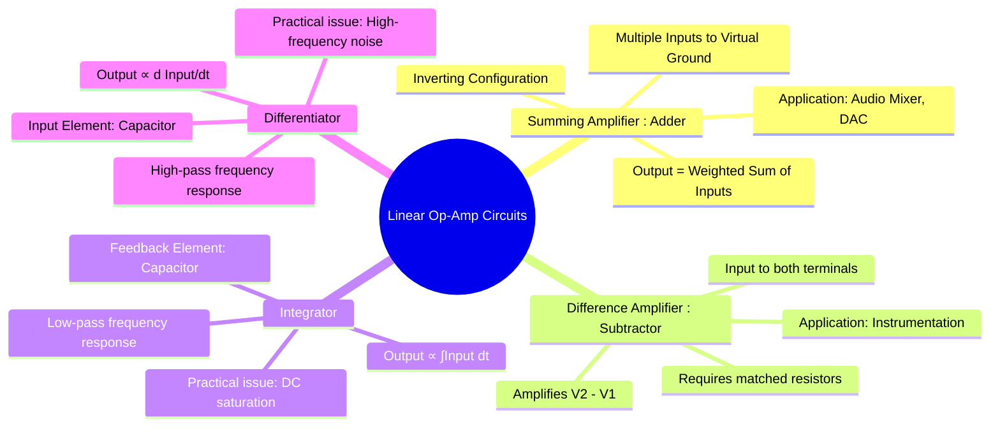

---
tags:
  - analog-electronics
  - op-amp
  - op-amp-applications
  - wave-shaping
  - gate-ee
created: 2025-10-15
aliases:
  - Summing Amplifier
  - Difference Amplifier
  - Op-Amp Integrator
  - Op-Amp Differentiator
  - Op-Amp Circuits - Adder, Subtractor, Integrator, Differentiator
subject: "[[Analog & Digital Electronics]]"
parent:
  - Operational Amplifiers (Op-Amps)
modified: 2026-07-23T12:21:26
---
### Op-Amp Circuits: Mathematical Operations
#op-amp-applications #analog-computing

> By using resistors and capacitors in specific configurations, op-amps can be made to perform mathematical operations such as summation, subtraction, integration, and differentiation. These circuits are the foundation of analog computing and signal processing.

---
#### 1. Summing Amplifier (Adder)
#summing-amplifier

The summing amplifier is a variation of the [[Op-Amp Applications - Inverting and Non-inverting Amplifiers|inverting amplifier]] that can accept multiple inputs. Its output is a weighted sum of these inputs.

**Analysis:**
The inverting terminal is a virtual ground ($v_-=0$). Applying KCL at this node:
$$I_1 + I_2 + \dots + I_n = I_f$$
$$\frac{V_1}{R_1} + \frac{V_2}{R_2} + \dots + \frac{V_n}{R_n} = \frac{-V_{out}}{R_f}$$
Solving for $V_{out}$:
$$\boxed{\quad V_{out} = -R_f \left( \frac{V_1}{R_1} + \frac{V_2}{R_2} + \dots + \frac{V_n}{R_n} \right) \quad}$$
*   If all resistors are equal ($R_1 = R_2 = \dots = R_f$), the circuit becomes a simple inverting adder: $V_{out} = -(V_1 + V_2 + \dots + V_n)$.
*   It can be used as an **averaging amplifier** by setting $R_f/R = 1/n$, where n is the number of inputs.

#### 2. Difference Amplifier (Subtractor)
#difference-amplifier

This circuit amplifies the difference between two input signals. It has inputs connected to both the inverting and non-inverting terminals.

**Analysis (using superposition):**
1. Output due to $V_1$ (with $V_2=0$): The circuit is an inverting amplifier. $V_{out1} = -\frac{R_2}{R_1}V_1$.
2. Output due to $V_2$ (with $V_1=0$): The circuit is a non-inverting amplifier. The voltage at the non-inverting terminal is $v_+ = V_2 \frac{R_4}{R_3+R_4}$. So, $V_{out2} = v_+ \left(1 + \frac{R_2}{R_1}\right)$.
The total output is $V_{out} = V_{out1} + V_{out2}$.

For the circuit to act as a true subtractor, we set the resistor ratios to be equal: $\frac{R_2}{R_1} = \frac{R_4}{R_3}$. The equation then simplifies to:
$$\boxed{\quad V_{out} = \frac{R_2}{R_1} (V_2 - V_1) \quad}$$
* **CMRR:** The common-mode rejection performance of this circuit is highly dependent on the precise matching of the resistor ratios.

#### 3. The Integrator
#op-amp-integrator

An integrator produces an output voltage that is proportional to the time integral of the input voltage. This is achieved by using a capacitor as the feedback element.

**Analysis (Ideal Integrator):**
The current through the input resistor is $I_{in} = V_{in}/R$. Due to the virtual ground, this entire current flows to charge the capacitor ($I_f = I_{in}$).
$$I_f = C \frac{d(v_- - V_{out})}{dt} = -C \frac{dV_{out}}{dt}$$
Equating the currents: $\frac{V_{in}}{R} = -C \frac{dV_{out}}{dt}$. Integrating both sides:
$$\int dV_{out} = -\frac{1}{RC} \int V_{in}(t) dt$$
$$\boxed{\quad V_{out}(t) = -\frac{1}{RC} \int_0^t V_{in}(\tau) d\tau + V_{out}(0) \quad}$$
* **Practical Problem:** At DC ($f=0$), the capacitor's impedance is infinite, making the op-amp's gain effectively infinite (open-loop). Any small DC input offset will cause the output to ramp up or down until it saturates.
* **Solution:** A large resistor ($R_f$) is placed in parallel with the capacitor. This limits the DC gain to $-R_f/R$, providing stability.

#### 4. The Differentiator
#op-amp-differentiator

A differentiator produces an output voltage that is proportional to the time derivative of the input voltage. This is achieved by swapping the resistor and capacitor of the integrator.

**Analysis (Ideal Differentiator):**
The current through the input capacitor is $I_{in} = C \frac{d(V_{in} - v_-)}{dt} = C \frac{dV_{in}}{dt}$. This current flows through the feedback resistor.
$$V_{out} = -I_f R = -I_{in} R$$
Substituting the expression for $I_{in}$:
$$\boxed{\quad V_{out}(t) = -RC \frac{dV_{in}(t)}{dt} \quad}$$
* **Practical Problem:** The gain of the circuit ($|A_v| = \omega RC$) increases with frequency. This makes the circuit extremely sensitive to high-frequency noise, which can dominate the output and cause instability.
* **Solution:** A small resistor ($R_{in}$) is placed in series with the input capacitor. This limits the gain at high frequencies.

---
### Related Concepts
#related-concepts

> [[Ideal Op-Amp]]

[[Op-Amp Applications - Inverting and Non-inverting Amplifiers]]
[[Instrumentation Amplifier]]
[[Active Filters (First and Second Order)]]