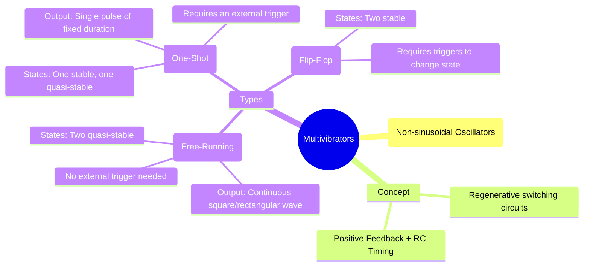

---
tags:
  - analog-electronics
  - op-amp
  - oscillator
  - wave-shaping
  - gate-ee
created: 2025-10-15
aliases:
  - Multivibrators
  - Astable Multivibrator
  - Monostable Multivibrator
  - Relaxation Oscillator
  - One-Shot
subject: "[[Analog & Digital Electronics]]"
parent:
  - Operational Amplifiers (Op-Amps)
modified: 2026-08-04T10:49:36
---
### Waveform Generation - Multivibrators
#multivibrator #regenerative-circuit

> **Multivibrators** are a class of electronic circuits that use positive feedback to implement regenerative switching, producing non-sinusoidal output waveforms like square waves, rectangular waves, and pulses. They are fundamental in timing applications. The two main types built with op-amps are the **Astable** (free-running) and **Monostable** (one-shot) multivibrators.

---
#### 1. Astable Multivibrator (Relaxation Oscillator)
#astable-multivibrator

An astable multivibrator has **no stable states**. It continuously switches between two quasi-stable states without any external trigger. It is a free-running oscillator that generates a square or rectangular wave.

*   **Circuit:** It consists of an op-amp configured as a [[Comparators and Schmitt Triggers|Schmitt Trigger]] (positive feedback via R1, R2) and an RC network that provides timing. The capacitor voltage is fed back to the inverting input.
*   **Operation:**
    1.  Assume the output $V_{out}$ is at $+V_{sat}$. The voltage at the non-inverting terminal is the Upper Threshold Point, $V_{UTP} = \beta V_{sat}$, where $\beta = R_1 / (R_1+R_2)$.
    2.  The capacitor C charges through resistor R towards $+V_{sat}$.
    3.  When the capacitor voltage $v_C$ just exceeds $V_{UTP}$, the op-amp's output switches to $-V_{sat}$.
    4.  Now, the voltage at the non-inverting terminal is the Lower Threshold Point, $V_{LTP} = -\beta V_{sat}$.
    5.  The capacitor C begins to discharge through R towards $-V_{sat}$.
    6.  When $v_C$ drops just below $V_{LTP}$, the output switches back to $+V_{sat}$, and the cycle repeats.
*   **Time Period of Oscillation (T):**
    The time it takes for the capacitor to charge/discharge between the threshold points determines the frequency. The total time period T is given by:
    $$\boxed{\quad T = 2RC \ln\left(\frac{1+\beta}{1-\beta}\right) \quad \text{where } \beta = \frac{R_1}{R_1+R_2} \quad}$$
    For the common special case where $R_1 = R_2$, then $\beta = 1/2$, and the equation simplifies to:
    $$\boxed{\quad T = 2RC \ln(3) \approx 2.2 RC \quad (\text{for } R_1=R_2) \quad}$$
    The frequency of oscillation is $f = 1/T$.

#### 2. Monostable Multivibrator (One-Shot)
#monostable-multivibrator

A monostable multivibrator has **one stable state** and one quasi-stable state. It remains in its stable state until an external trigger pulse is applied. It then switches to its quasi-stable state for a specific duration, determined by the RC components, before automatically returning to the stable state.

*   **Circuit:** The circuit is similar to the astable, but a diode (D) is added to clamp the capacitor voltage, creating a stable state. A trigger input is also required.
*   **Operation:**
    1.  **Stable State:** The output $V_{out}$ is at $+V_{sat}$. The diode D is forward biased, clamping the capacitor voltage $v_C$ at $V_D \approx 0.7V$. The circuit will remain in this state indefinitely as long as $V_D < V_{UTP}$.
    2.  **Triggering:** A short, negative-going trigger pulse is applied, typically to the non-inverting terminal, which momentarily pulls $v_+$ below $v_C$. This causes the output to flip to $-V_{sat}$.
    3.  **Quasi-Stable State:** The output is now $-V_{sat}$. The diode D becomes reverse-biased. The capacitor C begins to discharge (charge negatively) through R towards $-V_{sat}$.
    4.  **Return to Stable State:** The circuit remains in this quasi-stable state until the capacitor voltage $v_C$ drops to the level of $V_{LTP}$. At this point, the output switches back to $+V_{sat}$. The capacitor quickly recharges to $V_D$ through the diode, and the circuit returns to its stable state, awaiting another trigger.
*   **Pulse Width (T):**
    The duration of the output pulse (the time spent in the quasi-stable state) is given by:
    $$\boxed{\quad T = RC \ln\left(\frac{1}{1-\beta}\right) \quad (\text{assuming ideal diode}) \quad}$$
    For the common special case where $R_1 = R_2$, then $\beta = 1/2$:
    $$\boxed{\quad T = RC \ln(2) \approx 0.69 RC \quad (\text{for } R_1=R_2) \quad}$$

---
### Related Concepts
#related-concepts

> [[Comparators and Schmitt Triggers]]

[[Ideal Op-Amp]]
[[Waveform Generation - Sinusoidal Oscillators (RC Phase Shift, Wien Bridge)]]
[[Latches and Flip-Flops (SR, JK, T, D)]] (Digital equivalent of bistable multivibrator)