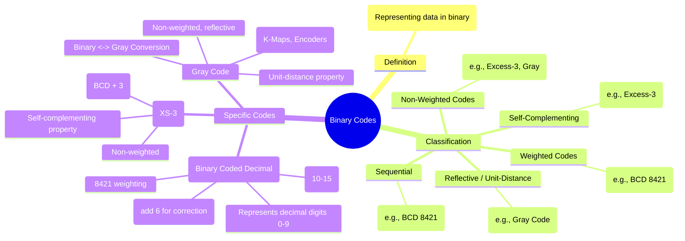

---
tags:
  - digital-logic
  - binary-codes
  - data-representation
  - digital-electronics
created: 2025-10-16
aliases:
  - Binary Codes
  - Weighted Codes
  - Non-Weighted Codes
  - Reflective Codes
  - Gray Code
  - Excess-3 Code
  - XS-3 Code
  - BCD
  - Binary Coded Decimal
subject: "[[Analog & Digital Electronics]]"
parent:
  - "[[Design of Combinational Circuits]]"
modified: 2026-08-04T09:11:13
---
### Binary Codes
#binary-codes #data-representation #digital-logic

> While natural binary is used for arithmetic, various **binary codes** are employed in digital systems to represent decimal digits, characters, and other information. These codes are designed to optimize for specific properties like ease of arithmetic, error detection, or reliability in mechanical-to-digital systems.

---
#### Classification of Codes
#binary-codes/classification

*   **Weighted Codes**: Each bit position has a fixed weight. The decimal value is the sum of the weights for all bits that are '1'.
    *   *Example*: The BCD code `1001` has weights (8, 4, 2, 1), so its value is $8 \times 1 + 4 \times 0 + 2 \times 0 + 1 \times 1 = 9$.
*   **Non-Weighted Codes**: Bit positions do not have a fixed weight.
    *   *Example*: Excess-3 and Gray codes.
*   **Self-Complementing Codes**: The code for the 9's complement of a decimal digit is the 1's complement of the digit's code. This simplifies subtraction logic.
    *   *Example*: Excess-3 code.
*   **Reflective Codes**: The code for decimal 9 is the reflection (1's complement) of the code for 0, 8 for 1, and so on.
    *   *Example*: Gray code.
*   **Sequential Codes**: Each code word is one binary number greater than the previous code word.
    *   *Example*: BCD (8421) is sequential. Gray code is not.

---
#### Binary Coded Decimal (BCD)
#bcd #weighted-code

BCD represents each decimal digit (0-9) with a 4-bit binary number. The most common form is the **8421 weighted code**.
*   It's a weighted and sequential code.
*   The binary combinations for 10 to 15 (`1010` to `1111`) are **invalid** in BCD.
*   **BCD Addition**: If the 4-bit sum of two BCD digits is greater than 9 (`1001`), or if a carry is generated, a correction is needed by adding 6 (`0110`).

*Example: Add $7_{10}$ and $5_{10}$ in BCD.*
$$\begin{align}
\text{7 in BCD} &\quad 0111 \\
\text{5 in BCD} &\quad \underline{+ 0101} \\
\text{Sum} &\quad 1100 \quad (\text{Invalid BCD, since } 12 > 9) \\
\text{Add correction} &\quad \underline{+ 0110} \\
\text{Final Result} &\quad \underbrace{1}_{Carry} \underbrace{0010}_{2} \quad \implies (12)_{BCD}
\end{align}$$

---
#### Excess-3 (XS-3) Code
#excess-3 #non-weighted-code #self-complementing

This is a non-weighted, self-complementing code derived by adding 3 (`0011`) to the natural BCD code of a decimal digit.
*   **Key Property**: It is **self-complementing**. The 9's complement of a decimal digit is obtained by simply taking the 1's complement of its XS-3 representation.
    *   *Example*:
        *   Decimal 2 in XS-3 is $2+3=5 \implies (0101)_{XS-3}$.
        *   Decimal 7 (9's complement of 2) in XS-3 is $7+3=10 \implies (1010)_{XS-3}$.
        *   Notice that $(1010)$ is the 1's complement of $(0101)$.

---
#### Gray Code
#gray-code #reflective-code #unit-distance

Gray code is a non-weighted, cyclic, and reflective code with a special **unit-distance property**: <u>successive code words differ by only a single bit</u>.
*   **Applications**:
    *   Used in [[Logic Minimization using Karnaugh Maps (K-Map)|Karnaugh Maps]] to ensure adjacent cells differ by one variable.
    *   Used in electromechanical position encoders (e.g., shaft encoders) to prevent erroneous readings during transitions. A single bit change minimizes the impact of mechanical misalignment.

##### Binary to Gray Conversion
The MSB of the Gray code is the same as the MSB of the binary number. For all other bits, the Gray code bit is the [[Boolean Algebra and Logic Gates#Logic Gates|XOR]] of the corresponding binary bit and the binary bit to its left (the next most significant bit).
$$\boxed{\quad G_i = B_i \oplus B_{i+1} \quad (\text{where } B_{n} \text{ is MSB and } B_{n+1} \text{ is assumed 0})}$$
*Example: Convert $(1011)_2$ to Gray code.*
*   $G_3 = B_3 = \mathbf{1}$
*   $G_2 = B_3 \oplus B_2 = 1 \oplus 0 = \mathbf{1}$
*   $G_1 = B_2 \oplus B_1 = 0 \oplus 1 = \mathbf{1}$
*   $G_0 = B_1 \oplus B_0 = 1 \oplus 1 = \mathbf{0}$
Result: $(1110)_G$

---
##### Gray to Binary Conversion
The MSB of the binary number is the same as the MSB of the Gray code. For all other bits, the binary bit is the XOR of the corresponding Gray code bit and the *previously calculated* binary bit to its left.
$$\boxed{\quad B_i = G_i \oplus B_{i+1} \quad (\text{where } B_{n} \text{ is MSB})}$$
*Example: Convert $(1110)_G$ to Binary.*
*   $B_3 = G_3 = \mathbf{1}$
*   $B_2 = G_2 \oplus B_3 = 1 \oplus 1 = \mathbf{0}$
*   $B_1 = G_1 \oplus B_2 = 1 \oplus 0 = \mathbf{1}$
*   $B_0 = G_0 \oplus B_1 = 0 \oplus 1 = \mathbf{1}$
Result: $(1011)_2$

---
#### Code Comparison Table

| Decimal | Natural Binary | BCD (8421) | Excess-3 (XS-3) | Gray Code |
|:-------:|:--------------:|:----------:|:---------------:|:---------:|
|    0    |      `0000`      |    `0000`    |      `0011`       |   `0000`    |
|    1    |      `0001`      |    `0001`    |      `0100`       |   `0001`    |
|    2    |      `0010`      |    `0010`    |      `0101`       |   `0011`    |
|    3    |      `0011`      |    `0011`    |      `0110`       |   `0010`    |
|    4    |      `0100`      |    `0100`    |      `0111`       |   `0110`    |
|    5    |      `0101`      |    `0101`    |      `1000`       |   `0111`    |
|    6    |      `0110`      |    `0110`    |      `1001`       |   `0101`    |
|    7    |      `0111`      |    `0111`    |      `1010`       |   `0100`    |
|    8    |      `1000`      |    `1000`    |      `1011`       |   `1100`    |
|    9    |      `1001`      |    `1001`    |      `1100`       |   `1101`    |

---
### Related Concepts

> [[Boolean Algebra and Logic Gates]]
> [[Number Systems]]

[[Logic Minimization using Karnaugh Maps (K-Map)]]
[[Arithmetic Circuits]]
[[Encoders and Decoders]]
[[Analog & Digital Electronics]]