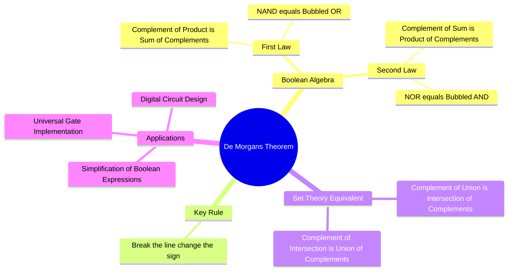

---
tags:
  - digital-electronics
  - boolean-algebra
  - logic-gates
  - mathematics
  - set-theory
  - gate
created: 2026-08-04T09:31:07
aliases:
  - De Morgan's Laws
  - De Morgan Theorem
subject: "[[Analog & Digital Electronics]]"
parent:
  - "[[Boolean Algebra and Logic Gates]]"
modified: 2026-08-04T09:31:07
---
### De Morgan's Theorem
#digital-electronics #boolean-algebra #logic-gates

> **De Morgan's Theorems** are two of the most powerful rules in Boolean Algebra and Set Theory. They provide a mathematical method to express the complement of a logical operation (AND or OR) in terms of the other operation and complemented variables. The popular mnemonic for applying these theorems is: **"Break the line, change the sign."**

---

#### Statements in Boolean Algebra
#boolean-algebra/laws

Let $A$ and $B$ be two Boolean variables.

**Theorem 1: Complement of a Product (NAND)**
The complement of the AND operation of two variables is equal to the OR operation of their individual complements.
$$\boxed{\quad \overline{A \cdot B} = \overline{A} + \overline{B} \quad}$$
*   **Interpretation:** A NAND gate is logically equivalent to a Negative-OR gate.

**Theorem 2: Complement of a Sum (NOR)**
The complement of the OR operation of two variables is equal to the AND operation of their individual complements.
$$\boxed{\quad \overline{A + B} = \overline{A} \cdot \overline{B} \quad}$$
*   **Interpretation:** A NOR gate is logically equivalent to a Negative-AND gate.

---
#### Logic Gate Equivalents (Hardware Level)
#logic-gates/equivalents

De Morgan's theorems are fundamentally about transforming logic gates, which is essential for implementing circuits using Universal Gates (NAND/NOR).

1.  **NAND = Bubbled OR:**
    An AND gate with an inverted output (NAND) behaves identically to an OR gate with inverted inputs (Bubbled OR).
    *   $A \text{ NAND } B \equiv (\text{NOT } A) \text{ OR } (\text{NOT } B)$
2.  **NOR = Bubbled AND:**
    An OR gate with an inverted output (NOR) behaves identically to an AND gate with inverted inputs (Bubbled AND).
    *   $A \text{ NOR } B \equiv (\text{NOT } A) \text{ AND } (\text{NOT } B)$

---
#### Generalization to $n$ Variables
#boolean-algebra/generalization

The theorems easily extend to any number of variables.

For $n$ variables $x_1, x_2, \dots, x_n$:
$$\boxed{\quad \overline{x_1 \cdot x_2 \cdot \dots \cdot x_n} = \overline{x_1} + \overline{x_2} + \dots + \overline{x_n} \quad}$$
$$\boxed{\quad \overline{x_1 + x_2 + \dots + x_n} = \overline{x_1} \cdot \overline{x_2} \cdot \dots \cdot \overline{x_n} \quad}$$

---
#### Set Theory Equivalent
#set-theory/demorgan

In Mathematics (Probability and Set Theory), the operations AND/OR translate to Intersection ($\cap$) and Union ($\cup$), and the overline translates to the Set Complement ($'$ or $^c$).

Let $A$ and $B$ be sets within a universal set $U$.
1.  **Complement of Union:**
    $$\boxed{\quad (A \cup B)' = A' \cap B' \quad}$$
    *(Elements not in A OR B are those elements not in A AND not in B).*
2.  **Complement of Intersection:**
    $$\boxed{\quad (A \cap B)' = A' \cup B' \quad}$$
    *(Elements not in A AND B are those elements not in A OR not in B).*

---
#### Example: Simplification of Boolean Expressions
#digital-electronics/simplification

De Morgan's Theorem is heavily used to simplify complex logical expressions, removing long overlines (complements over grouped variables).

**Example:** Simplify the expression $Y = \overline{(A + \overline{B}) \cdot C}$

**Solution:**
Apply Theorem 1 (break the long line over the AND, change AND to OR):
$$ \begin{align}
Y &= \overline{(A + \overline{B})} + \overline{C} \\
\end{align} $$

Apply Theorem 2 to the first term (break the line over the OR, change OR to AND):
$$ \begin{align}
Y &= (\overline{A} \cdot \overline{\overline{B}}) + \overline{C} \\
\end{align} $$

Apply the Involution Law ($\overline{\overline{B}} = B$):
$$ \begin{align}
Y &= \overline{A}B + \overline{C}
\end{align} $$
This expression is now in a simplified Sum of Products (SOP) form.

---
### Related Concepts
#topic/related-concepts

> [[Boolean Algebra and Logic Gates|Boolean Algebra]] (Fundamental rules and postulates)

[[Boolean Algebra and Logic Gates|Logic Gates]]
[[Universal Gates (NAND and NOR)]] (Circuit realization relies on De Morgan's)
[[Set Theory]] (Mathematical foundation)
[[Logic Minimization using Karnaugh Maps (K-Map)|Karnaugh Map]] (Alternative visual method for simplification)
[[Duality Principle]] (Closely related concept changing AND $\leftrightarrow$ OR)
