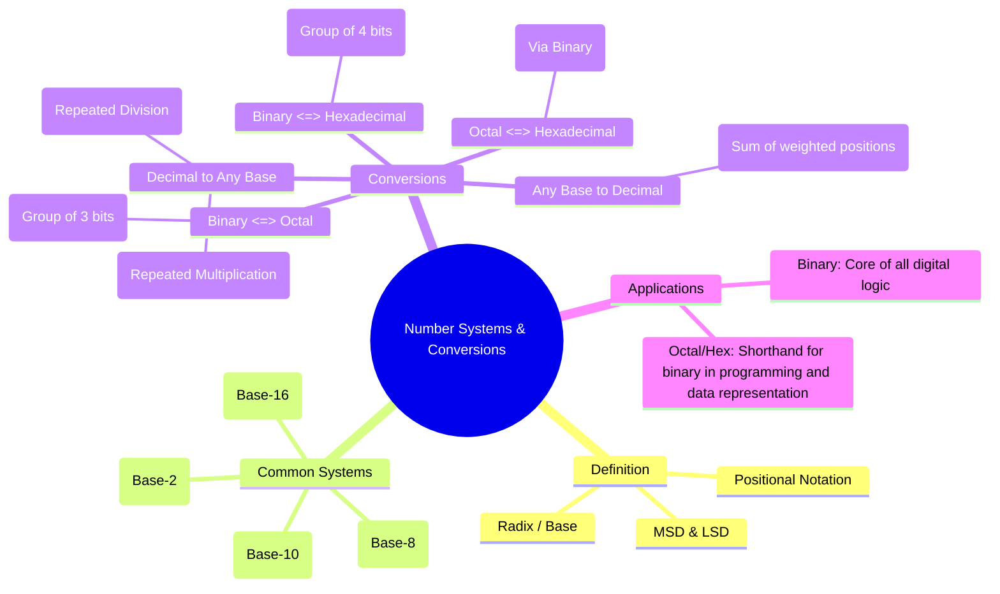

---
tags:
  - digital-logic
  - number-systems
  - digital-electronics
created: 2025-10-15
aliases:
  - Number Systems
  - Radix Representation
  - Binary Number System in Digital Electronics
  - Octal Number System in Digital Electronics
  - Hexadecimal Number System in Digital Electronics
  - Binary Number Conversion
  - Octal Number Conversion
  - Hexadecimal Number Conversion
  - Number System and Conversion
  - Common Number Systems
  - "Example : Number Systems : Decimal, Binary, Octal and Hexadecimal"
subject: "[[Analog & Digital Electronics]]"
parent: Digital Electronics
modified: 2026-08-04T10:08:53
---
### Number Systems and Conversions
#number-systems #digital-fundamentals #radix-conversion

> A number system is a systematic way to represent numbers using a set of symbols and rules. In digital electronics, while all operations are performed in binary, other systems like octal and hexadecimal are used as convenient shorthands for representing long binary numbers. Understanding the representation and conversion between these systems is fundamental.

#### Positional Number System
#positional-notation #radix

Any number $N$ can be expressed in a base (or radix) $r$ system using positional notation. The value of the number is the sum of its digits multiplied by their positional weights.
A number $(d_{n-1}d_{n-2}...d_1d_0.d_{-1}d_{-2}...d_{-m})_r$ has a decimal value of:
$$\boxed{\quad N = \sum_{i=-m}^{n-1} d_i \times r^i \quad}$$
where:
*   $r$ is the radix or base.
*   $d_i$ is the digit at position $i$.
*   $d_{n-1}$ is the Most Significant Digit (MSD).
*   $d_{-m}$ is the Least Significant Digit (LSD).
For binary numbers, these are called the Most Significant Bit (MSB) and Least Significant Bit (LSB).

---
#### Common Number Systems
#binary #octal #hexadecimal

| System        | Base (r) | Digits                                 | Example         |
| ------------- | :------: | -------------------------------------- | --------------- |
| **Decimal**   |    10    | 0, 1, 2, 3, 4, 5, 6, 7, 8, 9           | $(125)_{10}$    |
| **Binary**    |    2     | 0, 1                                   | $(1101)_2$      |
| **Octal**     |    8     | 0, 1, 2, 3, 4, 5, 6, 7                 | $(177)_8$       |
| **Hexadecimal** |    16    | 0-9, A(10), B(11), C(12), D(13), E(14), F(15) | $(A5)_{16}$     |

---
#### Conversion Methods
#number-systems/conversion

##### 1. Any Base to Decimal (Base-10)
#base-to-decimal

Use the positional notation expansion formula.
*Example:* Convert $(1101.11)_2$ to decimal.
$$\begin{align}
(1101.11)_2 &= 1 \times 2^3 + 1 \times 2^2 + 0 \times 2^1 + 1 \times 2^0 + 1 \times 2^{-1} + 1 \times 2^{-2} \\
&= 8 + 4 + 0 + 1 + 0.5 + 0.25 \\
&= (13.75)_{10}
\end{align}$$

*Example:* Convert $(2A.8)_{16}$ to decimal.
$$\begin{align}
(2A.8)_{16} &= 2 \times 16^1 + A \times 16^0 + 8 \times 16^{-1} \\
&= 2 \times 16 + 10 \times 1 + 8 \times 0.0625 \\
&= 32 + 10 + 0.5 \\
&= (42.5)_{10}
\end{align}$$

---
##### 2. Decimal (Base-10) to Any Base
#decimal-to-base

This is a two-part process for numbers with a fractional part.

*   **Integer Part**: Use the **Repeated Division** method. Divide the integer by the target base $r$, note the remainder, and repeat with the quotient until the quotient is 0. The remainders, read from bottom to top, form the new number.
*   **Fractional Part**: Use the **Repeated Multiplication** method. Multiply the fraction by the target base $r$, note the integer part, and repeat with the new fractional part until the fraction becomes 0 or desired precision is reached. The integer parts, read from top to bottom, form the new fraction.

*Example:* Convert $(41.6875)_{10}$ to binary (base-2).

**Integer Part (41):**
$41 \div 2 = 20$ (Rem: **1**) $\uparrow$ LSB
$20 \div 2 = 10$ (Rem: **0**) $\uparrow$
$10 \div 2 = 5$ (Rem: **0**) $\uparrow$
$5 \div 2 = 2$ (Rem: **1**) $\uparrow$
$2 \div 2 = 1$ (Rem: **0**) $\uparrow$
$1 \div 2 = 0$ (Rem: **1**) $\uparrow$ MSB
Integer part is $(101001)_2$.

**Fractional Part (0.6875):**
$0.6875 \times 2 = 1.375$ (Int: **1**) $\downarrow$ MSB
$0.375 \times 2 = 0.75$ (Int: **0**) $\downarrow$
$0.75 \times 2 = 1.5$ (Int: **1**) $\downarrow$
$0.5 \times 2 = 1.0$ (Int: **1**) $\downarrow$ LSB
Fractional part is $(.1011)_2$.

So, $(41.6875)_{10} = (101001.1011)_2$.

---
##### 3. Binary <=> Octal / Hexadecimal (Shortcut)
#binary-conversion-shortcut

This works because $8 = 2^3$ and $16 = 2^4$.

*   **Binary to Octal**: Group binary digits in sets of **3** from the radix point (left and right). Add leading/trailing zeros to complete a group if needed.
    *   Example: $(10110001.11)_2 = (\underbrace{010}_{2}\underbrace{110}_{6}\underbrace{001}_{1}.\underbrace{110}_{6})_2 = (261.6)_8$
*   **Binary to Hexadecimal**: Group binary digits in sets of **4** from the radix point.
    *   Example: $(10110001.11)_2 = (\underbrace{1011}_{B}\underbrace{0001}_{1}.\underbrace{1100}_{C})_2 = (B1.C)_{16}$

$$\boxed{\begin{align}
\text{Binary to Octal} &\implies \text{Group bits in 3s} \\
\text{Binary to Hexadecimal} &\implies \text{Group bits in 4s}
\end{align}}$$

*   **Octal/Hexadecimal to Binary**: Reverse the process. Convert each octal/hex digit to its 3-bit/4-bit binary equivalent.
    *   Example: $(37.21)_8 = (\underbrace{011}_{3}\underbrace{111}_{7}.\underbrace{010}_{2}\underbrace{001}_{1})_2 = (011111.010001)_2$
    *   Example: $(F5.A)_{16} = (\underbrace{1111}_{F}\underbrace{0101}_{5}.\underbrace{1010}_{A})_2 = (11110101.1010)_2$

---
##### 4. Octal <=> Hexadecimal
#octal-hexadecimal-conversion

The easiest way is to use binary as an intermediate base.
*   **Octal to Hexadecimal**: `Octal -> Binary -> Hexadecimal`
*   **Hexadecimal to Octal**: `Hexadecimal -> Binary -> Octal`

*Example:* Convert $(275)_8$ to Hexadecimal.
1.  **To Binary**: $(275)_8 = (010\ 111\ 101)_2$
2.  **To Hex**: Regroup in 4s: $(\underbrace{1011}_{B}\underbrace{1101}_{D})_2 = (BD)_{16}$

---
### Related Concepts

> [[Binary Codes (BCD, Gray Code, Excess-3)]]

[[Boolean Algebra and Logic Gates]]
[[Arithmetic Circuits]]
[[Signed Number Representation]]
[[Analog & Digital Electronics]]
