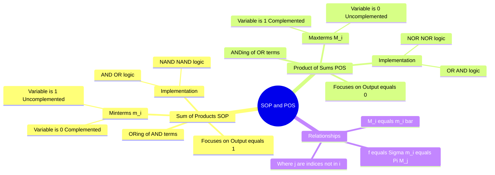

---
tags:
  - digital-electronics
  - boolean-algebra
  - logic-design
  - gate
created: 2026-03-18
aliases:
  - Canonical Forms
  - Minterms and Maxterms
  - Standard SOP and POS
subject: "[[Analog & Digital Electronics]]"
parent:
  - "[[Boolean Algebra and Logic Gates]]"
modified: 2026-08-04T10:36:58
---
### Sum of Products (SOP) and Product of Sums (POS)
#digital-electronics/boolean-algebra #logic-design

> **SOP (Sum of Products)** and **POS (Product of Sums)** are the two standard ways to express a Boolean function. They directly translate truth tables into algebraic expressions. SOP focuses on the input combinations that produce a `1` (True) output, while POS focuses on the combinations that produce a `0` (False) output.

---
#### Sum of Products (SOP) & Minterms
#boolean-algebra/sop #minterms

An SOP expression consists of two or more AND terms (products) that are ORed (summed) together.
*   *Example:* $Y = AB + \overline{A}C + BC$

**Minterms ($m_i$):**
A **Standard (or Canonical) SOP** expression contains only **minterms**. A minterm is a product term that contains *all* the variables of the function exactly once (either complemented or uncomplemented).
*   A minterm evaluates to `1` for exactly one specific combination of inputs.
*   **Convention:** For a minterm, if a variable is `1`, it is written **uncomplemented** ($A$). If it is `0`, it is written **complemented** ($\overline{A}$).
*   *Example (3 variables $A, B, C$):* The input `101` (decimal 5) corresponds to the minterm $m_5 = A\overline{B}C$.

A function can be written as the sum of its minterms:
$$\boxed{\quad f(A,B,C) = \sum m(1, 3, 5, 7) \quad}$$
This means the output is `1` when the input is 1, 3, 5, or 7.

---
#### Product of Sums (POS) & Maxterms
#boolean-algebra/pos #maxterms

A POS expression consists of two or more OR terms (sums) that are ANDed (multiplied) together.
*   *Example:* $Y = (A+B) \cdot (\overline{A}+C) \cdot (B+C)$

**Maxterms ($M_i$):**
A **Standard (or Canonical) POS** expression contains only **maxterms**. A maxterm is a sum term that contains *all* the variables of the function exactly once.
*   A maxterm evaluates to `0` for exactly one specific combination of inputs.
*   **Convention:** For a maxterm, the rule is inverted. If a variable is `0`, it is written **uncomplemented** ($A$). If it is `1`, it is written **complemented** ($\overline{A}$).
*   *Example (3 variables $A, B, C$):* The input `101` (decimal 5) corresponds to the maxterm $M_5 = \overline{A} + B + \overline{C}$.

A function can be written as the product of its maxterms:
$$\boxed{\quad f(A,B,C) = \prod M(0, 2, 4, 6) \quad}$$
This means the output is `0` when the input is 0, 2, 4, or 6.

---
#### Relationship between Minterms and Maxterms
#boolean-algebra/conversion

By [[De Morgan's Theorem]], a maxterm is the exact complement of its corresponding minterm, and vice versa.
$$\boxed{\quad M_i = \overline{m_i} \quad \text{and} \quad m_i = \overline{M_i} \quad}$$

**Converting SOP to POS:**
If a function is defined by a set of minterms, the same function can be defined by the POS of the **missing indices** (the maxterms).
Let $n$ be the number of variables. The total number of combinations is $2^n$.
If $f(A,B,C) = \sum m(1, 2, 4, 7)$
Then identically:
$$\boxed{\quad f(A,B,C) = \prod M(0, 3, 5, 6) \quad}$$

**Complement of a Function ($f'$):**
To find the complement of the entire function, you take the remaining indices in the *same* form:
*   $f'(A,B,C) = \sum m(0, 3, 5, 6)$
*   $f'(A,B,C) = \prod M(1, 2, 4, 7)$

---
#### Expanding to Canonical Form
#gate/problem-solving

In GATE, you often receive a non-standard expression and need to find the number of minterms.
**Rule:** AND the missing variable using $(X + \overline{X}) = 1$ for SOP.

*   *Example:* Convert $Y = AB + C$ to standard SOP (3 variables $A,B,C$).
    *   $AB$ is missing $C$: $AB(C + \overline{C}) = ABC + AB\overline{C} = m_7 + m_6$
    *   $C$ is missing $A,B$: $(A + \overline{A})(B + \overline{B})C = (AB + A\overline{B} + \overline{A}B + \overline{A}\overline{B})C = ABC + A\overline{B}C + \overline{A}BC + \overline{A}\overline{B}C = m_7 + m_5 + m_3 + m_1$
    *   Total $Y = \sum m(1, 3, 5, 6, 7)$ (Removing duplicates).

---
#### Hardware Implementation (Two-Level Logic)
#logic-gates/implementation

The form of the expression directly dictates the physical logic gate implementation.

1.  **SOP Form:**
    *   Directly implements as a two-level **AND-OR** circuit.
    *   Using De Morgan's, this is logically equivalent to a **NAND-NAND** circuit. (Highly preferred in IC design as NAND is a universal gate).
2.  **POS Form:**
    *   Directly implements as a two-level **OR-AND** circuit.
    *   Using De Morgan's, this is logically equivalent to a **NOR-NOR** circuit.

---
### Related Concepts
#topic/related-concepts

> [[Logic Minimization using Karnaugh Maps (K-Map)]] (Used to minimize SOP/POS expressions)

[[Boolean Algebra and Logic Gates|Boolean Algebra]]
[[De Morgan's Theorem]]
[[Boolean Algebra and Logic Gates|Logic Gates]]
[[Universal Gates (NAND and NOR)]]
[[Combinational Logic Circuits]]
