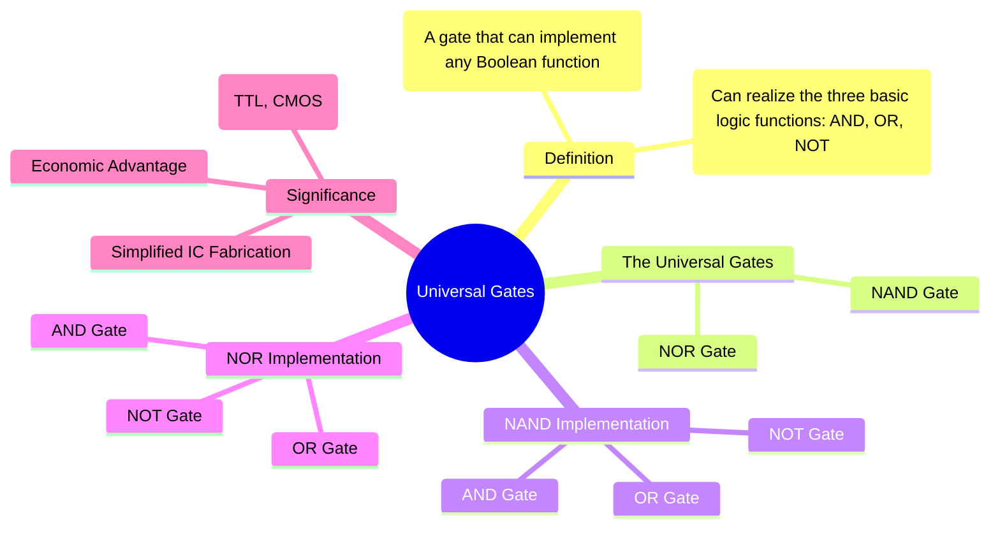

---
tags:
  - digital-logic
  - universal-gates
  - logic-synthesis
  - digital-electronics
created: 2025-10-18
aliases:
  - Universal Logic Gates
  - NAND Universality
  - NOR Universality
subject: "[[Analog & Digital Electronics]]"
parent:
  - Digital Electronics
modified: 2026-08-04T10:46:38
---
### Universal Gates (NAND and NOR)
#universal-gates #logic-synthesis #digital-design

> A universal gate is a logic gate that can be used, by itself, to implement any Boolean function. The **NAND** and **NOR** gates are the two universal gates in digital logic. This property is extremely important in the manufacturing of Integrated Circuits (ICs), as it allows complex digital systems to be fabricated using only one type of gate, which simplifies the production process and reduces costs.

---

|                                                                         NAND                                                                          |                                                                        NOR                                                                        |
| :---------------------------------------------------------------------------------------------------------------------------------------------------: | :-----------------------------------------------------------------------------------------------------------------------------------------------: |
|                                                                  ![[NAND Gate.png]]                                                                   |                                                                 ![[NOR Gate.png]]                                                                 |
| $$\begin{array}{\|c\|c\|c\|} \hline A & B & Q=\overline{A \cdot B} \\ \hline 0 & 0 & 1 \\ 0 & 1 & 1 \\ 1 & 0 & 1 \\ 1 & 1 & 0 \\ \hline \end{array}$$ | $$\begin{array}{\|c\|c\|c\|} \hline A & B & Q=\overline{A + B} \\ \hline 0 & 0 & 1 \\ 0 & 1 & 0 \\ 1 & 0 & 0 \\ 1 & 1 & 0 \\ \hline \end{array}$$ |
|                                                                                                                                                       |                                                                                                                                                   |

The proof of universality lies in showing that the three basic logic operations (NOT, AND, OR) can be realized using only the universal gate in question.

> See more [[Boolean Algebra and Logic Gates#Logic Gates|Logic Gates]]

---
#### NAND as a Universal Gate
#nand-gate #universality

Any logic function can be implemented using only NAND gates.

##### 1. NOT Gate from NAND
A NOT gate (inverter) is created by connecting all inputs of a NAND gate together.
When both inputs are A, the output is $(A \cdot A)' = A'$.
$$\boxed{\quad A' = (A \cdot A)' \quad}$$

![[NOT Gate using NAND Gate.png]]

---
##### 2. AND Gate from NAND
An AND gate is created by inverting the output of a NAND gate. This requires two NAND gates: one to perform the NAND operation and a second configured as an inverter.
$$\boxed{\quad A \cdot B = ((A \cdot B)')' \quad}$$

![[AND Gate using NAND Gate.png]]

---
##### 3. OR Gate from NAND
An OR gate is realized by inverting the inputs before they are fed into a NAND gate. This requires three NAND gates. This implementation is a direct application of [[De Morgan's theorem]].
$$\boxed{\quad A + B = (A' \cdot B')' \quad}$$
According to De Morgan's law, $(A' \cdot B')' = (A')' + (B')' = A + B$.

![[OR Gate using NAND Gate.png]]

---
#### NOR as a Universal Gate
#nor-gate #universality

Similarly, any logic function can be implemented using only NOR gates.

##### 1. NOT Gate from NOR
A NOT gate is created by connecting all inputs of a NOR gate together.
When both inputs are A, the output is $(A + A)' = A'$.
$$\boxed{\quad A' = (A + A)' \quad}$$

![[NOT Gate using NOR Gate.png]]

---
##### 2. OR Gate from NOR
An OR gate is created by inverting the output of a NOR gate. This requires two NOR gates.
$$\boxed{\quad A + B = ((A + B)')' \quad}$$

![[OR Gate using NOR Gate.png]]

---
##### 3. AND Gate from NOR
An AND gate is realized by inverting the inputs before they are fed into a NOR gate. This requires three NOR gates and is also based on [[De Morgan's theorem]].
$$\boxed{\quad A \cdot B = (A' + B')' \quad}$$
According to De Morgan's law, $(A' + B')' = (A')' \cdot (B')' = A \cdot B$.

![[AND Gate using NOR Gate.png]]

---
#### Significance in Digital Logic Design
#ic-fabrication #logic-design

*   **Economic & Manufacturing Simplicity**: Fabricating an IC with just one type of gate (e.g., NAND) is far simpler and more cost-effective than using a mix of different gates. It standardizes the design and production flow.
*   **Foundation of Logic Families**: Many popular logic families are based on a fundamental universal gate. For example, Transistor-Transistor Logic (TTL) is naturally a NAND-based logic family, while CMOS logic can easily implement both NAND and NOR gates, which serve as the building blocks for all other functions.

---
### Related Concepts

> [[Logic Minimization using Karnaugh Maps (K-Map)]]
> [[Boolean Algebra and Logic Gates]]

[[De Morgan's Theorem]]
[[Logic Families - TTL, ECL, CMOS]]
[[Design of Combinational Circuits]]
[[Analog & Digital Electronics]]
