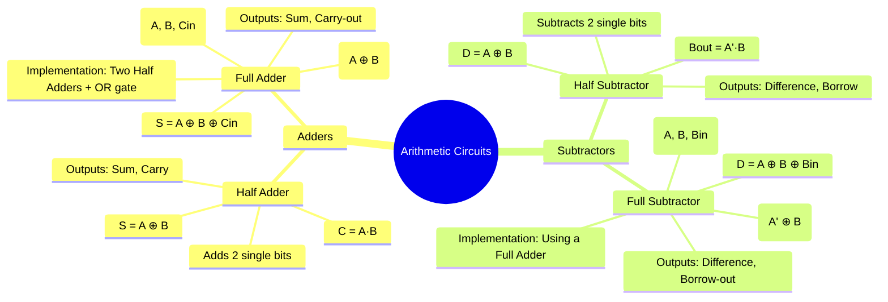

---
tags:
  - digital-logic
  - combinational-circuits
  - arithmetic-circuits
  - digital-electronics
created: 2025-10-21
aliases:
  - Adders and Subtractors
  - Half Adder
  - Full Adder
  - Half Subtractor
  - Full Subtractor
  - Arithmetic Circuits - Half Adder, Full Adder, Subtractors
subject: "[[Analog & Digital Electronics]]"
parent: "[[Design of Combinational Circuits]]"
modified: 2026-08-04T09:09:57
---
### Arithmetic Circuits
#arithmetic-circuits #combinational-logic #digital-design

> Arithmetic circuits are combinational logic circuits designed to perform arithmetic operations such as addition, subtraction, multiplication, and division on binary numbers. Adders and subtractors are the fundamental building blocks of the Arithmetic Logic Unit (ALU) in a CPU.

---
#### Half Adder
#half-adder

A **Half Adder** is a combinational circuit that performs the addition of **two single bits**. It produces two outputs: a Sum (S) and a Carry (C).

*   **Inputs**: A, B
*   **Outputs**: Sum (S), Carry (C)

**Truth Table:**

| $A$ | $B$ | $S$ | $C$ |
| :-: | :-: | :-: | :-: |
|  0  |  0  |  0  |  0  |
|  0  |  1  |  1  |  0  |
|  1  |  0  |  1  |  0  |
|  1  |  1  |  0  |  1  |

From the truth table, the Boolean expressions are:
$$\boxed{\quad S = A'B + AB' = A \oplus B \quad}$$
$$\boxed{\quad C = A \cdot B \quad}$$
**Logic Diagram:**

---
#### Full Adder
#full-adder

A **Full Adder** is a combinational circuit that performs the addition of **three single bits**: two input bits (A, B) and a carry-in bit (Cin) from a previous stage. It is the essential component for building multi-bit adders.

*   **Inputs**: A, B, Cin
*   **Outputs**: Sum (S), Carry-out (Cout)

**Truth Table:**

| $A$ | $B$ | $C_{in}$ | $S$ | $C_{out}$ |
| :-: | :-: | :------: | :-: | :-------: |
|  0  |  0  |    0     |  0  |     0     |
|  0  |  0  |    1     |  1  |     0     |
|  0  |  1  |    0     |  1  |     0     |
|  0  |  1  |    1     |  0  |     1     |
|  1  |  0  |    0     |  1  |     0     |
|  1  |  0  |    1     |  0  |     1     |
|  1  |  1  |    0     |  0  |     1     |
|  1  |  1  |    1     |  1  |     1     |

From the truth table or a K-map, the simplified expressions are:
$$\boxed{\quad S = A'B'C_{in} + A'BC'_{in} + AB'C'_{in} + ABC_{in} = A \oplus B \oplus C_{in} \quad}$$
$$\boxed{\quad C_{out} = AB + BC_{in} + AC_{in} = AB + C_{in}(A \oplus B) \quad}$$
**Implementation using Half Adders:** A Full Adder can be constructed from two Half Adders and an OR gate, which is a very common design.

---
#### Half Subtractor
#half-subtractor

A **Half Subtractor** is a combinational circuit that subtracts **two single bits**. It produces two outputs: a Difference (D) and a Borrow-out (Bout).

*   **Inputs**: A, B
*   **Outputs**: Difference (D), Borrow-out (Bout)

**Truth Table:**

| $A$ | $B$ | $D$ | $B_{out}$ |
| :-: | :-: | :-: | :-------: |
|  0  |  0  |  0  |     0     |
|  0  |  1  |  1  |     1     |
|  1  |  0  |  1  |     0     |
|  1  |  1  |  0  |     0     |

From the truth table, the Boolean expressions are:
$$\boxed{\quad D = A'B + AB' = A \oplus B \quad}$$
$$\boxed{\quad B_{out} = A' \cdot B \quad}$$

---
#### Full Subtractor
#full-subtractor

A **Full Subtractor** is a combinational circuit that subtracts **three single bits**: two input bits (A, B) and a borrow-in bit (Bin) from a previous stage.

*   **Inputs**: A, B, Bin
*   **Outputs**: Difference (D), Borrow-out (Bout)

**Truth Table:**

| $A$ | $B$ | $B_{in}$ | $D$ | $B_{out}$ |
| :-: | :-: | :------: | :-: | :-------: |
|  0  |  0  |    0     |  0  |     0     |
|  0  |  0  |    1     |  1  |     1     |
|  0  |  1  |    0     |  1  |     1     |
|  0  |  1  |    1     |  0  |     1     |
|  1  |  0  |    0     |  1  |     0     |
|  1  |  0  |    1     |  0  |     0     |
|  1  |  1  |    0     |  0  |     0     |
|  1  |  1  |    1     |  1  |     1     |

From the truth table or a K-map, the simplified expressions are:
$$\boxed{\quad D = A \oplus B \oplus B_{in} \quad}$$
$$\boxed{\quad B_{out} = A'B + A'B_{in} + BB_{in} = A'B + B_{in}(A \oplus B)' \quad}$$
**Implementation using a Full Adder:** A Full Subtractor can be implemented using a Full Adder and inverters. The subtraction $A - B$ is equivalent to $A + (-B)$. In 2's complement, $-B = B' + 1$. A full subtractor for $A - B - B_{in}$ can be realized by computing $A + B' + (1-B_{in})$ in a more complex setup, but a common direct implementation uses the Full Adder structure by feeding $B$ through an inverter.

---
### Related Concepts

> [[Parallel Adders and Look-Ahead Carry Adders]]

[[Design of Combinational Circuits]]
[[Boolean Algebra and Logic Gates]]
[[Digital Comparators]]
[[Analog & Digital Electronics]]