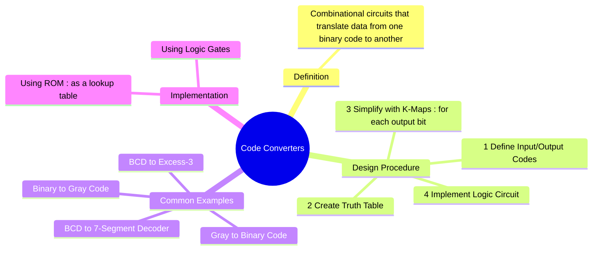

---
tags:
  - digital-logic
  - combinational-circuits
  - code-converter
  - digital-design
  - digital-electronics
created: 2025-10-25
aliases:
  - Code Converter
  - Code Conversion Circuits
subject: "[[Analog & Digital Electronics]]"
parent: "[[Design of Combinational Circuits]]"
modified: 2026-08-04T09:18:39
---
### Code Converters
#code-converter #combinational-logic #digital-design

> A **Code Converter** is a combinational logic circuit designed to change the bit pattern of data from one type of binary code to another. Examples include converting from Binary to Gray code, BCD to Excess-3, or BCD to the signals required to drive a 7-segment display. The design of any code converter follows the standard procedure for combinational circuits: creating a truth table, simplifying the logic for each output bit using K-maps, and then implementing the resulting expressions with logic gates.

---
#### Binary to Gray Code Converter
#binary-to-gray-converter

This circuit converts an n-bit natural binary number to its n-bit Gray code equivalent. The primary advantage of Gray code is its unit-distance property, which is useful in positional encoders.

The conversion logic is based on the XOR operation:
*   The Most Significant Bit (MSB) of the Gray code ($G_n$) is the same as the MSB of the binary code ($B_n$).
*   For all other bits, the Gray code bit is the XOR of the corresponding binary bit and the binary bit to its left (the next most significant bit).
$$\boxed{\quad G_i = B_i \oplus B_{i+1} \quad (\text{with } G_{MSB} = B_{MSB}) \quad}$$
**4-bit Binary to Gray Converter Logic Diagram:**

---
#### Gray to Binary Code Converter
#gray-to-binary-converter

This circuit performs the inverse operation, converting an n-bit Gray code back to its natural binary equivalent.

The conversion logic is slightly different:
*   The MSB of the binary code ($B_n$) is the same as the MSB of the Gray code ($G_n$).
*   For all other bits, the binary bit is the XOR of the corresponding Gray code bit and the *previously calculated* binary bit to its left.
$$\boxed{\quad B_i = G_i \oplus B_{i+1} \quad (\text{with } B_{MSB} = G_{MSB}) \quad}$$
**4-bit Gray to Binary Converter Logic Diagram:**

---
#### BCD to 7-Segment Decoder/Driver
#bcd-to-7-segment

This is a very common practical code converter used to drive a common-cathode 7-segment display. It takes a 4-bit BCD input (representing a decimal digit 0-9) and outputs 7 signals (a, b, c, d, e, f, g) to light up the appropriate segments of the display.

**Design Process:**
1.  **Truth Table**: A truth table is created with 4 BCD inputs (D, C, B, A) and 7 outputs (a-g).
2.  **Don't Cares**: Since BCD is only valid for digits 0-9, the input combinations for 10 through 15 are invalid. These are treated as **don't care conditions (X)** in the K-maps, which allows for significant simplification.
3.  **K-Maps**: A separate 4-variable K-map is created for each of the 7 output segments.
4.  **Implementation**: The simplified expressions are implemented with logic gates.

**Example Truth Table (partial):**

| Dec | D C B A | a | b | c | d | e | f | g |
|:---:|:---:|:-:|:-:|:-:|:-:|:-:|:-:|:-:|
| 0 | 0 0 0 0 | 1 | 1 | 1 | 1 | 1 | 1 | 0 |
| 1 | 0 0 0 1 | 0 | 1 | 1 | 0 | 0 | 0 | 0 |
| 2 | 0 0 1 0 | 1 | 1 | 0 | 1 | 1 | 0 | 1 |
| ... | ... |...|...|...|...|...|...|...|
| 9 | 1 0 0 1 | 1 | 1 | 1 | 0 | 0 | 1 | 1 |
| 10 | 1 0 1 0 | X | X | X | X | X | X | X |
| ... | ... |...|...|...|...|...|...|...|
| 15 | 1 1 1 1 | X | X | X | X | X | X | X |

The simplified expression for each segment is derived from its K-map. For example, the logic for segment 'a' is a complex SOP expression derived from its map.

---
### Related Concepts

> [[Binary Codes (BCD, Gray Code, Excess-3)]]

[[Design of Combinational Circuits]]
[[Logic Minimization using Karnaugh Maps (K-Map)]]
[[Encoders and Decoders]]
[[Multiplexers (MUX) and Demultiplexers (DEMUX)]]
[[Analog & Digital Electronics]]
