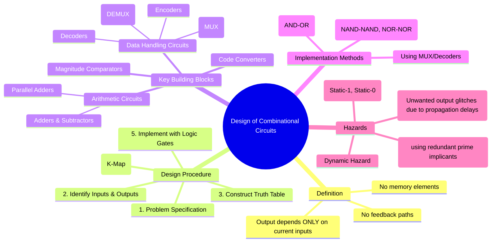

---
tags:
  - digital-logic
  - combinational-circuits
  - digital-design
  - digital-electronics
created: 2025-10-20
aliases:
  - Combinational Logic Design
  - Combinational Circuits
subject: "[[Analog & Digital Electronics]]"
parent:
  - Digital Electronics
modified: 2026-08-04T09:32:05
---
### Design of Combinational Circuits
#combinational-logic #digital-design #logic-circuits

> A **combinational logic circuit** is a type of digital circuit where the output is a pure function of only the present input values. These circuits have no memory or feedback loops, meaning the output will change immediately (ignoring propagation delay) in response to a change in inputs. All digital circuits are built from a combination of these fundamental circuits and sequential circuits.

---
#### Design Procedure
#combinational-design/procedure

The design of a combinational circuit is a systematic process that transforms a problem specification into a functional logic diagram.

1.  **Problem Specification**: Clearly define the function of the circuit, what it is supposed to do.
2.  **Identify Inputs and Outputs**: Determine the number of input variables and the number of required output functions.
3.  **Construct Truth Table**: Create a truth table that maps every possible combination of inputs to the corresponding desired outputs.
4.  **Boolean Simplification**: For each output function, derive the simplest possible Boolean expression. This is typically done using a [[Logic Minimization using Karnaugh Maps (K-Map)|Karnaugh Map]] or [[Boolean Algebra and Logic Gates#Boolean Algebra Postulates and Theorems|Boolean algebra theorems]]. The goal is to minimize the number of gates and gate inputs.
5.  **Logic Diagram Implementation**: Draw the logic circuit diagram based on the simplified Boolean expressions using appropriate logic gates.
##### Example

*Example: Design a 3-bit prime number detector.*
1.  **Spec**: Output is 1 if the 3-bit input number (A, B, C) is a prime number (1, 2, 3, 5, 7).
2.  **I/O**: 3 inputs (A, B, C), 1 output (Y).
3.  **Truth Table**:

    | A | B | C | Decimal | Y (is Prime?) |
    |:---:|:---:|:---:|:---:|:---:|
    | 0 | 0 | 0 | 0 | 0 |
    | 0 | 0 | 1 | 1 | 1 |
    | 0 | 1 | 0 | 2 | 1 |
    | 0 | 1 | 1 | 3 | 1 |
    | 1 | 0 | 0 | 4 | 0 |
    | 1 | 0 | 1 | 5 | 1 |
    | 1 | 1 | 0 | 6 | 0 |
    | 1 | 1 | 1 | 7 | 1 |
    
4.  **[[Logic Minimization using Karnaugh Maps (K-Map)#🔥Procedure for SOP Minimization (Grouping '1's)|K-Map Simplification]]** for $Y(A,B,C) = \sum m(1, 2, 3, 5, 7)$:
    *   Grouping `m(1,3,5,7)` gives a quad, simplifying to $C$.
    *   Grouping `m(2,3)` gives a pair, simplifying to $A'B$.
    *   Simplified SOP: $Y = C + A'B$
5.  **Implementation**: An OR gate with inputs C and the output of an AND gate (with inputs A' and B).

---
#### Standard Combinational Building Blocks
#combinational-logic/building-blocks

Many complex digital systems are built using standard, pre-designed combinational circuits.
*   **Arithmetic Circuits**: Perform arithmetic operations like addition and subtraction.
    *   [[Arithmetic Circuits]]
    *   [[Parallel Adders and Look-Ahead Carry Adders]]
*   **Data Handling Circuits**: Used for routing, selecting, and distributing data.
    *   [[Multiplexers (MUX) and Demultiplexers (DEMUX)]]
    *   [[Encoders and Decoders]]
*   **Code Converters**: Convert data from one binary code to another.
    *   [[Binary Codes (BCD, Gray Code, Excess-3)|Code Converters]] (e.g., Binary to Gray)
*   **Magnitude Comparators**: Compare the magnitudes of two binary numbers.
    *   [[Digital Comparators]]

---
#### Hazards in Combinational Circuits
#logic-hazards #timing-issues

A **hazard** is a short, unwanted glitch or transient pulse that can appear at the output of a combinational circuit due to unequal propagation delays through different signal paths.

*   **Static Hazard**: The output is supposed to remain at a constant logic level but glitches to the opposite level.
    *   **Static-1 Hazard**: The output should be 1 but momentarily goes to 0. Occurs when two adjacent '1's in a K-map are not covered by the same group.
    *   **Static-0 Hazard**: The output should be 0 but momentarily goes to 1. Occurs when two adjacent '0's are not covered by the same group in a POS implementation.
*   **Dynamic Hazard**: The output is supposed to change from one level to the other but changes multiple times before settling.

##### Elimination of Static Hazards
Static-1 hazards in SOP implementations can be eliminated by adding **redundant prime implicants** to the K-map. The rule is to ensure that every pair of adjacent '1's is covered by a common group.
$$\boxed{\quad \text{Hazards are eliminated by adding redundant terms that cover transitions.} \quad}$$
*Example: A function $F = A'B + AC$. When B=1, C=1, and A transitions from 1 to 0, both terms may momentarily be 0, causing a glitch. A redundant term $BC$ (covering the transition) would prevent this: $F = A'B + AC + BC$.* (See [[Boolean Algebra and Logic Gates#Important Theorems for Simplification|Consensus Theorem]])

---
### Related Concepts

> [[Logic Minimization using Karnaugh Maps (K-Map)]]

[[Universal Gates (NAND and NOR)]]
[[Boolean Algebra and Logic Gates]]
[[Sequential Logic Circuits]]
