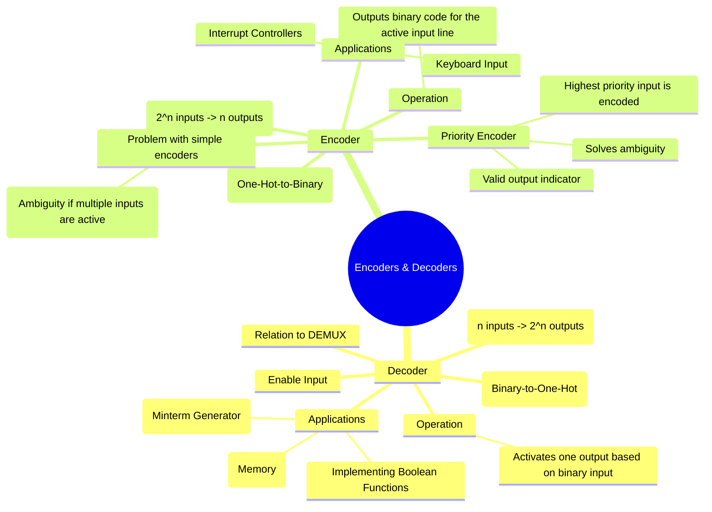

---
tags:
  - digital-logic
  - combinational-circuits
  - decoder
  - encoder
  - digital-electronics
created: 2025-10-24
aliases:
  - Encoders
  - Decoders
  - Priority Encoder
  - "Example : 2-to-4 Line Decoder"
  - "Example : 4-to-2 Priority Encoder"
subject: "[[Analog & Digital Electronics]]"
parent: "[[Design of Combinational Circuits]]"
modified: 2026-08-04T09:37:31
---
### Encoders and Decoders
#encoder #decoder #combinational-logic

> Encoders and Decoders are combinational logic circuits that perform code conversions. They are essentially inverse operations of each other. A **Decoder** converts an n-bit binary code into one of $2^n$ unique output lines. An **Encoder** performs the reverse operation, converting one of $2^n$ active input lines into an n-bit binary code.

---
#### Decoders
#decoder #minterm-generator

A decoder is a combinational circuit that converts binary information from $n$ input lines to a maximum of $2^n$ unique output lines. For any given binary input, only one output line is activated (goes HIGH). This makes them ideal "minterm generators".

##### Example: 2-to-4 Line Decoder
A 2-to-4 decoder has 2 inputs ($A_1, A_0$) and 4 outputs ($Y_0$ to $Y_3$). An **Enable (E)** input is often included to activate or deactivate the decoder.

**Truth Table (Active-High Output):**

| E | $A_1$ | $A_0$ | $Y_3$ | $Y_2$ | $Y_1$ | $Y_0$ |
|:-:|:---:|:---:|:---:|:---:|:---:|:---:|
| 0 | X | X | 0 | 0 | 0 | 0 |
| 1 | 0 | 0 | 0 | 0 | 0 | 1 |
| 1 | 0 | 1 | 0 | 0 | 1 | 0 |
| 1 | 1 | 0 | 0 | 1 | 0 | 0 |
| 1 | 1 | 1 | 1 | 0 | 0 | 0 |

The output equations are direct representations of the minterms:
$$\begin{align}
Y_0 &= E \cdot A_1' \cdot A_0' \\
Y_1 &= E \cdot A_1' \cdot A_0 \\
Y_2 &= E \cdot A_1 \cdot A_0' \\
Y_3 &= E \cdot A_1 \cdot A_0
\end{align}$$

##### Implementing Boolean Functions with a Decoder
Since a decoder generates all minterms for its input variables, any SOP Boolean function can be implemented by OR-ing the decoder outputs corresponding to the function's minterms.
$$\boxed{\quad \text{A decoder plus an OR gate can implement any SOP function.} \quad}$$
*Example:* Implement $F(A,B) = \sum m(1,3)$ using a 2-to-4 decoder.
This is done by connecting the outputs $Y_1$ and $Y_3$ of the decoder to an OR gate.

**Other Applications**: Address decoding in memory systems, BCD-to-7-segment display drivers.

---
#### Encoders
#encoder #priority-encoder

An encoder is the inverse of a decoder. It has $2^n$ input lines and $n$ output lines. It generates the binary code corresponding to which input line is active.

##### The Problem with Simple Encoders
If more than one input is active at the same time, the output is ambiguous. For example, if both inputs $I_1$ and $I_2$ are high, what should the binary output be? This problem is solved by using a **Priority Encoder**.

##### Priority Encoder
A priority encoder includes a priority function. If two or more inputs are active simultaneously, the input with the highest established priority will take precedence and be represented at the output. They also typically include a **Valid (V)** output to indicate that at least one input is active.

##### Example: 4-to-2 Priority Encoder
Assume input $I_3$ has the highest priority and $I_0$ has the lowest.

**Truth Table:**

| $I_3$ | $I_2$ | $I_1$ | $I_0$ | V | $Y_1$ | $Y_0$ | Description |
|:---:|:---:|:---:|:---:|:-:|:---:|:---:| --- |
| 0 | 0 | 0 | 0 | 0 | X | X | No input active |
| 0 | 0 | 0 | 1 | 1 | 0 | 0 | $I_0$ is active |
| 0 | 0 | 1 | X | 1 | 0 | 1 | $I_1$ is active (don't care about $I_0$) |
| 0 | 1 | X | X | 1 | 1 | 0 | $I_2$ is active (don't care about $I_1, I_0$) |
| 1 | X | X | X | 1 | 1 | 1 | $I_3$ is active (highest priority) |

From a K-map or observation, the simplified output expressions are:
$$\boxed{\begin{align}
Y_1 &= I_3 + I_2 \\
Y_0 &= I_3 + I_2'I_1 \\
V &= I_3 + I_2 + I_1 + I_0
\end{align}}$$
**Applications**: Keyboard encoders (converting a key press to ASCII/binary), interrupt controllers in CPUs (prioritizing hardware interrupt requests).

---
### Related Concepts

> [[Multiplexers (MUX) and Demultiplexers (DEMUX)]] (A decoder with enable is a DEMUX)

[[Design of Combinational Circuits]]
[[Boolean Algebra and Logic Gates]]
[[Code Converters]]
[[Analog & Digital Electronics]]