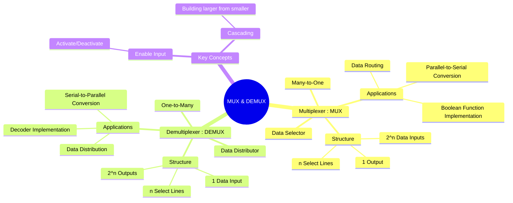

---
tags:
  - digital-logic
  - combinational-circuits
  - data-selector
  - data-distributor
  - digital-electronics
created: 2025-10-23
aliases:
  - MUX
  - DEMUX
  - Multiplexer
  - Demultiplexer
  - Data Selector
  - Data Distributor
  - "Example : 4-to-1 MUX"
  - "Example : 1-to-4 DEMUX"
subject: "[[Analog & Digital Electronics]]"
parent: "[[Design of Combinational Circuits]]"
modified: 2026-08-04T10:05:00
---
### Multiplexers (MUX) and Demultiplexers (DEMUX)
#data-handling-circuits #combinational-logic

> Multiplexers and Demultiplexers are fundamental combinational logic circuits used for data routing and control. A **Multiplexer (MUX)** selects one of several input lines and directs it to a single output line. A **Demultiplexer (DEMUX)** performs the reverse operation, taking a single input and distributing it to one of many output lines.

---
#### Multiplexer (MUX) - The Data Selector
#multiplexer #mux

A multiplexer, often called a MUX or data selector, is a circuit with $2^n$ data inputs, $n$ select lines, and one output. The select lines determine which data input is routed to the output. It functions like a digitally controlled rotary switch.

##### Example: 4-to-1 MUX
A 4-to-1 MUX has 4 data inputs ($I_0, I_1, I_2, I_3$), 2 select lines ($S_1, S_0$), and 1 output ($Y$).

**Truth Table:**

| $S_1$ | $S_0$ | Output Y |
|:---:|:---:|:---:|
| 0 | 0 | $I_0$ |
| 0 | 1 | $I_1$ |
| 1 | 0 | $I_2$ |
| 1 | 1 | $I_3$ |

**Boolean Expression:**
$$\boxed{\quad Y = I_0S_1'S_0' + I_1S_1'S_0 + I_2S_1S_0' + I_3S_1S_0 \quad}$$

**Logic Diagram:**

##### Implementing Boolean Functions with a MUX
A MUX can act as a universal logic circuit to implement any Boolean function. For a function with $n$ variables, an $2^{n-1}$-to-1 MUX can be used.
**Procedure:**
1.  Use $n-1$ variables as the MUX's select lines.
2.  The remaining variable is used to drive the data input lines.
3.  For each combination of select lines, the corresponding data input is tied to `0`, `1`, the remaining variable, or its complement, based on the function's truth table.

*Example: Implement $F(A,B,C) = \sum m(1, 2, 6, 7)$ using a 4:1 MUX.*
1.  Use A and B as select lines ($S_1=A, S_0=B$). C will drive the data inputs.
2.  Create an implementation table:

| $I_n$ | A | B | Minterms | F when C=0 | F when C=1 | Data Input |
|:---:|:-:|:-:|:---:|:---:|:---:|:---|
| $I_0$ | 0 | 0 | m0, m1 | 0 | 1 (`m1`) | $C$ |
| $I_1$ | 0 | 1 | m2, m3 | 1 (`m2`) | 0 | $C'$ |
| $I_2$ | 1 | 0 | m4, m5 | 0 | 0 | $0$ |
| $I_3$ | 1 | 1 | m6, m7 | 1 (`m6`) | 1 (`m7`) | $1$ |

The connections are: $I_0=C, I_1=C', I_2=0, I_3=1$.

---
#### Demultiplexer (DEMUX) - The Data Distributor
#demultiplexer #demux

A demultiplexer, or DEMUX, is a circuit with 1 data input, $n$ select lines, and $2^n$ outputs. It routes the single data input to one of the output lines, as determined by the select lines. The remaining outputs are held at their inactive logic level (usually 0).

##### Example: 1-to-4 DEMUX
A 1-to-4 DEMUX has 1 data input ($D_{in}$), 2 select lines ($S_1, S_0$), and 4 outputs ($Y_0, Y_1, Y_2, Y_3$).

**Truth Table:**

| $S_1$ | $S_0$ | $Y_3$ | $Y_2$ | $Y_1$ | $Y_0$ |
|:---:|:---:|:---:|:---:|:---:|:---:|
| 0 | 0 | 0 | 0 | 0 | $D_{in}$ |
| 0 | 1 | 0 | 0 | $D_{in}$ | 0 |
| 1 | 0 | 0 | $D_{in}$ | 0 | 0 |
| 1 | 1 | $D_{in}$ | 0 | 0 | 0 |

**Output Equations:**
$$\boxed{\begin{align}
Y_0 &= D_{in} \cdot S_1'S_0' \\
Y_1 &= D_{in} \cdot S_1'S_0 \\
Y_2 &= D_{in} \cdot S_1S_0' \\
Y_3 &= D_{in} \cdot S_1S_0
\end{align}}$$

##### Relationship with Decoders
A demultiplexer is functionally equivalent to a decoder with an enable line.
$$\boxed{\quad \text{n-to-2}^n \text{ Decoder with Enable} = \text{1-to-2}^n \text{ Demultiplexer} \quad}$$
*   The decoder's inputs serve as the DEMUX's select lines.
*   The decoder's enable input serves as the DEMUX's data input.

---
#### Key Applications
*   **MUX Applications**:
    *   **Data Routing**: Selecting data from one of many sources (e.g., memory, peripherals) to send to a single destination (e.g., CPU).
    *   **Parallel-to-Serial Conversion**: By sequentially selecting parallel data lines, a serial data stream can be generated.
    *   **Logic Function Generation**: Implementing complex Boolean functions.
*   **DEMUX Applications**:
    *   **Data Distribution**: Sending a single data source to one of many destinations.
    *   **Serial-to-Parallel Conversion**: A serial input stream can be distributed to parallel output lines.
    *   Used as a **Decoder**.

---
### Related Concepts

> [[Encoders and Decoders]]

[[Design of Combinational Circuits]]
[[Latches and Flip-Flops (SR, JK, T, D)]]
[[Code Converters]]
[[Analog & Digital Electronics]]
