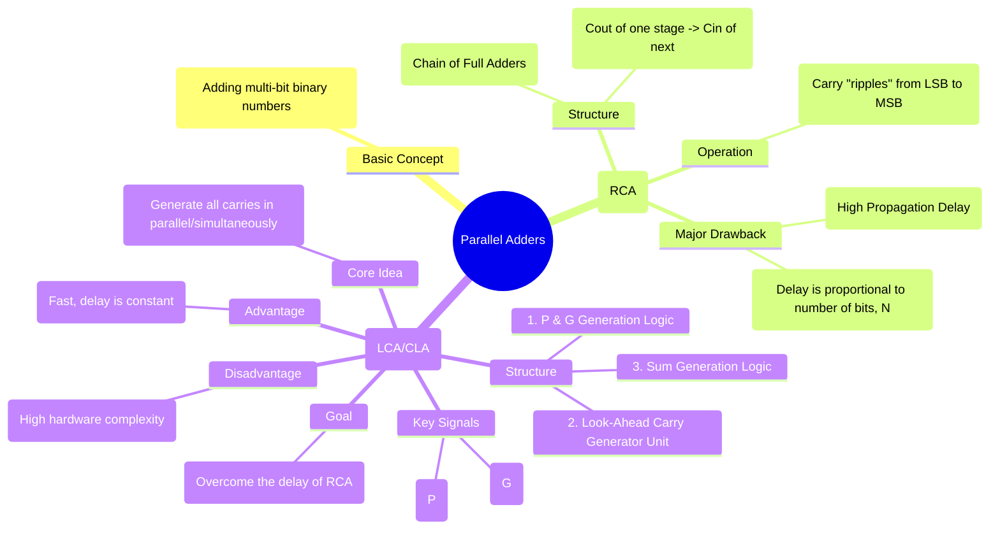

---
tags:
  - digital-logic
  - combinational-circuits
  - arithmetic-circuits
  - parallel-adder
  - lookahead-carry
created: 2025-10-22
aliases:
  - Parallel Adder
  - Ripple-Carry Adder
  - Look-Ahead Carry Adder
  - RCA
  - LCA
  - Carry Lookahead Adder
  - CLA
subject: "[[Analog & Digital Electronics]]"
parent: "[[Arithmetic Circuits]]"
modified: 2026-08-04T10:10:14
---
### Parallel Adders and Look-Ahead Carry Adders
#parallel-adder #arithmetic-circuits #combinational-logic

> While a [[Arithmetic Circuits|Full Adder]] adds two single bits with a carry, practical applications require adding multi-bit numbers. A **Parallel Adder** is a digital circuit capable of adding two binary numbers of N bits simultaneously. The two primary implementations are the Ripple-Carry Adder and the Look-Ahead Carry Adder, which represent a fundamental trade-off between speed and hardware complexity.

---
#### Ripple-Carry Adder (RCA)
#ripple-carry-adder

The Ripple-Carry Adder is the simplest way to construct an N-bit parallel adder. It is built by cascading N [[Arithmetic Circuits|Full Adders]]. The carry-out ($C_{out}$) of each full adder is connected to the carry-in ($C_{in}$) of the next most significant full adder.

**The Problem: Propagation Delay**
The major drawback of the RCA is its speed. The sum bit of the most significant stage ($S_{N-1}$) cannot be calculated until the carry from the previous stage ($C_{N-1}$) is available. This carry, in turn, depends on the carry from the stage before it, and so on, all the way back to the first stage. This sequential dependency is known as the **carry ripple**.

The total propagation delay for an N-bit RCA is:
$$\boxed{\quad T_{RCA} \approx (N-1) \times T_{carry} + T_{sum} \quad}$$
where $T_{carry}$ is the carry propagation delay of one full adder and $T_{sum}$ is the time to generate the final sum bit. The delay is linearly proportional to the number of bits, N, making it slow for large N (e.g., 32 or 64 bits).

---
#### Look-Ahead Carry Adder (LCA / CLA)
#lookahead-carry-adder

The Look-Ahead Carry Adder (also called Carry Lookahead Adder) solves the speed problem of the RCA by calculating the carry signals for each stage in advance, directly from the input bits, rather than waiting for them to ripple through the stages.

This is achieved by defining two new signals for each bit position `i`:
1.  **Carry Generate ($G_i$)**: Stage `i` will generate a carry-out, regardless of the carry-in. This happens only when both inputs $A_i$ and $B_i$ are 1.
    $$\boxed{\quad G_i = A_i \cdot B_i \quad}$$
2.  **Carry Propagate ($P_i$)**: Stage `i` will propagate the carry-in to the carry-out. This happens if at least one of the inputs $A_i$ or $B_i$ is 1. (More formally, if exactly one is 1).
    $$\boxed{\quad P_i = A_i \oplus B_i \quad}$$

Using these signals, the carry-out of any stage ($C_{i+1}$) can be expressed as:
$$\boxed{\quad C_{i+1} = G_i + P_i C_i \quad}$$
This means a carry-out is produced if the stage itself generates a carry ($G_i=1$) OR if it propagates an incoming carry ($P_i=1$ and $C_i=1$).

We can recursively expand this to express each carry signal purely in terms of the input bits ($A_i, B_i$) and the initial carry-in ($C_0$):
$$\begin{align}
C_1 &= G_0 + P_0 C_0 \\
C_2 &= G_1 + P_1 C_1 = G_1 + P_1(G_0 + P_0 C_0) = G_1 + P_1 G_0 + P_1 P_0 C_0 \\
C_3 &= G_2 + P_2 C_2 = G_2 + P_2 G_1 + P_2 P_1 G_0 + P_2 P_1 P_0 C_0 \\
C_4 &= G_3 + P_3 C_3 = G_3 + P_3 G_2 + P_3 P_2 G_1 + P_3 P_2 P_1 G_0 + P_3 P_2 P_1 P_0 C_0
\end{align}$$

**Structure and Advantage:**
An LCA consists of three parts:
1.  Logic to generate $P_i$ and $G_i$ for each stage from inputs $A_i, B_i$.
2.  A **Look-Ahead Carry Generator** unit that implements the carry equations above using two-level AND-OR logic. This computes all carries ($C_1$ to $C_N$) simultaneously.
3.  Logic to generate the final sum bits using the generated carries: $S_i = P_i \oplus C_i$.

Since all carries are generated in parallel, the total delay is no longer proportional to N. It is a nearly constant time, making the LCA significantly faster than the RCA for multi-bit addition. The trade-off is a much higher hardware complexity due to the complex AND-OR logic in the carry generator unit.

---
#### Comparison: RCA vs. LCA

| Feature | Ripple-Carry Adder (RCA) | Look-Ahead Carry Adder (LCA) |
| :--- | :--- | :--- |
| **Speed** | Slow | Fast |
| **Delay** | Proportional to N (number of bits) | Nearly constant |
| **Hardware** | Simple (N Full Adders) | Complex (P, G, and carry logic) |
| **Area** | Small | Large |
| **Use Case** | Small adders or where cost is critical | High-performance systems (ALUs, CPUs) |

---
### Related Concepts

> [[Arithmetic Circuits]]

[[Design of Combinational Circuits]]
[[Logic Families - TTL, ECL, CMOS]] (determines gate delays)
[[Digital Comparators]]
[[Analog & Digital Electronics]]