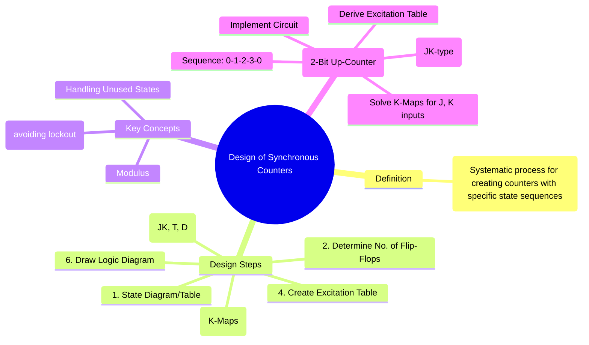

---
tags:
  - digital-logic
  - sequential-circuits
  - synchronous-counter
  - counter-design
  - digital-electronics
created: 2025-10-31
aliases:
  - Synchronous Counter Design
  - Design of Synchronous Sequential Circuits
  - "Example : Design of a 2-Bit (Mod-4) Synchronous Up-Counter"
subject: "[[Analog & Digital Electronics]]"
parent: "[[Counters - Asynchronous (Ripple) and Synchronous Counters]]"
modified: 2026-08-04T09:32:18
---
### Design of Synchronous Counters
#synchronous-counter-design #sequential-logic-design

> The design of a synchronous counter is a structured, systematic process for creating a sequential circuit that progresses through a predefined sequence of states in synchronization with a common clock signal. This process involves defining the state sequence, determining the logic required to control the flip-flop inputs, simplifying this logic, and finally, implementing the circuit.

---
#### The Design Procedure
#counter-design/procedure

The design of any synchronous counter, regardless of its counting sequence (e.g., up, down, random), follows these steps:

1.  **State Diagram and State Table**: Define the desired counting sequence. First, draw a state diagram to visualize the transitions. Then, create a state table listing the Present State and the corresponding Next State for each step in the sequence.
2.  **Determine the Number of Flip-Flops**: The number of flip-flops (N) required is determined by the number of states (M) in the counter, known as its **modulus**. The relationship is:
    $$\boxed{\quad 2^N \ge M \quad}$$
3.  **Choose the Flip-Flop Type**: Select the type of flip-flop to be used (e.g., JK, T, or D). The choice affects the complexity of the combinational logic. JK flip-flops are often preferred as the "don't care" conditions in their excitation table can lead to simpler logic.
4.  **Create the Excitation Table**: This is the core step. Combine the state table with the chosen flip-flop's **excitation table**. For each state transition (from Present to Next State), determine the required input conditions (J, K, T, or D) for each flip-flop.
5.  **Simplify Logic using K-Maps**: Use [[Logic Minimization using Karnaugh Maps (K-Map)|Karnaugh Maps]] to derive simplified Boolean expressions for each flip-flop input. The inputs to the K-maps are the present state bits, and the outputs are the required J, K, T, or D values. Unused states in the count sequence can be treated as don't care (X) conditions for further simplification.
6.  **Draw the Logic Diagram**: Implement the simplified expressions using logic gates and connect them to the inputs of the chosen flip-flops. Connect the clock signal to all flip-flops.

---
#### Example: Design of a 2-Bit (Mod-4) Synchronous Up-Counter
Let's design a counter that counts from 0 to 3 (00 → 01 → 10 → 11 → 00...).

**Step 1 & 2**: The sequence is 0-1-2-3. There are M=4 states. We need N=2 flip-flops ($2^2=4 \ge 4$). Let's call them $Q_B$ (MSB) and $Q_A$ (LSB).

**Step 3**: We will use **JK flip-flops**.

**Step 4**: Create the combined State/Excitation Table. We use the JK Excitation Table (e.g., for a 0→1 transition, J=1, K=X).

| Present State | Next State | \multicolumn{2}{c|}{FF-B Inputs} | \multicolumn{2}{c|}{FF-A Inputs} |
|:---:|:---:|:---:|:---:|:---:|:---:|
| $Q_B$ $Q_A$ | $Q_B^+$ $Q_A^+$ | $J_B$ | $K_B$ | $J_A$ | $K_A$ |
| 0 &nbsp;&nbsp; 0 | 0 &nbsp;&nbsp; 1 | 0 | X | 1 | X |
| 0 &nbsp;&nbsp; 1 | 1 &nbsp;&nbsp; 0 | 1 | X | X | 1 |
| 1 &nbsp;&nbsp; 0 | 1 &nbsp;&nbsp; 1 | X | 0 | 1 | X |
| 1 &nbsp;&nbsp; 1 | 0 &nbsp;&nbsp; 0 | X | 1 | X | 1 |

**Step 5**: Simplify using K-Maps for $J_B, K_B, J_A, K_A$ as functions of $Q_B, Q_A$.

| For $J_B$ | $Q_A=0$ | $Q_A=1$ |
| :---: | :---: | :---: |
| $Q_B=0$ | 0 | 1 |
| $Q_B=1$ | X | X |
Grouping gives $\boxed{J_B = Q_A}$

| For $K_B$ | $Q_A=0$ | $Q_A=1$ |
| :---: | :---: | :---: |
| $Q_B=0$ | X | X |
| $Q_B=1$ | 0 | 1 |
Grouping gives $\boxed{K_B = Q_A}$

| For $J_A$ | $Q_A=0$ | $Q_A=1$ |
| :---: | :---: | :---: |
| $Q_B=0$ | 1 | X |
| $Q_B=1$ | 1 | X |
Grouping gives $\boxed{J_A = 1}$

| For $K_A$ | $Q_A=0$ | $Q_A=1$ |
| :---: | :---: | :---: |
| $Q_B=0$ | X | 1 |
| $Q_B=1$ | X | 1 |
Grouping gives $\boxed{K_A = 1}$

**Step 6**: Draw the logic diagram.
*   FF-A: $J_A=1, K_A=1$.
*   FF-B: $J_B=Q_A, K_B=Q_A$.

---
#### Self-Starting Counters and Lockout
#self-starting-counter

If a counter has unused states (e.g., a Mod-5 counter using 3 flip-flops has 3 unused states), there's a risk that on power-up it could start in one of these states and get stuck, a condition called **lockout**.
*   A **self-starting** counter is designed to guarantee that even if it enters an unused state, it will eventually transition into the main counting sequence.
*   This is achieved during the K-map stage by explicitly defining the next state for each unused state (e.g., forcing them all to transition to state 000) instead of treating them as don't cares.

---
### Related Concepts

> [[Counters - Asynchronous (Ripple) and Synchronous Counters]]

[[Finite State Machines (FSM) - Mealy and Moore Models]]
[[Latches and Flip-Flops (SR, JK, T, D)]]
[[Logic Minimization using Karnaugh Maps (K-Map)]]
[[Analog & Digital Electronics]]