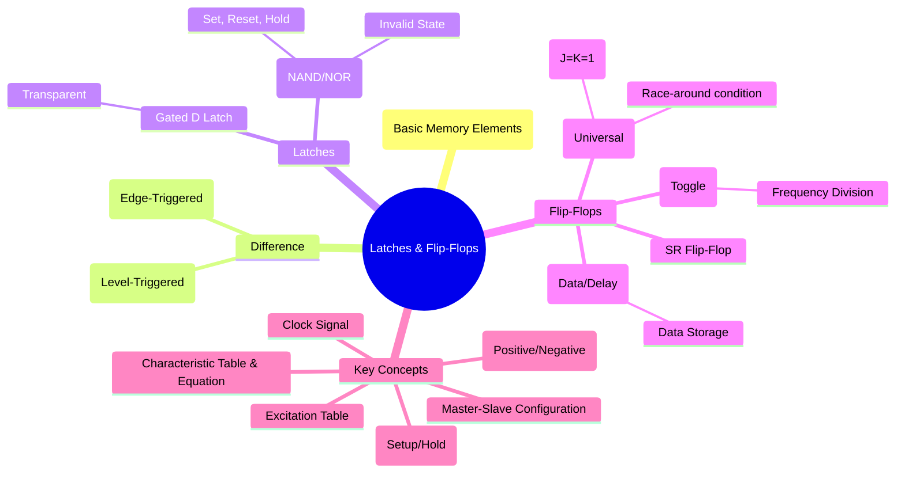

---
tags:
  - digital-logic
  - sequential-circuits
  - flip-flops
  - latches
  - memory-elements
  - digital-electronics
created: 2025-10-27
aliases:
  - Flip-Flops
  - Latches
  - Bistable Multivibrators
subject: "[[Analog & Digital Electronics]]"
parent:
  - Sequential Logic Circuits
modified: 2026-08-04T09:53:16
---
### Latches and Flip-Flops
#sequential-logic #memory-elements #flip-flops #latches

> **Latches** and **Flip-Flops** are the fundamental building blocks of sequential logic circuits. They are bistable multivibrators, meaning they have two stable states (0 and 1) and can store a single bit of information. The primary difference between them lies in how their state is changed.

*   **Latch**: A latch is **level-triggered**. Its output can change as long as the control signal (Enable) is active (e.g., HIGH). This property is called transparency.
*   **Flip-Flop**: A flip-flop is **edge-triggered**. Its output changes only at a specific instant: the rising (positive) or falling (negative) edge of a clock signal. This provides synchronous operation and avoids the timing problems associated with latches.

---
#### S-R (Set-Reset) Latch and Flip-Flop
#sr-latch #sr-flip-flop

The most basic memory element. The SR Flip-Flop is the edge-triggered version of the SR latch.
*   **S (Set)**: Sets the output Q to 1.
*   **R (Reset)**: Resets the output Q to 0.
*   **Invalid State ($S=R=1$)**: This condition is forbidden because it leads to an unpredictable or metastable state where both Q and Q' might be the same.

| **Characteristic Table (SR)** | | **Excitation Table (SR)** |
| :--- | :--- | :--- |
| **S R Qn** \| **Qn+1** | | **Qn Qn+1** \| **S R** |
| 0 0 Qn \| Qn (Hold) | | 0 &nbsp;&nbsp; 0 &nbsp;&nbsp;&nbsp;&nbsp; \| 0 X |
| 0 1 Qn \| 0 (Reset) | | 0 &nbsp;&nbsp; 1 &nbsp;&nbsp;&nbsp;&nbsp; \| 1 0 |
| 1 0 Qn \| 1 (Set) | | 1 &nbsp;&nbsp; 0 &nbsp;&nbsp;&nbsp;&nbsp; \| 0 1 |
| 1 1 Qn \| ? (Invalid) | | 1 &nbsp;&nbsp; 1 &nbsp;&nbsp;&nbsp;&nbsp; \| X 0 |

Characteristic Equation: $\boxed{Q_{n+1} = S + R'Q_n}$ (with condition $SR=0$)

---
#### J-K (Jack-Kilby) Flip-Flop
#jk-flip-flop #universal-flip-flop

The JK flip-flop is the most versatile and is considered a universal flip-flop. It improves on the SR flip-flop by eliminating the invalid state.
*   **J=K=0**: Hold state.
*   **J=0, K=1**: Reset state.
*   **J=1, K=0**: Set state.
*   **J=K=1**: **Toggle state**. The output flips to its complement ($Q_{n+1} = Q_n'$).

| **Characteristic Table (JK)** | | **Excitation Table (JK)** |
| :--- | :--- | :--- |
| **J K Qn** \| **Qn+1** | | **Qn Qn+1** \| **J K** |
| 0 0 Qn \| Qn (Hold) | | 0 &nbsp;&nbsp; 0 &nbsp;&nbsp;&nbsp;&nbsp; \| 0 X |
| 0 1 Qn \| 0 (Reset) | | 0 &nbsp;&nbsp; 1 &nbsp;&nbsp;&nbsp;&nbsp; \| 1 X |
| 1 0 Qn \| 1 (Set) | | 1 &nbsp;&nbsp; 0 &nbsp;&nbsp;&nbsp;&nbsp; \| X 1 |
| 1 1 Qn \| Qn' (Toggle) | | 1 &nbsp;&nbsp; 1 &nbsp;&nbsp;&nbsp;&nbsp; \| X 0 |

Characteristic Equation: $\boxed{Q_{n+1} = JQ_n' + K'Q_n}$

**Race-Around Condition**: In level-triggered JK latches, if J=K=1 and the clock is HIGH for too long, the output may toggle multiple times. This is solved by using an **edge-triggered** design or a **Master-Slave configuration**.

---
#### D (Data or Delay) Flip-Flop
#d-flip-flop

The D flip-flop is the simplest and most widely used for data storage in registers. It has a single data input D. The output Q simply takes on the value of the D input at the active clock edge.
It can be created from a JK flip-flop by setting $J=D$ and $K=D'$.

| **Characteristic Table (D)** | | **Excitation Table (D)** |
| :--- | :--- | :--- |
| **D Qn** \| **Qn+1** | | **Qn Qn+1** \| **D** |
| 0 Qn \| 0 | | 0 &nbsp;&nbsp; 0 &nbsp;&nbsp;&nbsp;&nbsp; \| 0 |
| 1 Qn \| 1 | | 0 &nbsp;&nbsp; 1 &nbsp;&nbsp;&nbsp;&nbsp; \| 1 |
| | | 1 &nbsp;&nbsp; 0 &nbsp;&nbsp;&nbsp;&nbsp; \| 0 |
| | | 1 &nbsp;&nbsp; 1 &nbsp;&nbsp;&nbsp;&nbsp; \| 1 |

Characteristic Equation: $\boxed{Q_{n+1} = D}$

---
#### T (Toggle) Flip-Flop
#t-flip-flop

The T flip-flop has a single input T. It is ideal for building counters.
*   **T=0**: The flip-flop holds its current state ($Q_{n+1} = Q_n$).
*   **T=1**: The flip-flop toggles its state on the clock edge ($Q_{n+1} = Q_n'$).
It can be created from a JK flip-flop by tying J and K inputs together ($J=K=T$). When T=1, the output waveform has half the frequency of the input clock, making it a **frequency divider**.

| **Characteristic Table (T)** | | **Excitation Table (T)** |
| :--- | :--- | :--- |
| **T Qn** \| **Qn+1** | | **Qn Qn+1** \| **T** |
| 0 Qn \| Qn (Hold) | | 0 &nbsp;&nbsp; 0 &nbsp;&nbsp;&nbsp;&circ; \| 0 |
| 1 Qn \| Qn' (Toggle) | | 0 &nbsp;&nbsp; 1 &nbsp;&nbsp;&nbsp;&circ; \| 1 |
| | | 1 &nbsp;&nbsp; 0 &nbsp;&nbsp;&nbsp;&circ; \| 1 |
| | | 1 &nbsp;&nbsp; 1 &nbsp;&nbsp;&nbsp;&circ; \| 0 |

Characteristic Equation: $\boxed{Q_{n+1} = T \oplus Q_n = T'Q_n + TQ_n'}$

---
### Master-Slave Flip-Flop
#master-slave-flip-flop

A Master-Slave flip-flop is constructed from two cascaded latches: a **master** latch and a **slave** latch. It provides a mechanism for creating edge-triggered behavior.
*   The master latch is active on one clock level (e.g., HIGH), and the slave is active on the opposite level (LOW).
*   This isolates the inputs from the outputs, preventing the race-around condition and ensuring that the output changes only once per clock cycle, effectively at the clock edge.

---
### Related Concepts

> [[Sequential Logic Circuits]]

[[Registers (Shift Registers - SISO, SIPO, PISO, PIPO)]]
[[Counters - Asynchronous (Ripple) and Synchronous Counters]]
[[Finite State Machines (FSM) - Mealy and Moore Models]]
[[Design of Combinational Circuits]]
[[Analog & Digital Electronics]]
