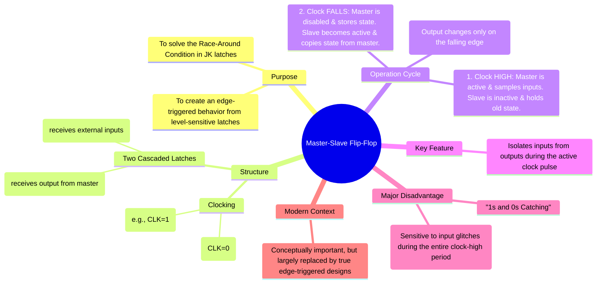

---
tags:
  - digital-logic
  - sequential-circuits
  - flip-flops
  - master-slave
  - timing-circuits
  - digital-electronics
created: 2025-10-28
aliases:
  - Master-Slave Flip-Flop
  - M-S Flip-Flop
subject: "[[Analog & Digital Electronics]]"
parent: "[[Latches and Flip-Flops (SR, JK, T, D)]]"
modified: 2026-08-04T09:59:02
---
### Master-Slave Flip-Flop Configuration
#master-slave-flip-flop #sequential-logic #race-around-condition

> The **Master-Slave Flip-Flop** is a sequential circuit built from two cascaded latches (a master and a slave) controlled by complementary clock signals. It was developed to solve the critical **race-around condition** found in level-triggered JK latches and to approximate edge-triggered behavior before true edge-triggered designs became common.

---
#### Structure and Operation

A master-slave configuration consists of:
1.  A **Master Latch**: This latch receives the external inputs (e.g., J and K) and is enabled during one level of the clock (e.g., when CLK is HIGH).
2.  A **Slave Latch**: This latch receives its inputs from the master's outputs. It is enabled during the opposite clock level (e.g., when CLK is LOW).

This creates a two-phase operation:
*   **Phase 1 (CLK = 1)**: The master latch is active ("open") and responds to the J and K inputs. The slave latch is inactive ("closed") and holds the previous state, so the final output Q does not change.
*   **Phase 2 (CLK transition 1 → 0)**: The master latch becomes inactive ("closed"), storing the state it captured from J and K. Simultaneously, the slave latch becomes active ("open") and copies the state from the master. The final output Q is updated at this instant.

The overall effect is that the flip-flop's output changes only on the **negative edge** (falling edge) of the clock pulse.

---
#### Solving the Race-Around Condition
#race-around-condition

The race-around condition occurs in a level-triggered JK latch when J=K=1 and the clock pulse width is longer than the propagation delay of the latch. The output toggles continuously until the clock pulse ends.

The master-slave configuration solves this because the feedback path from the final output (slave's output) to the input (master's input) is broken by the clocking scheme.
$$\boxed{\quad \text{The output Q changes only when the master is disabled.} \quad}$$
Since the master is disabled before the slave updates the output, the master cannot see the toggled output within the same clock cycle. This ensures the output toggles only once per clock pulse.

---
#### Disadvantage: "1s and 0s Catching"
#ones-catching #zeros-catching

A critical drawback of the master-slave design is that it is not a *true* edge-triggered device. The master's input is sensitive to the J and K lines during the *entire duration* of the active clock level (e.g., for the entire time CLK=1).
*   **1s Catching**: If J=1 and K=0, any glitch or unwanted pulse that makes the J input go low momentarily while the clock is high will **not** be "caught". However, if J=0 and K=0 (hold state) and a glitch causes J to go high while the clock is high, the master will "catch" this '1' and set the output on the clock edge.
*   This means the inputs must be stable throughout the entire master-active phase of the clock. True edge-triggered flip-flops only require the input to be stable for a very short period around the clock edge (setup and hold time).

Because of this vulnerability to noise and glitches, the master-slave configuration has been largely superseded by more robust, true edge-triggered designs in modern digital ICs.

---
### Related Concepts

> [[Latches and Flip-Flops (SR, JK, T, D)]]

[[Counters - Asynchronous (Ripple) and Synchronous Counters]]
[[Registers (Shift Registers - SISO, SIPO, PISO, PIPO)]]
[[Timing Parameters (Setup, Hold)]]
[[Analog & Digital Electronics]]
