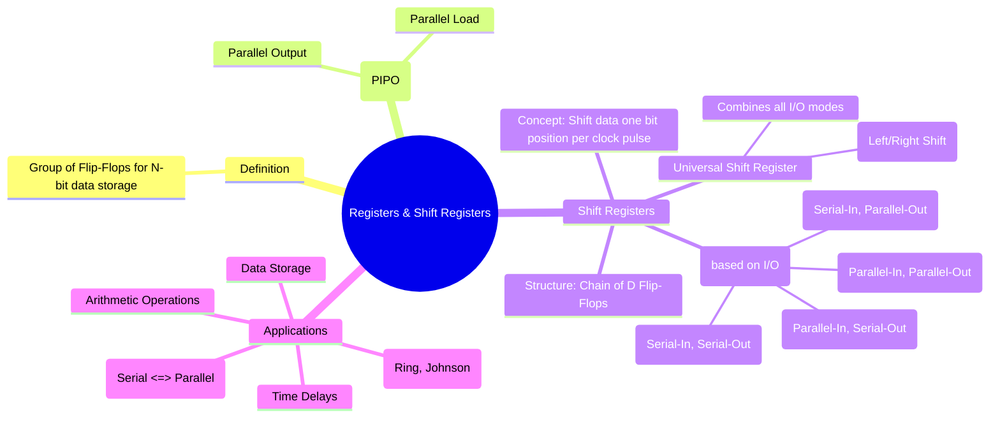

---
tags:
  - digital-logic
  - sequential-circuits
  - registers
  - shift-register
  - digital-electronics
created: 2025-10-29
aliases:
  - Registers
  - Shift Registers
subject: "[[Analog & Digital Electronics]]"
parent:
  - Sequential Logic Circuits
modified: 2026-08-04T10:24:11
---
### Registers and Shift Registers
#registers #shift-register #sequential-logic #data-storage

> A **Register** is a group of [[Latches and Flip-Flops (SR, JK, T, D)|flip-flops]] (typically D-type) used to store a multi-bit binary word. Each flip-flop stores one bit of data. A **Shift Register** is a specialized register that can move (shift) the stored data one bit position to the left or right with each clock pulse. Registers are fundamental components for data storage, manipulation, and transfer in virtually all digital systems.

---
#### Classification of Shift Registers by I/O
Shift registers are primarily categorized by how data is loaded into and retrieved from them: serially (one bit at a time) or in parallel (all bits at once).

##### 1. Serial-In, Serial-Out (SISO)
#siso-register

In a SISO register, data is entered serially into the first flip-flop and shifted one position with each clock pulse. The data is retrieved serially from the output of the last flip-flop.
*   **Structure**: A simple chain of N D-flip-flops for an N-bit register.
*   **Operation**: It takes N clock pulses for the first bit of data to appear at the output.
*   **Primary Application**: Creating a time delay. An N-bit SISO register delays a serial data stream by N clock cycles.

##### 2. Serial-In, Parallel-Out (SIPO)
#sipo-register

Data is shifted in serially, but all the stored bits are available simultaneously on parallel outputs.
*   **Structure**: A chain of D-flip-flops with an output tap from each flip-flop.
*   **Operation**: After N clock pulses, the entire N-bit word is loaded and can be read in parallel.
*   **Primary Application**: **Serial-to-Parallel data conversion**. This is essential in communication systems for converting a received serial data stream into a parallel word for processing.

##### 3. Parallel-In, Serial-Out (PISO)
#piso-register

All bits of the data word are loaded simultaneously (in parallel) into the register. The data is then shifted out one bit at a time.
*   **Structure**: Requires additional logic (e.g., multiplexers) to select between two modes: parallel loading or shifting. A `Shift/Load` control line is used to switch modes.
*   **Operation**: When `Load` is active, parallel data is loaded. When `Shift` is active, data is shifted out serially.
*   **Primary Application**: **Parallel-to-Serial data conversion**. Used for transmitting parallel data (e.g., from a CPU bus) over a serial communication link.

##### 4. Parallel-In, Parallel-Out (PIPO)
#pipo-register

This is the most basic form of a register. Data is loaded in parallel and read out in parallel. It doesn't perform shifting but is the foundation of data storage.
*   **Primary Application**: Temporary data storage (e.g., buffer registers, data registers in a CPU).

---
#### Universal Shift Register
#universal-shift-register

A universal shift register is the most versatile type, combining all the functionalities into one device. It can operate in any of the four I/O modes and can also perform bidirectional shifting (shift-left or shift-right).
*   **Control**: Mode select lines are used to determine the operation (e.g., Hold, Shift Right, Shift Left, Parallel Load).
*   **Implementation**: Uses multiplexers at the input of each flip-flop to select the appropriate data source based on the selected mode.

---
#### Applications of Shift Registers
*   **Data Format Conversion**: The primary use for SIPO and PISO registers.
*   **Counters**:
    *   **Ring Counter**: The output of the last flip-flop is connected back to the input of the first. Used to generate timing signals.
    *   [[Ring Counter and Johnson Counter|Johnson Counter (Twisted-Ring Counter)]]: The *inverted* output of the last flip-flop is fed back. Generates a sequence of length 2N.
*   **Arithmetic Operations**: A shift-left operation is equivalent to multiplication by 2, and a shift-right is equivalent to division by 2. This is used in simple binary multiplication and division algorithms.
*   **Pseudo-Random Number Generation**: Linear Feedback Shift Registers (LFSRs) are used to generate sequences of seemingly random numbers.

---
### Related Concepts

> [[Latches and Flip-Flops (SR, JK, T, D)]]

[[Counters - Asynchronous (Ripple) and Synchronous Counters]]
[[Ring Counter and Johnson Counter]]
[[Finite State Machines (FSM) - Mealy and Moore Models]]
[[Analog & Digital Electronics]]
