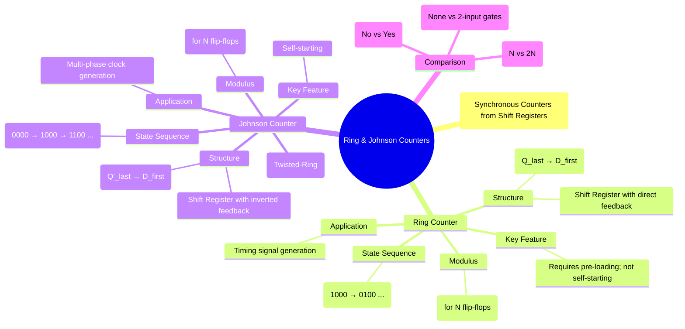

---
tags:
  - digital-logic
  - sequential-circuits
  - counters
  - shift-register
  - digital-electronics
created: 2025-11-01
aliases:
  - Ring Counter
  - Johnson Counter
  - Twisted-Ring Counter
  - Switched-Tail Counter
subject: "[[Analog & Digital Electronics]]"
parent: "[[Counters - Asynchronous (Ripple) and Synchronous Counters]]"
modified: 2026-08-04T10:26:05
---
### Ring Counter and Johnson Counter
#ring-counter #johnson-counter #shift-register-counter

> **Ring** and **Johnson** counters are special types of synchronous counters constructed from shift registers. Instead of producing a binary count, they circulate a specific bit pattern, making them useful for generating timing signals and state sequences where simple decoding is a priority. They are essentially shift registers with a feedback loop from the output back to the input.

---
#### Ring Counter
#ring-counter

A Ring Counter is the simplest shift register counter. It is created by connecting the output of the last flip-flop ($Q_{n-1}$) directly to the input of the first flip-flop ($D_0$). The circuit circulates a single '1' (or '0') bit around the loop.

*   **Structure**: A [[Registers (Shift Registers - SISO, SIPO, PIPO)|SISO shift register]] with direct feedback.
*   **Initialization**: The counter must be pre-loaded with a specific pattern, typically a single '1' (e.g., `1000`). It is **not self-starting**. If it powers up in an invalid state (e.g., `1010`), it will circulate that invalid pattern.
*   **Modulus**: An N-bit ring counter has N distinct states.
    $$\boxed{\quad \text{Modulus of Ring Counter} = N \quad}$$

**4-Bit Ring Counter State Sequence (starting from `1000`):**
1.  `1000`
2.  `0100`
3.  `0010`
4.  `0001`
5.  `1000` (repeats)

**Advantages**:
*   **No Decoding Logic**: The state of the counter is directly available from the output of each flip-flop. Each state is a "one-hot" encoding.

**Disadvantages**:
*   **Inefficient Use of States**: An N-bit counter uses only N states out of the $2^N$ possible states.
*   **Not Self-Starting**: Requires an external circuit to preset the initial state.

---
#### Johnson Counter (Twisted-Ring Counter)
#johnson-counter #twisted-ring-counter

A Johnson Counter, also known as a **twisted-ring** or **switched-tail** counter, improves upon the ring counter by feeding back the *inverted* output of the last flip-flop ($Q'_{n-1}$) to the input of the first ($D_0$).

*   **Structure**: A SISO shift register with inverted feedback.
*   **Initialization**: The counter is typically started from the all-zeros state (`0000`). It is **self-starting**; even if it enters an unused state, it will eventually fall into the correct sequence.
*   **Modulus**: An N-bit Johnson counter has 2N distinct states.
    $$\boxed{\quad \text{Modulus of Johnson Counter} = 2N \quad}$$

**4-Bit Johnson Counter State Sequence (starting from `0000`):**
1.  `0000`
2.  `1000`
3.  `1100`
4.  `1110`
5.  `1111`
6.  `0111`
7.  `0011`
8.  `0001`
9.  `0000` (repeats)

**Advantages**:
*   **More States**: Provides more states than a ring counter for the same number of flip-flops.
*   **Self-Starting**.
*   **Glitch-Free Decoding**: States can be decoded using simple 2-input AND gates.

---
#### Comparison Table

| Feature | Ring Counter | Johnson Counter |
| :--- | :--- | :--- |
| **Feedback** | $Q_{n-1} \rightarrow D_0$ (Direct) | $Q'_{n-1} \rightarrow D_0$ (Inverted) |
| **Modulus** | N | 2N |
| **No. of States (4-bit)** | 4 | 8 |
| **No. of Unused States** | $2^N - N$ | $2^N - 2N$ |
| **Self-Starting** | No | Yes |
| **Decoding Logic** | None required | 2-input AND gates required |

---
### Related Concepts

> [[Registers (Shift Registers - SISO, SIPO, PIPO)]]

[[Counters - Asynchronous (Ripple) and Synchronous Counters]]
[[Finite State Machines (FSM) - Mealy and Moore Models]]
[[Latches and Flip-Flops (SR, JK, T, D)]]
[[Analog & Digital Electronics]]
