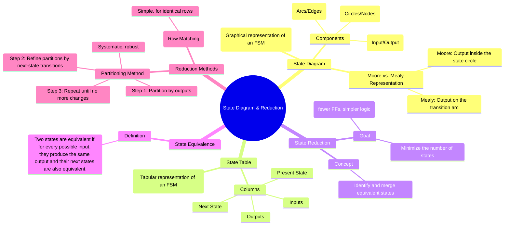

---
tags:
  - digital-logic
  - sequential-circuits
  - fsm
  - state-reduction
  - state-diagram
  - digital-electronics
created: 2025-11-03
aliases:
  - State Diagram
  - State Reduction
  - FSM Simplification
subject: "[[Analog & Digital Electronics]]"
parent: "[[Finite State Machines (FSM) - Mealy and Moore Models]]"
modified: 2026-08-04T10:33:46
---
### State Diagram and State Reduction
#fsm #state-diagram #state-reduction #sequential-logic-design

> A **State Diagram** is a graphical tool used to describe the behavior of a [[Finite State Machines (FSM) - Mealy and Moore Models|Finite State Machine]]. It provides an intuitive, visual understanding of the states, transitions, and outputs of a sequential circuit. **State Reduction** is the process of optimizing an FSM by identifying and merging redundant (or equivalent) states. The goal is to create a machine with the minimum possible number of states that exhibits the exact same input-output behavior, leading to simpler and more cost-effective hardware.

---
#### State Diagram
#state-diagram

A state diagram consists of:
*   **States**: Represented by circles (nodes), often labeled with a name or the state's binary assignment.
*   **Transitions**: Represented by directed arcs (edges) connecting the states.
*   **Labels**: The arcs are labeled to show the input that causes the transition. The placement of the output label depends on the FSM model:
    *   **Moore Machine**: The output is associated with the state itself and is written *inside* the state circle.
    *   **Mealy Machine**: The output is associated with the transition and is written on the arc next to the input, typically in the format `input / output`.

---
#### State Table
#state-table

The state table is the tabular representation of the state diagram. It lists the present state, the next state for each possible input, and the output for each state (Moore) or transition (Mealy). The state table is the starting point for both hardware implementation and state reduction.

---
#### State Reduction
#state-reduction #fsm-simplification

Reducing the number of states in an FSM is crucial because the number of required [[Latches and Flip-Flops (SR, JK, T, D)|flip-flops]] depends on the number of states ($N_{FFs} \ge \log_2(N_{states})$). Fewer states lead to fewer flip-flops and simpler combinational logic.

**Equivalent States**: Two states are said to be equivalent if it is impossible to distinguish between them by observing the output sequence generated by any input sequence.
> For two states $S_i$ and $S_j$ to be equivalent:
> 1.  They must produce the same output for every possible input.
> 2.  For every possible input, their next states must also be equivalent.

#### State Reduction by Partitioning
#partitioning-method

The partitioning method is a systematic algorithm to find all equivalent states.
**Procedure:**
1.  **Partition 0 ($P_0$)**: Group all states that have the same output. States with different outputs cannot be equivalent and are placed in different groups (partitions).
2.  **Partition 1 ($P_1$)**: For each group in $P_0$, check the next-state transitions for each input. If for a given input, some states in a group transition to states in one partition of $P_0$ while others transition to states in a different partition of $P_0$, then that group must be split.
3.  **Repeat**: Continue creating new partitions ($P_2, P_3, ...$) by refining the previous partition until a new partition is identical to the previous one ($P_k = P_{k-1}$).
4.  **Final Result**: The states that remain in the same group in the final partition are equivalent to each other. These states can be merged into a single state in the reduced FSM.

**Example:**
Consider the following state table:

| Present State | Next State (x=0) | Next State (x=1) | Output |
|:---:|:---:|:---:|:---:|
| A | E | C | 0 |
| B | C | A | 0 |
| C | B | G | 0 |
| D | G | A | 1 |
| E | B | G | 0 |
| G | D | C | 0 |

1.  **$P_0$ (Partition by output)**: State D has output 1, all others have output 0.
    $P_0 = (A, B, C, E, G), (D)$
2.  **$P_1$ (Refine $P_0$)**:
    *   Check group (A, B, C, E, G). Let's call the groups in $P_0$ $G_1=(ABCEG)$ and $G_2=(D)$.
    *   For x=0, states A, B, C, E, G transition to E, C, B, B, D respectively.
        *   Transitions to E, C, B are in $G_1$.
        *   Transition to D is in $G_2$.
    *   Since state G transitions to a different group ($G_2$) than the others for x=0, we must split G out.
    $P_1 = (A, B, C, E), (G), (D)$
3.  **$P_2$ (Refine $P_1$)**:
    *   Check group (A, B, C, E). Let's call groups in $P_1$ $G_1=(ABCE), G_2=(G), G_3=(D)$.
    *   For x=0: A→E($G_1$), B→C($G_1$), C→B($G_1$), E→B($G_1$). All go to $G_1$. OK.
    *   For x=1: A→C($G_1$), B→A($G_1$), C→G($G_2$), E→G($G_2$).
    *   States A, B transition to $G_1$. States C, E transition to $G_2$. We must split the group.
    $P_2 = (A, B), (C, E), (G), (D)$
4.  **$P_3$ (Refine $P_2$)**:
    *   Check (A, B): x=0 → E, C (both in CE group). x=1 → C, A (both in AB group). OK.
    *   Check (C, E): x=0 → B, B (both in AB group). x=1 → G, G (both in G group). OK.
    *   No further splits are possible. $P_3 = P_2$.

**Conclusion**: The equivalent states are (A, B) and (C, E). The reduced state table will have 4 states: S0=(A,B), S1=(C,E), S2=(G), S3=(D).

---
### Related Concepts

> [[Finite State Machines (FSM) - Mealy and Moore Models]]

[[Design of Synchronous Counters]]
[[Latches and Flip-Flops (SR, JK, T, D)]]
[[Analog & Digital Electronics]]