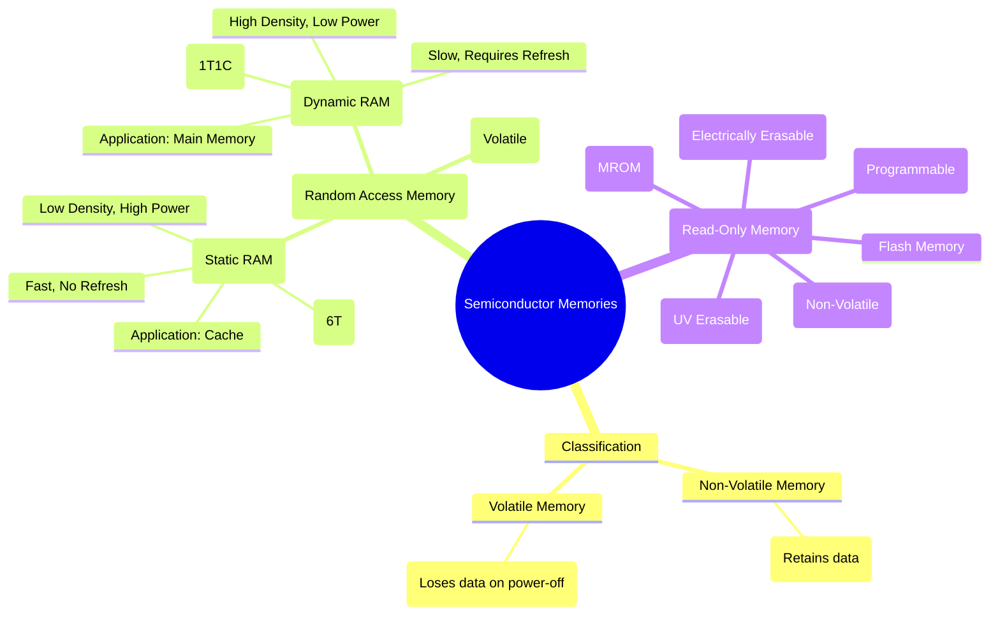

---
tags:
  - semiconductor-memory
  - digital-logic
  - ram
  - rom
  - sram
  - dram
  - digital-electronics
created: 2025-11-07
aliases:
  - Semiconductor Memory
  - ROM
  - RAM
  - SRAM
  - DRAM
subject: "[[Analog & Digital Electronics]]"
parent:
  - Data Converters and Memories
modified: 2026-08-04T10:26:45
---
### Semiconductor Memories
#semiconductor-memory #digital-storage

> **Semiconductor memories** are digital devices used to store binary information. They are a crucial component of any microprocessor-based system, providing storage for program code and data. Memories are organized as an array of cells, each capable of storing a single bit. They are broadly classified based on their data retention capability and access method.

*   **Volatile Memory**: Loses its stored information when the power is turned off. Example: RAM.
*   **Non-Volatile Memory**: Retains its stored information even after power is removed. Example: ROM.
*   **Memory Organization**: A memory unit is addressed using an address bus. The size of the address bus determines the memory capacity ($2^N$ locations for N address lines). A data bus is used to transfer data to and from the memory, and control lines (like Chip Select, Read/Write) manage the operation.

---
### Random Access Memory (RAM)
#ram #volatile-memory

RAM is a **volatile** read/write memory. The term "random access" means that any memory location can be accessed directly in a fixed amount of time, regardless of its physical position.

#### Static RAM (SRAM)
#sram #cache-memory
SRAM stores each bit of data in a bistable latch, typically constructed using six transistors (6T cell).

*   **Principle**: The flip-flop holds the bit value (0 or 1) as long as power is supplied. It does **not** need to be refreshed.
*   **Characteristics**:
    *   **Fast**: Very low access times (a few nanoseconds), making it suitable for high-speed operations.
    *   **Low Density**: The 6T cell is large, so fewer bits can be stored per unit area.
    *   **High Power Consumption**: The latches continuously draw power to maintain their state.
    *   **Expensive**: More complex and larger cell size leads to a higher cost per bit.
*   **Application**: Primarily used for **cache memory** (L1, L2, L3) in CPUs due to its high speed.

#### Dynamic RAM (DRAM)
#dram #main-memory
DRAM stores each bit of data as an electrical charge on a tiny capacitor, with a single transistor acting as a switch (1T1C cell).

*   **Principle**: The presence or absence of charge on the capacitor represents a 1 or a 0. Since the charge leaks away over time, the memory cells must be periodically read and rewritten. This process is called **refreshing**.
*   **Characteristics**:
    *   **Slower**: Access times are slower than SRAM due to the refresh cycle and the time taken to read the charge.
    *   **High Density**: The simple 1T1C cell is very small, allowing for a huge number of bits per chip.
    *   **Low Power Consumption**: Lower static power consumption compared to SRAM.
    *   **Inexpensive**: The simple, dense structure makes it very cheap per bit.
*   **Application**: Used as the **main system memory** in computers, GPUs, and other devices.

---
### Read-Only Memory (ROM)
#rom #non-volatile-memory

ROM is a **non-volatile** memory from which data can be read but not easily written to. It is used to store firmware, bootloaders, and other critical system software that should not be altered during normal operation.

#### Types of ROM
*   **Mask ROM (MROM)**: Programmed at the factory during the manufacturing process. The contents cannot be changed. Economical for very high-volume products.
*   **Programmable ROM (PROM)**: Can be programmed once by the user using a PROM programmer. This is a one-time-programmable (OTP) process that involves blowing internal fuses.
*   **Erasable PROM (EPROM)**: Can be erased and reprogrammed. Erasure is performed by exposing the silicon die to strong ultraviolet (UV) light through a characteristic quartz window on the chip.
*   **Electrically Erasable PROM (EEPROM)**: Can be erased and reprogrammed electrically, one byte at a time, without removing it from the circuit. Writing and erasing are much slower than reading.
*   **Flash Memory**: A modern type of EEPROM that is much faster because it erases and writes data in blocks or pages instead of byte by byte. It is the dominant technology for SSDs, USB drives, and memory cards.

---
#### Comparison: SRAM vs. DRAM

| Feature | SRAM (Static RAM) | DRAM (Dynamic RAM) |
| :--- | :--- | :--- |
| **Basic Cell** | Latch/Flip-Flop (6 Transistors) | Capacitor & Transistor (1T1C) |
| **Speed / Access Time**| Very Fast (~1-10 ns) | Slower (~50-100 ns) |
| **Density** | Low | Very High |
| **Power Consumption** | High | Low |
| **Cost per Bit** | High | Low |
| **Refreshing** | Not Required | Required |
| **Primary Use** | CPU Cache, Registers | Main Memory |

---
### Related Concepts

> [[Latches and Flip-Flops (SR, JK, T, D)]]

[[Encoders and Decoders]]
[[Analog & Digital Electronics]]