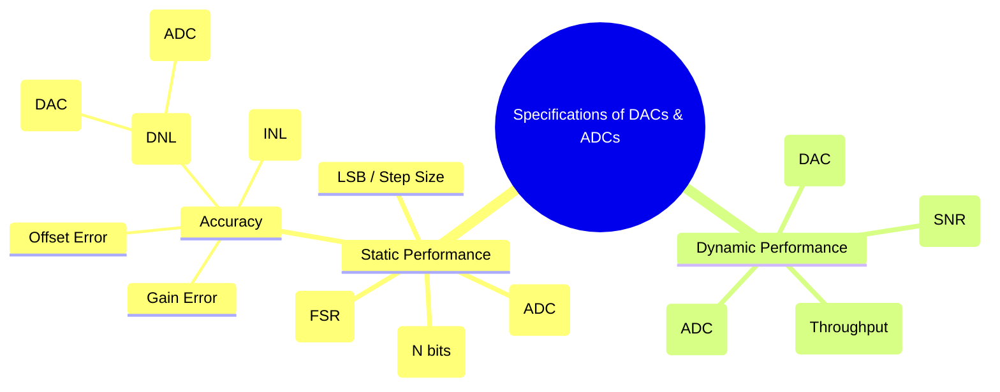

---
tags:
  - data-converters
  - adc
  - dac
  - performance-metrics
  - analog-electronics
  - digital-electronics
created: 2025-11-06
aliases:
  - Data Converter Specifications
  - ADC/DAC Specs
  - Signal-to-Noise Ratio (SNR)
subject: "[[Analog & Digital Electronics]]"
parent:
  - Data Converters and Memories
modified: 2026-08-04T10:32:37
---
### Specifications of DACs and ADCs
#data-converter-specs #performance-metrics

> The performance of a [[Digital-to-Analog Converters (DAC) - Weighted Resistor, R-2R Ladder|DAC]] or [[Analog-to-Digital Converters (ADC)|ADC]] is characterized by a set of specifications that define its accuracy, speed, and overall quality. Understanding these parameters is crucial for selecting the right converter for a specific application, as they represent the trade-offs between speed, precision, and cost.

---
#### Static Performance Specifications
These specifications describe the converter's performance with DC or very slow-changing signals.

##### 1. Resolution
#resolution
The **resolution** (N) is the number of bits in the digital input (DAC) or output (ADC). It determines the number of discrete levels the converter can produce or distinguish.
*   Number of levels = $2^N$.
*   A higher resolution means a smaller step size and a finer representation of the analog signal.

##### 2. LSB and Full-Scale Range (FSR)
#lsb #full-scale-range
*   **Full-Scale Range (FSR)**: The range of analog voltages or currents that the converter operates over (e.g., 0V to 5V).
*   **LSB (Least Significant Bit)**: The smallest analog change that results from a one-bit change in the digital code. It is also called the **step size**.
    $$\boxed{\quad \text{LSB Step Size} = \frac{V_{FSR}}{2^N} \quad}$$

##### 3. Quantization Error (ADC)
#quantization-error
This is an inherent error in all ADCs that results from representing a continuous analog signal with a finite number of discrete levels. For an ideal ADC, the quantization error is uniformly distributed and bounded.
$$\boxed{\quad \text{Quantization Error} \le \pm \frac{1}{2} \text{ LSB} \quad}$$

##### 4. Accuracy (Linearity Errors)
#linearity #dnl #inl
Accuracy describes how close the actual transfer function is to the ideal. It is primarily defined by two linearity metrics:
*   **Differential Non-Linearity (DNL)**: The deviation between an actual step width and the ideal value of 1 LSB. An ideal converter has a DNL of 0.
    *   **For ADCs**: If $DNL \le -1$ LSB, it results in **Missing Codes** (some digital output codes will never be generated).
    *   **For DACs**: If $DNL < -1$ LSB, the converter is **Non-Monotonic**.
*   **Integral Non-Linearity (INL)**: The maximum deviation of the actual transfer function from an ideal straight line drawn between its endpoints. INL is the cumulative sum of DNL errors and represents a measure of the overall straightness or linearity of the converter. An ideal converter has an INL of 0.

##### 5. Monotonicity (DAC)
#monotonicity
A DAC is **monotonic** if its analog output is a non-decreasing function of its digital input. In other words, as the digital code increases, the analog output should always increase or stay the same.
$$\boxed{\quad \text{A DAC is guaranteed to be monotonic if } DNL > -1 \text{ LSB for all codes.} \quad}$$
This is critical for control applications where a non-monotonic response could cause system instability.

---
#### Dynamic Performance Specifications
These specifications describe the converter's performance with fast-changing (AC) signals.

##### 1. Conversion Time (ADC)
#conversion-time
The total time required for an ADC to complete one full conversion of the analog input to a digital output. The inverse of the conversion time is the **sampling rate** or **throughput**.

##### 2. Settling Time (DAC)
#settling-time
The time it takes for a DAC's output to settle to within a specified error band (e.g., $\pm 0.5$ LSB) of its final value after the digital input code has changed. It is a measure of the DAC's speed.

##### 3. Signal-to-Noise Ratio (SNR)
#signal-to-noise-ratio
SNR measures the ratio of the full-scale signal power to the total noise power (primarily quantization noise). For an ideal N-bit ADC, the maximum theoretical SNR is given by:
$$\boxed{\quad SNR_{dB} = 6.02N + 1.76 \quad}$$
This formula is fundamental for estimating the dynamic range of a data converter.

---
### Related Concepts

> [[Digital-to-Analog Converters (DAC) - Weighted Resistor, R-2R Ladder]]

[[Analog-to-Digital Converters (ADC)]]
[[Ideal Op-Amp]]
[[Analog & Digital Electronics]]
