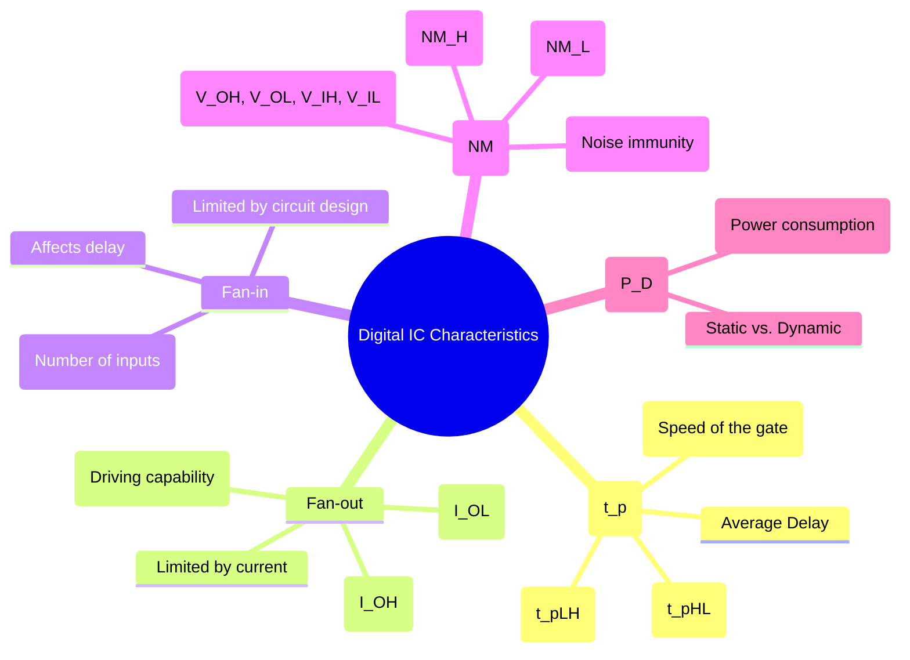

---
tags:
  - digital-logic
  - logic-families
  - ic-characteristics
  - performance-metrics
  - digital-electronics
created: 2025-11-08
aliases:
  - Digital IC Characteristics
  - Logic Gate Characteristics
  - Logic Family Parameters
  - Characteristics of Digital ICs (Propagation Delay, Fan-in, Fan-out, Noise Margin)
subject: "[[Analog & Digital Electronics]]"
parent:
  - Logic Families
modified: 2026-08-04T09:17:06
---
### Characteristics of Digital ICs
#ic-characteristics #logic-families #performance-metrics

> The ideal behavior of logic gates described by Boolean algebra differs from their real-world performance. Digital Integrated Circuits (ICs) are characterized by a set of parameters that define their electrical and timing limitations. These characteristics are crucial for designing reliable, high-speed digital systems and for comparing different logic families (like TTL and CMOS).

---
#### Propagation Delay ($t_p$)
#propagation-delay #timing

Propagation delay is the time it takes for the output of a gate to respond to a change in its input. It is a measure of the gate's speed and is typically measured between the 50% voltage levels of the input and output signals.

*   **Rise Time ($t_r$)**: Time for a signal to go from 10% to 90% of its final value.
*   **Fall Time ($t_f$)**: Time for a signal to go from 90% to 10% of its final value.
*   **Low-to-High Propagation Delay ($t_{pLH}$)**: The delay when the output transitions from a logic LOW to a logic HIGH.
*   **High-to-Low Propagation Delay ($t_{pHL}$)**: The delay when the output transitions from a logic HIGH to a logic LOW.

These two delays are often unequal. The average propagation delay is given by:
$$\boxed{\quad t_p = \frac{t_{pLH} + t_{pHL}}{2} \quad}$$

---
#### Fan-out
#fan-out #drive-capability

Fan-out is the maximum number of standard inputs of gates in the **same logic family** that the output of a single gate can reliably drive without impairing its normal operation.

It is limited by the current-sourcing and current-sinking capabilities of the output stage.
*   **Current Sourcing**: When the output is HIGH, it supplies current ($I_{OH}$) to the inputs it is driving ($I_{IH}$).
*   **Current Sinking**: When the output is LOW, it accepts current ($I_{OL}$) from the inputs it is driving ($I_{IL}$).

The fan-out is calculated for both high and low states, and the smaller of the two values is taken as the overall fan-out.
$$\boxed{\quad \text{Fan-out} = \min \left( \frac{I_{OH(max)}}{I_{IH(max)}}, \frac{I_{OL(max)}}{I_{IL(max)}} \right) \quad}$$

---
#### Fan-in
#fan-in
Fan-in is simply the number of inputs that a logic gate is designed to have. For example, a 3-input AND gate has a fan-in of 3. Increasing the fan-in of a gate can increase its propagation delay due to higher internal capacitance.

---
#### Noise Margin ($NM$)
#noise-margin #noise-immunity

Noise margin is a measure of a circuit's ability to tolerate noise voltage on its inputs without changing its output state. A larger noise margin implies better noise immunity. It is defined by the following voltage levels:
*   $V_{OH(min)}$: Minimum output voltage in the HIGH state.
*   $V_{OL(max)}$: Maximum output voltage in the LOW state.
*   $V_{IH(min)}$: Minimum input voltage guaranteed to be recognized as a HIGH.
*   $V_{IL(max)}$: Maximum input voltage guaranteed to be recognized as a LOW.

There are two noise margins:
*   **High-Level Noise Margin ($NM_H$)**: The noise tolerance when the signal is in the HIGH state.
    $$\boxed{\quad NM_H = V_{OH(min)} - V_{IH(min)} \quad}$$
*   **Low-Level Noise Margin ($NM_L$)**: The noise tolerance when the signal is in the LOW state.
    $$\boxed{\quad NM_L = V_{IL(max)} - V_{OL(max)} \quad}$$

The overall noise margin for the logic family is the smaller of $NM_H$ and $NM_L$.

---
#### Power Dissipation ($P_D$)
#power-dissipation
This is the amount of power consumed by the logic gate. It is the product of the supply voltage ($V_{CC}$) and the average supply current ($I_{CC(avg)}$).
$$\boxed{\quad P_D = V_{CC} \cdot I_{CC(avg)} \quad}$$
There are two components:
*   **Static Power Dissipation**: Power consumed when the output is not changing.
*   **Dynamic Power Dissipation**: Power consumed during the switching of the output from one state to another. This is significant in CMOS logic and is proportional to the switching frequency.

---
### Related Concepts

> [[Logic Families - TTL, ECL, CMOS]]

[[Counters - Asynchronous (Ripple) and Synchronous Counters]] (Propagation delay is critical here)
[[Design of Combinational Circuits]]
[[Analog & Digital Electronics]]
