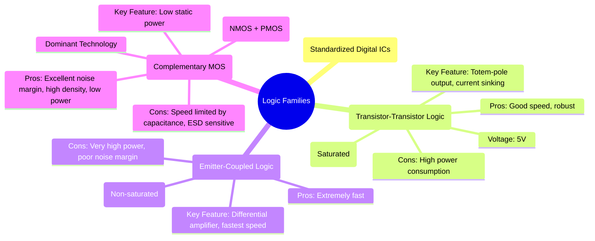

---
tags:
  - digital-logic
  - logic-families
  - ttl
  - ecl
  - cmos
  - digital-electronics
created: 2025-11-09
aliases:
  - Logic Families
  - TTL
  - ECL
  - CMOS
subject: "[[Analog & Digital Electronics]]"
parent:
  - Digital Electronics
modified: 2026-08-04T09:55:41
---
### Logic Families - TTL, ECL, CMOS
#logic-families #ic-technology

> A **logic family** is a collection of digital integrated circuit (IC) gates that are manufactured with a standardized set of electrical characteristics. These characteristics include logic levels, supply voltage, power consumption, and speed, allowing gates from the same family to be interconnected directly. The choice of logic family involves a trade-off between key performance metrics, primarily speed, power dissipation, and noise immunity.

---
#### Transistor-Transistor Logic (TTL)
#ttl #bjt-logic

TTL was a widely used logic family based on **Bipolar Junction Transistors (BJTs)**. The transistors in standard TTL gates operate in the saturated region.
*   **Technology**: Uses a multi-emitter transistor for the input stage and a **totem-pole output stage**. The totem-pole configuration provides active pull-up and active pull-down, enabling fast switching and good current drive capability.
*   **Operation**: A key characteristic is **current sinking**. When a TTL output is LOW, it must be able to sink current from the inputs it is driving.
*   **Characteristics**:
    *   **Supply Voltage**: Standardized at **5V**.
    *   **Speed**: Moderate propagation delay (e.g., ~10 ns for standard TTL).
    *   **Power Consumption**: Relatively high static power dissipation.
    *   **Noise Margin**: Good, but not as high as CMOS.
*   **Subfamilies**: Improvements led to subfamilies like **Schottky TTL (74S)**, which added Schottky diodes to prevent transistors from saturating deeply, thus increasing speed, and **Low-Power Schottky TTL (74LS)**, which offered a good compromise between speed and power (a better speed-power product).

---
#### Emitter-Coupled Logic (ECL)
#ecl #non-saturating-logic

ECL is another BJT-based logic family designed for ultimate speed. Its key feature is that the transistors are operated in the active region and are **prevented from saturating**.
*   **Technology**: The core of an ECL gate is a **differential amplifier**. By avoiding saturation, the storage time delay associated with BJTs is eliminated.
*   **Characteristics**:
    *   **Speed**: **The fastest logic family**, with propagation delays under 1 ns.
    *   **Power Consumption**: **Very high and constant**, as the differential pair is always drawing current.
    *   **Noise Margin**: Relatively poor due to a small logic voltage swing (e.g., ~0.8V).
    *   **Outputs**: It typically provides complementary outputs (both true and inverted) without extra gates.
*   **Applications**: Used in high-performance applications where speed is the absolute priority, such as in high-speed communication systems and the critical paths of early supercomputers.

---
#### Complementary Metal-Oxide-Semiconductor (CMOS)
#cmos #mosfet-logic

CMOS is the dominant logic family used in virtually all modern digital ICs, from microprocessors to memory. It uses a complementary pair of an N-channel (NMOS) and a P-channel (PMOS) **MOSFET**.
*   **Technology**: In a CMOS gate (like an inverter), the PMOS transistor acts as a pull-up network and the NMOS as a pull-down network. Crucially, in a steady HIGH or LOW state, one of the transistors is OFF, creating no direct path from the power supply ($V_{DD}$) to ground.
*   **Characteristics**:
    *   **Power Consumption**: **Extremely low static power dissipation**. Power is primarily consumed during switching (dynamic power), and is proportional to the clock frequency ($P \propto f C V_{DD}^2$).
    *   **Noise Margin**: **Excellent**, because the output voltage levels are very close to the supply rails ($V_{OH} \approx V_{DD}$, $V_{OL} \approx 0V$).
    *   **Fan-out**: Very high, as MOSFET gates have very high input impedance (they are capacitive loads).
    *   **Supply Voltage**: Flexible, with a wide operating range.
*   **Dominance**: The low-power, high-density nature of CMOS has made it the standard for large-scale integration (LSI, VLSI).

---
#### Comparison of Major Logic Families

| Parameter | TTL (74LS) | ECL | CMOS (HC) |
| :--- | :--- | :--- | :--- |
| **Basic Transistor** | BJT (Saturated) | BJT (Non-saturated) | MOSFET |
| **Propagation Delay** | ~10 ns | < 1 ns | ~25 ns (can be much faster) |
| **Power Dissipation** | Low (~2 mW/gate) | Very High (~60 mW/gate) | Very Low (Static, ~µW) |
| **Noise Margin** | Good | Fair/Poor | Excellent |
| **Fan-out** | ~20 | ~25 | >50 |
| **Key Advantage** | Robust, good balance | Highest Speed | Lowest Power |

---
### Related Concepts

> [[Characteristics of Digital ICs]]

[[CMOS Logic Gates]]
[[Bipolar Junction Transistor (BJT)]]
[[MOSFET]]
[[Analog & Digital Electronics]]