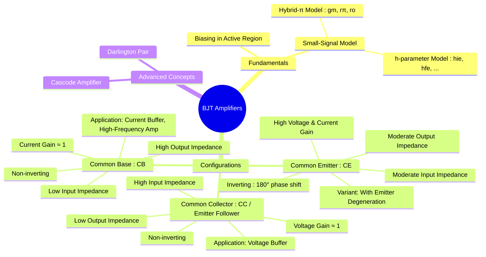

---
tags:
  - bjt
  - amplifiers
  - analog-electronics
  - common-emitter
  - common-collector
  - common-base
created: 2025-09-08
aliases:
  - BJT Amplifier
  - Bipolar Junction Transistor Amplifier
subject: "[[Analog & Digital Electronics]]"
parent: Amplifiers
modified: 2026-08-04T09:11:56
---
### BJT Amplifiers
#bjt-amplifiers #analog-circuits

> BJT amplifiers are circuits that use a Bipolar Junction Transistor to increase the strength of a weak AC signal. For a BJT to function as an amplifier, it must be biased to operate in the **active region**, where the emitter-base junction is forward-biased and the collector-base junction is reverse-biased. This allows the small AC signal at the input to control a much larger current in the output circuit. The analysis is performed using [[Small Signal Analysis]].

---
#### BJT Biasing for Amplification
#bjt-biasing
A stable DC operating point ([[BJT Biasing and Thermal Stability|Q-Point]]) must be established in the middle of the active region to allow for maximum symmetrical swing of the output signal, preventing [[Clipper and Clamper Circuits|clipping]]. The [[Transistor Biasing|voltage divider bias]] configuration is the most common method due to its excellent stability.

#### Small-Signal Operation (Hybrid-$\pi$ Model)
#hybrid-pi-model

For AC analysis, the BJT is replaced by its small-signal equivalent circuit, the hybrid-$\pi$ model. The parameters of this model are determined by the DC Q-point.

1. **Transconductance ($g_m$)**: The gain of the voltage-controlled current source.
    $$\boxed{\quad g_m = \frac{I_{CQ}}{V_T} \quad}$$
2. **Input Resistance ($r_\pi$)**: The AC resistance seen looking into the base.
    $$\boxed{\quad r_\pi = \frac{\beta}{g_m} = \frac{\beta V_T}{I_{CQ}} \quad}$$
3. **Output Resistance ($r_o$)**: Accounts for the Early effect.
    $$\boxed{\quad r_o = \frac{V_A}{I_{CQ}} \quad}$$
    where $V_A$ is the Early voltage.

---
### Amplifier Configurations
#bjt-configurations

There are three basic single-stage BJT amplifier configurations.

#### 1. Common Emitter (CE) Amplifier
#common-emitter-amplifier

Input is applied to the Base, output is taken from the Collector, and the Emitter is common (AC ground, often via a bypass capacitor). It is the most versatile and widely used configuration.

* **Characteristics**: Provides both high voltage and high current gain. The output is **180° out of phase** with the input.
* **Voltage Gain ($A_v$)**:
    $$\boxed{\quad A_v = -g_m (R_C \parallel r_o) \approx -g_m R_C \quad}$$
* **Input Impedance ($R_{in}$)**:
    $$\boxed{\quad R_{in} = R_B \parallel r_\pi \quad}$$
    where $R_B = R_1 \parallel R_2$ for a voltage divider bias.
* **Output Impedance ($R_{out}$)**:
    $$\boxed{\quad R_{out} = R_C \parallel r_o \approx R_C \quad}$$

##### Common Emitter with Emitter Degeneration
An unbypassed emitter resistor ($R_E$) is included. This introduces negative feedback.
* **Effects**: Stabilizes voltage gain, increases input impedance, and increases output impedance, at the cost of reduced gain.
* **Voltage Gain ($A_v$)**:
    $$\boxed{\quad A_v = \frac{-\beta R_C}{r_\pi + (1+\beta)R_E} \approx \frac{-R_C}{R_E} \quad \text{if } (1+\beta)R_E \gg r_\pi}$$

#### 2. Common Collector (CC) Amplifier / Emitter Follower
#common-collector-amplifier #emitter-follower

Input is applied to the Base, output is taken from the Emitter, and the Collector is common (AC ground).

* **Characteristics**: Voltage gain is slightly less than 1, **non-inverting**, high current gain, high input impedance, and low output impedance. Used as a **voltage buffer** to connect a high-impedance source to a low-impedance load.
* **Voltage Gain ($A_v$)**:
    $$\boxed{\quad A_v = \frac{(1+\beta)(R_E \parallel r_o)}{r_\pi + (1+\beta)(R_E \parallel r_o)} \approx \frac{R_E}{R_E + r_e} \approx 1 \quad}$$
    where $r_e = r_\pi / (1+\beta) = V_T/I_{EQ}$.
* **Input Impedance ($R_{in}$)**:
    $$\boxed{\quad R_{in} = R_B \parallel [r_\pi + (1+\beta)R_E] \quad}$$
* **Output Impedance ($R_{out}$)**:
    $$\boxed{\quad R_{out} = R_E \parallel \left(\frac{r_\pi + R_{th}}{\beta+1}\right) = R_E \parallel r_e \quad}$$
    where $R_{th}$ is the Thevenin resistance of the source driving the base.

#### 3. Common Base (CB) Amplifier
#common-base-amplifier

Input is applied to the Emitter, output is taken from the Collector, and the Base is common (AC ground).

* **Characteristics**: Non-inverting voltage gain (similar magnitude to CE), current gain is slightly less than 1, low input impedance, and high output impedance. Used as a **current buffer** or for high-frequency applications.
* **Voltage Gain ($A_v$)**:
    $$\boxed{\quad A_v = g_m (R_C \parallel r_o) \approx g_m R_C \quad}$$
* **Input Impedance ($R_{in}$)**:
    $$\boxed{\quad R_{in} = R_E \parallel r_e \parallel \frac{r_o+R_C}{1+g_m r_o} \approx r_e = \frac{V_T}{I_{EQ}} \quad}$$
* **Output Impedance ($R_{out}$)**:
    $$\boxed{\quad R_{out} = R_C \parallel r_o[1+g_m(r_\pi \parallel R_E)] \approx R_C \quad}$$

#### Summary of BJT Amplifier Characteristics

| Characteristic      | Common Emitter (CE)      | Common Collector (CC)      | Common Base (CB)          |
| ------------------- | ------------------------ | -------------------------- | ------------------------- |
| **Voltage Gain** ($A_v$) | High, Inverting          | $\approx 1$, Non-inverting | High, Non-inverting       |
| **Current Gain** ($A_i$) | High ($\beta$)           | High ($\beta+1$)           | $\approx 1$ ($\alpha$)    |
| **Input Impedance** | Moderate ($\sim r_\pi$) | High                       | Low ($\sim r_e$)         |
| **Output Impedance**| Moderate ($\sim R_C$)  | Low                        | High ($\sim R_C$)        |
| **Phase Shift**     | 180°                     | 0°                         | 0°                        |
| **Application**     | General purpose gain     | Voltage Buffer, Driver     | Current Buffer, RF Amp    |

---
### Related Concepts
#related-concepts

> [[Common Source Configuration]] (The underlying device)

[[Small Signal Analysis]] (The core analysis technique)
[[Transistor Biasing]] (Setting up the DC conditions)
[[MOSFET Amplifiers]] (Comparison with MOSFET counterparts)
[[Frequency Response]] (Analysis of amplifier performance vs. frequency)