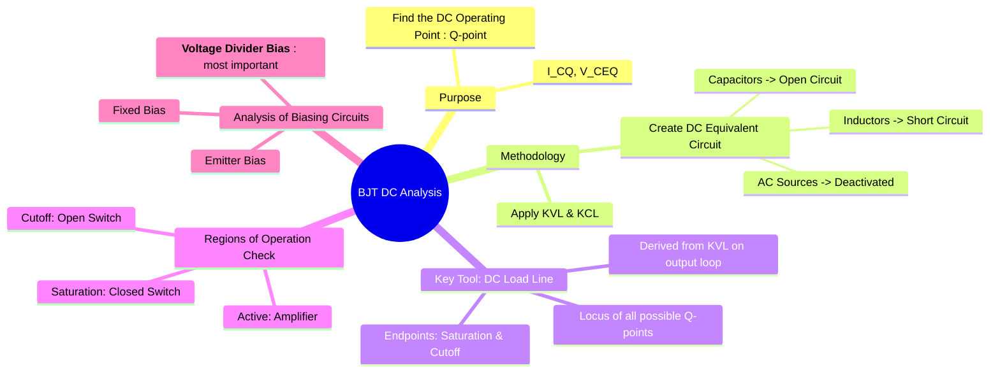

---
tags:
  - bjt
  - dc-analysis
  - biasing
  - q-point
  - load-line
  - analog-electronics
created: 2025-09-08
aliases:
  - BJT Biasing
  - DC Biasing of BJT
  - Q-point analysis
  - Voltage Divider Bias
subject: "[[Analog & Digital Electronics]]"
parent: "[[Transistor Biasing]]"
modified: 2026-08-04T09:12:31
---
### BJT DC Analysis
#bjt-dc-analysis #q-point

> **BJT DC Analysis**, or biasing, is the process of determining the DC collector current ($I_{CQ}$) and the DC collector-emitter voltage ($V_{CEQ}$) of a transistor in a given circuit. This specific set of DC values is called the **Quiescent Point (Q-point)**. The primary goal of DC analysis is to establish a stable Q-point in the desired region of operation—typically the **active region** for amplifier applications.

The Q-point determines the parameters ($g_m, r_\pi$) for the subsequent [[BJT Small-Signal Model|AC analysis]].

---
#### DC Equivalent Circuit
#dc-equivalent-circuit

To perform DC analysis, the circuit is simplified based on the DC behavior of its components:
1.  All **capacitors** are treated as **open circuits**.
2.  All **inductors** are treated as **short circuits**.
3.  All AC voltage and current sources are deactivated (voltage sources are shorted, current sources are opened).

---
#### The DC Load Line
#dc-load-line

The DC load line is a graphical tool representing all possible combinations of $I_C$ and $V_{CE}$ for a given amplifier. It is a straight line drawn on the BJT's output characteristics. The Q-point must lie on this line.
The line is derived by applying KVL to the collector-emitter output loop. For a standard common-emitter configuration, the KVL equation is:
$$V_{CC} = I_C R_C + V_{CE}$$
Rearranging this gives the equation of the load line:
$$\boxed{\quad I_C = -\frac{1}{R_C} V_{CE} + \frac{V_{CC}}{R_C} \quad}$$
The two endpoints of the load line are:
1.  **Saturation Point (Y-intercept)**: Found by setting $V_{CE} = 0$.
    $$\boxed{\quad I_{C,sat} = \frac{V_{CC}}{R_C} \quad}$$
2.  **Cutoff Point (X-intercept)**: Found by setting $I_C = 0$.
    $$\boxed{\quad V_{CE,cutoff} = V_{CC} \quad}$$

---
#### General Analysis Procedure
#bjt-dc-analysis/procedure

The general steps to find the Q-point ($I_{CQ}$, $V_{CEQ}$) are:
1.  Draw the DC equivalent circuit.
2.  **Analyze the Base-Emitter Loop**: Apply KVL to the input loop (base circuit) to find the base current, $I_B$.
3.  **Find Collector Current**: Use the DC current gain, $\beta$ (or $h_{FE}$), to find the collector current.
    $$\boxed{\quad I_C = \beta I_B \quad}$$
4.  **Analyze the Collector-Emitter Loop**: Apply KVL to the output loop to find the collector-emitter voltage, $V_{CE}$.
5.  **Verify Region of Operation**: Check the biasing conditions to confirm the transistor is operating in the assumed region (usually active).
    *   **Active Region**: Base-Emitter junction is forward-biased ($V_{BE} \approx 0.7V$) and Collector-Base junction is reverse-biased ($V_{CB} > 0$, or $V_C > V_B$).
    *   **Saturation**: Both junctions are forward-biased ($V_{CE} \approx V_{CE,sat} \approx 0.2V$).
    *   **Cutoff**: Both junctions are reverse-biased ($I_B \approx 0, I_C \approx 0$).

#### Analysis of Voltage Divider Bias
#voltage-divider-bias

This is the most common and stable biasing circuit. The base circuit can be simplified using [[Thevenin's Theorem]].
*   **Thevenin Voltage ($V_{th}$)**:
    $$\boxed{\quad V_{th} = V_{CC} \frac{R_2}{R_1+R_2} \quad}$$
*   **Thevenin Resistance ($R_{th}$)**:
    $$\boxed{\quad R_{th} = R_1 \parallel R_2 \quad}$$
The KVL equation for the simplified base-emitter loop is:
$$\boxed{\quad V_{th} = I_B R_{th} + V_{BE} + I_E R_E \quad}$$
Using the relationship $I_E = (\beta+1)I_B$, we can solve for $I_B$:
$$I_B = \frac{V_{th} - V_{BE}}{R_{th} + (\beta+1)R_E}$$
Once $I_B$ is known, $I_C$ and $V_{CE}$ can be found using the general procedure.

---
### Related Concepts
#related-concepts

> [[Transistor Biasing]] (Discusses stability and other biasing circuits)

[[BJT]] (The core device)
[[Small Signal Analysis]] (The AC analysis that follows DC analysis)
[[Kirchhoff's Laws]] (The fundamental analysis tool)
[[Thevenin's Theorem]] (Used for simplifying the voltage divider bias circuit)
[[DC Load Line]]