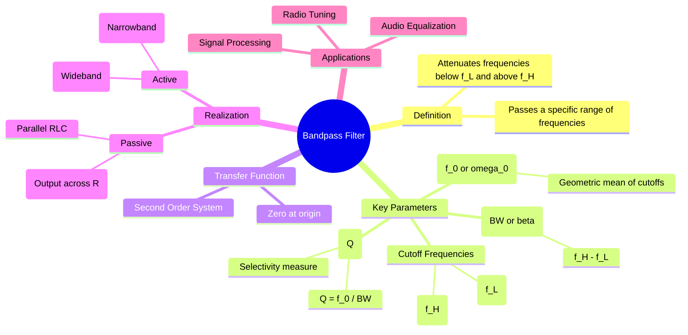

---
tags:
  - analog-electronics
  - signals-and-systems
  - filters
  - gate
  - circuit-theory
created: 2026-08-04T09:10:23
aliases:
  - BPF
  - Band-Pass Filter
subject: "[[Analog & Digital Electronics]]"
parent:
  - Filters (Active and Passive)
formula:
  - "Band-Pass Filter (Transfer Function) : $$H(s) = \\frac{V_{out}(s)}{V_{in}(s)} = \\frac{K \\left(\\frac{\\omega_0}{Q}\\right) s}{s^2 + \\left(\\frac{\\omega_0}{Q}\\right) s + \\omega_0^2}$$"
modified: 2026-08-04T09:10:23
---
### Bandpass Filter (BPF)
#filters #analog-electronics #signal-processing

> A Bandpass Filter (BPF) is a circuit that allows signals within a specific frequency range (known as the **passband**) to pass through with minimal attenuation, while rejecting (attenuating) signals at frequencies outside this range (the **stopbands**).

---
#### Frequency Response Characteristics
#filters/frequency-response

A BPF is characterized by two cutoff frequencies (at -3dB gain):
1.  **Lower Cutoff Frequency ($\omega_L$ or $f_L$)**
2.  **Upper Cutoff Frequency ($\omega_H$ or $f_H$)**

##### Key Relationships
*   **Bandwidth ($\beta$ or $BW$):** The width of the passband.
    $$\boxed{\quad BW = \omega_H - \omega_L \quad}$$
*   **Center Frequency (Resonant Frequency, $\omega_0$):** The frequency at which the gain is maximum. For a geometric symmetric response:
    $$\boxed{\quad \omega_0 = \sqrt{\omega_L \omega_H} \quad}$$
    *(Note: For very narrow band filters, the arithmetic mean is often a close approximation, but geometric mean is the exact definition for the logarithmic symmetry of Bode plots).*
*   **Quality Factor ($Q$):** A measure of the selectivity or "sharpness" of the filter. A higher $Q$ indicates a narrower bandwidth relative to the center frequency.
    $$\boxed{\quad Q = \frac{\omega_0}{BW} = \frac{\omega_0}{\omega_H - \omega_L} \quad}$$

---
#### Transfer Function
#filters/transfer-function

The standard form of the transfer function for a second-order bandpass filter is:
$$\boxed{\quad H(s) = \frac{V_{out}(s)}{V_{in}(s)} = \frac{K \left(\frac{\omega_0}{Q}\right) s}{s^2 + \left(\frac{\omega_0}{Q}\right) s + \omega_0^2} \quad}$$
or expressed in terms of bandwidth $\beta = \omega_0/Q$:
$$H(s) = \frac{A_0 \beta s}{s^2 + \beta s + \omega_0^2}$$
Where:
*   $K$ or $A_0$ is the gain at the center frequency $\omega_0$.
*   The presence of a zero at the origin ($s$ in the numerator) blocks DC.
*   The pole locations determine $\omega_0$ and $Q$.

> [!pyq]- PYQ : 2019
> ![[ee_2019#^q6]]

---
#### Classification: Wideband vs. Narrowband
#filters/classification

1.  **Wideband BPF ($Q < 10$)**:
    *   Constructed by cascading a **High-Pass Filter (HPF)** with cutoff $f_L$ and a **Low-Pass Filter (LPF)** with cutoff $f_H$.
    *   Condition: $f_L < f_H$.
    *   The bandwidth is designed by setting the two distinct cutoff frequencies independently.

2.  **Narrowband BPF ($Q \ge 10$)**:
    *   Usually realized using a single resonant circuit or specific active topologies (e.g., Multiple Feedback BPF).
    *   Relies on resonance to select a specific frequency.
    *   $\omega_L \approx \omega_0 - \frac{BW}{2}$ and $\omega_H \approx \omega_0 + \frac{BW}{2}$.

---
#### Circuit Realization (Passive RLC)
#filters/passive-realization

A simple passive bandpass filter can be created using a **Series RLC circuit** and taking the output voltage across the **Resistor ($R$)**.

*   **Impedance:** $Z = R + j(\omega L - \frac{1}{\omega C})$
*   **At Resonance ($\omega_0 = 1/\sqrt{LC}$):** The reactive components cancel out ($Z=R$), current is maximum, and $V_{out} = V_{in}$.
*   **At Low/High Frequencies:** The capacitor (low freq) or inductor (high freq) dominates the impedance, reducing the current and $V_{out}$.

$$H(s) = \frac{V_R(s)}{V_{in}(s)} = \frac{R}{R + sL + \frac{1}{sC}} = \frac{\frac{R}{L}s}{s^2 + \frac{R}{L}s + \frac{1}{LC}}$$
Comparing to standard form:
*   $\omega_0 = \frac{1}{\sqrt{LC}}$
*   $BW = \frac{R}{L}$
*   $Q = \frac{\omega_0}{BW} = \frac{1}{R}\sqrt{\frac{L}{C}}$

---
### Related Concepts
#topic/related-concepts

> [[Low-Pass Filter]]
> [[High-Pass Filter]]

[[Band Stop Filter]] (Notch Filter - The inverse of Bandpass)
[[Series Resonance in RLC Circuits]]
[[Quality Factor (Q-Factor)]]
[[Bode Plots]]
[[Operational Amplifiers]] (For Active Filter realization)
[[Butterworth Filter]] (Filter approximation type)
