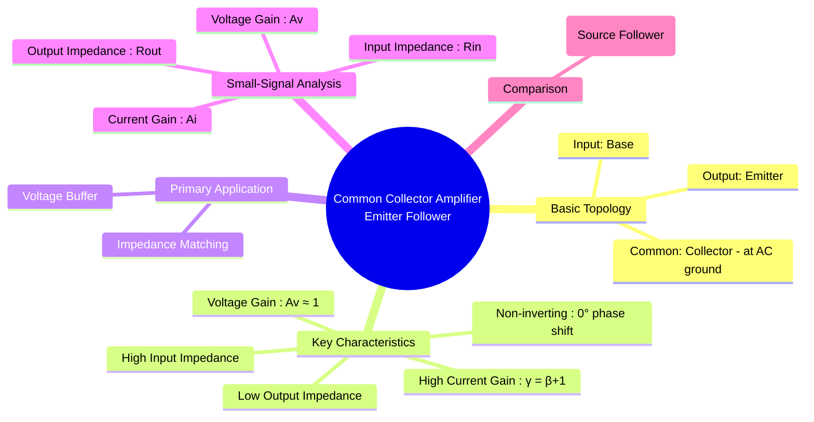

---
tags:
  - bjt-amplifier
  - analog-electronics
  - common-collector
  - emitter-follower
  - voltage-buffer
created: 2025-09-08
aliases:
  - "CC Amplifier : BJT Amplifier"
  - "Emitter Follower : BJT Amplifier"
subject: "[[Analog & Digital Electronics]]"
parent: "[[BJT Amplifiers]]"
modified: 2026-08-04T09:20:54
---
### Common Collector (CC) Amplifier / Emitter Follower
#common-collector-amplifier #emitter-follower #voltage-buffer #impedance-matching

> The Common Collector (CC) amplifier, more popularly known as the **Emitter Follower**, is a BJT configuration where the input signal is applied to the base, the output is taken from the emitter, and the collector is common to both input and output (AC ground). It is called an "emitter follower" because the output voltage on the emitter faithfully follows the input voltage on the base, with a nearly unity, non-inverting voltage gain.

Its primary application is as a [[voltage buffer]], used for impedance matching between a high-impedance source and a low-impedance load.

---
#### Key Characteristics
* **Voltage Gain ($A_v$)**: Slightly less than 1.
* **Current Gain ($A_i$)**: High ($\gamma = \beta+1$).
* **Input Impedance ($R_{in}$)**: High.
* **Output Impedance ($R_{out}$)**: Low.
* **Phase Shift**: 0° (non-inverting).

---
#### Small-Signal Analysis

The analysis uses the [[BJT Small-Signal Model#The Hybrid-$ pi$ Model|BJT's hybrid-pi model]]. The circuit's unique properties arise from the feedback inherent in its topology.

* **Voltage Gain ($A_v$)**:
    The gain is always positive and slightly less than unity.
    $$\boxed{\quad A_v = \frac{(1+\beta)(R_E \parallel r_o)}{r_\pi + (1+\beta)(R_E \parallel r_o)} \quad}$$
    Ignoring the often large $r_o$ and using the relation $r_e = \frac{r_\pi}{1+\beta} = \frac{\alpha}{g_m}$, the formula simplifies to a very common and useful form:
    $$A_v \approx \frac{R_E}{r_e + R_E}$$
    Since $R_E$ is typically much larger than the small dynamic emitter resistance $r_e$, the gain $A_v$ is very close to 1.

* **Input Impedance ($R_{in}$)**:
    The impedance seen at the emitter leg is "reflected" to the base, magnified by a factor of $(1+\beta)$. This results in a very high input impedance.
    The impedance looking into the base is $$\boxed{\quad Z_{base} = r_\pi + (1+\beta)R_E \quad}$$
    The total input impedance of the amplifier is this in parallel with the biasing resistors.
    $$\boxed{\quad R_{in} = R_B \parallel [r_\pi + (1+\beta)R_E] \quad}$$

* **Output Impedance ($R_{out}$)**:
    The impedance looking back into the emitter is low. The resistance at the base (from the source, $R_S$, and biasing resistors, $R_B$) is reflected to the emitter and is *reduced* by a factor of $(1+\beta)$.
    The impedance looking into the emitter terminal is $$\boxed{\quad Z_{emitter} = r_e + \frac{R_{th}}{\beta+1}\quad}$$, where $R_{th} = R_S \parallel R_B$.
    The total output impedance of the amplifier is this in parallel with the emitter resistor $R_E$.
    $$\boxed{\quad R_{out} = R_E \parallel \left(r_e + \frac{R_S \parallel R_B}{\beta+1}\right) \quad}$$
    Often, this is approximated as simply $R_{out} \approx R_E \parallel r_e$, which is a small value.

* **Current Gain ($A_i$)**:
    The intrinsic current gain of the device is $I_E/I_B = \gamma = \beta+1$, which is high. The overall circuit current gain $A_{is} = i_{load}/i_{source}$ is also high.

#### Application: The Voltage Buffer
The Emitter Follower is an excellent voltage buffer for two main reasons:
1. **High Input Impedance**: It draws very little current from the input source, preventing the source's voltage from dropping (i.e., it doesn't "load" the source).
2. **Low Output Impedance**: It can supply a relatively large current to a low-impedance load without a significant internal voltage drop.

This allows it to efficiently connect a weak, high-impedance source to a demanding, low-impedance load, ensuring maximum voltage transfer.

---
### Related Concepts
#related-concepts

> [[BJT Amplifiers]] (Parent category)

[[Common Emitter Amplifier]]
[[Common Base Amplifier]]
[[Small Signal Analysis]] (The method used for analysis)
[[Impedance Matching]] (The primary application)
[[Common Drain Amplifier]] (The MOSFET equivalent, also a buffer)
[[Darlington Pair]] (A configuration of two BJTs, often in a CC-CC setup, to achieve extremely high current gain and input impedance)