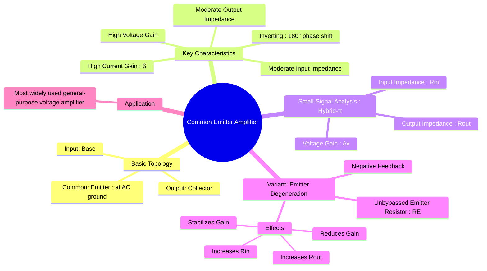

---
tags:
  - bjt-amplifier
  - analog-electronics
  - common-emitter
  - voltage-amplifier
created: 2025-09-08
aliases:
  - CE Amplifier
  - Common-Emitter Amplifier
subject: "[[Analog & Digital Electronics]]"
parent: "[[BJT Amplifiers]]"
modified: 2026-08-04T09:21:26
---
### Common Emitter (CE) Amplifier
#common-emitter-amplifier #voltage-amplifier

> The Common Emitter (CE) amplifier is the most widely used BJT amplifier configuration. It is celebrated for providing both high voltage gain and high current gain, making it an excellent choice for a general-purpose voltage amplifier. Its key identifying feature is that the input signal is applied to the base, the output is taken from the collector, and the emitter is common to both (usually at AC ground).

A critical characteristic of the CE amplifier is that the output signal is **180° out of phase** with the input signal. It is the BJT equivalent of the [[Common Source Amplifier|Common Source (CS) MOSFET amplifier]].

---
#### Basic Configuration

The circuit is biased to keep the BJT in the **active region**. The emitter is connected to ground, often through a bypass capacitor ($C_E$) which acts as a short circuit for AC signals, ensuring the emitter is at AC ground.

---
#### Small-Signal Analysis (without Emitter Degeneration)
#small-signal-analysis
Using the hybrid-$\pi$ model for AC analysis, we can determine the amplifier's key parameters.

* **Voltage Gain ($A_v$)**:
    The gain is the ratio of the AC output voltage ($v_{out}$) at the collector to the AC input voltage ($v_{in}$) at the base. The output voltage is the collector current flowing through the parallel combination of the collector resistor ($R_C$) and the transistor's output resistance ($r_o$).
    $$v_{out} = -i_c (R_C \parallel r_o) = -g_m v_{be} (R_C \parallel r_o)$$
    Since $v_{in} = v_{be}$, the gain is:
    $$\boxed{\quad A_v = \frac{v_{out}}{v_{in}} = -g_m (R_C \parallel r_o) \quad}$$
    If the Early effect is negligible ($r_o \to \infty$), the gain simplifies to $A_v \approx -g_m R_C$.

* **Input Impedance ($R_{in}$)**:
    The input impedance is the impedance seen by the source looking into the amplifier. It is the parallel combination of the biasing resistors ($R_B = R_1 \parallel R_2$) and the impedance looking into the base of the transistor, which is $r_\pi$.
    $$\boxed{\quad R_{in} = R_B \parallel r_\pi \quad}$$

* **Output Impedance ($R_{out}$)**:
    The output impedance is found by looking into the collector terminal with the input source set to zero. This makes $v_{be}=0$, so the current source $g_m v_{be}$ is open. We are left with the collector resistor $R_C$ in parallel with the transistor's output resistance $r_o$.
    $$\boxed{\quad R_{out} = R_C \parallel r_o \quad}$$

---
#### Common Emitter Amplifier with Emitter Degeneration
#emitter-degeneration
To improve stability and linearity, an unbypassed resistor ($R_E$) is added in the emitter leg. This introduces **negative feedback**.

* **Effects of Emitter Degeneration**:
    1. **Stabilizes Voltage Gain**: Makes the gain less dependent on transistor parameters like $\beta$ and temperature.
    2. **Increases Input Impedance**: Reduces loading on the signal source.
    3. **Increases Output Impedance**.
    4. **Reduces Voltage Gain**: This is the primary trade-off.

* **Voltage Gain ($A_v$) with Degeneration**:
    The emitter resistor provides feedback, which reduces the overall gain.
    $$\boxed{\quad A_v = \frac{-\beta R_C}{r_\pi + (1+\beta)R_E} \quad}$$
    A very useful and common approximation occurs when $(1+\beta)R_E \gg r_\pi$:
    $$A_v \approx \frac{-\beta R_C}{(1+\beta)R_E} \approx \frac{-R_C}{R_E}$$
    This shows the gain is now determined by a ratio of external resistors, making it stable and predictable.

* **Input Impedance ($R_{in}$) with Degeneration**:
    The emitter resistor's impedance is "magnified" by a factor of $(1+\beta)$ when seen from the base.
    $$\boxed{\quad R_{in} = R_B \parallel [r_\pi + (1+\beta)R_E] \quad}$$
    This results in a significantly higher input impedance compared to the standard CE configuration.

---
### Related Concepts
#related-concepts

> [[BJT Amplifiers]] (Parent category)

[[Common Collector Amplifier]]
[[Common Base Amplifier]]
[[Small Signal Analysis]] (The method used for analysis)
[[Transistor Biasing]] (Essential for setting the Q-point)
[[BJT]] (The core device)
[[Common Source Amplifier]] (The MOSFET equivalent)