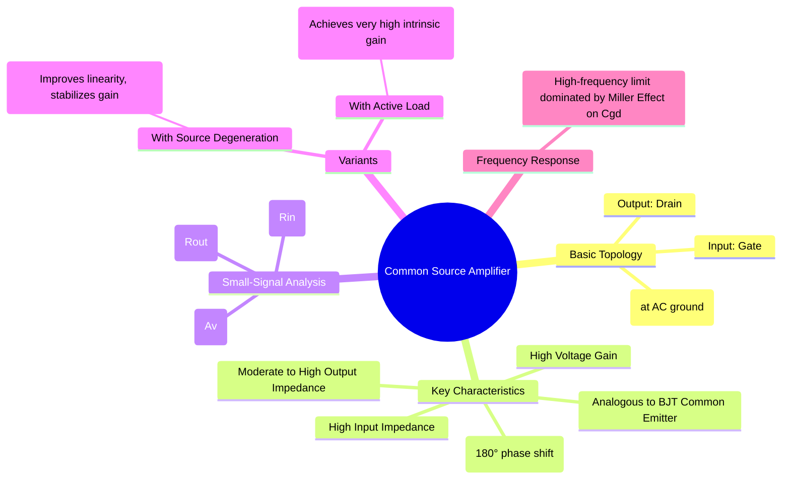

---
tags:
  - mosfet-amplifier
  - analog-electronics
  - common-source
  - voltage-amplifier
created: 2025-09-08
aliases:
  - CS Amplifier
  - Common-Source Amplifier
subject: "[[Analog & Digital Electronics]]"
parent: "[[MOSFET Amplifiers]]"
modified: 2026-08-04T09:22:14
---
### Common Source (CS) Amplifier
#common-source-amplifier #voltage-amplifier

> The Common Source (CS) amplifier is the most fundamental and widely used MOSFET amplifier configuration. It acts as a transconductance amplifier, converting an input voltage signal at the gate to an output current at the drain, which is then passed through a load resistor to produce an amplified output voltage. It is analogous to the Common Emitter (CE) amplifier in BJT circuits.

Its primary characteristics are high voltage gain, high input impedance, and a 180° phase inversion between the input and output signals.

---
#### Basic Configuration
The input signal is applied to the gate, the output is taken from the drain, and the source terminal is common to both input and output (typically connected to ground or AC ground via a bypass capacitor). A load resistor ($R_D$) is connected between the drain and the power supply ($V_{DD}$). [[Transistor Biasing|Biasing]] is set to keep the MOSFET in the **saturation region**.

---
#### Small-Signal Analysis
The analysis is performed using the MOSFET small-signal model. The key parameters ($g_m$, $r_o$) are determined by the DC Q-point.

* **Voltage Gain ($A_v$)**:
    The small AC gate voltage $v_{gs}$ creates a drain current $i_d = g_m v_{gs}$. This current flows through the parallel combination of the load resistor $R_D$ and the MOSFET's own output resistance $r_o$. The output voltage is $v_{out} = -i_d (R_D \parallel r_o)$.
    $$\boxed{\quad A_v = \frac{v_{out}}{v_{in}} = -g_m (R_D \parallel r_o) \quad}$$
    If the Early effect is negligible ($r_o \to \infty$), the gain simplifies to:
    $$A_v \approx -g_m R_D$$

* **Input Impedance ($R_{in}$)**:
    Since the gate of a MOSFET is electrically insulated by a layer of silicon dioxide, the input impedance looking into the gate terminal itself is nearly infinite. Therefore, the input impedance of the amplifier circuit is determined entirely by the external biasing resistors ($R_G$).
    $$\boxed{\quad R_{in} = R_G \quad}$$
    For a voltage divider bias, $R_G = R_1 \parallel R_2$. This is typically very high.

* **Output Impedance ($R_{out}$)**:
    The output impedance is found by looking into the drain terminal while setting the independent input source to zero ($v_{in}=0 \implies v_{gs}=0$). The voltage-controlled current source $g_m v_{gs}$ becomes zero (an open circuit). We are left with the load resistor $R_D$ in parallel with the transistor's output resistance $r_o$.
    $$\boxed{\quad R_{out} = R_D \parallel r_o \quad}$$

---
#### Common Source Amplifier with Source Degeneration
#source-degeneration
An unbypassed resistor ($R_S$) is placed between the source and ground. This introduces negative feedback, which has several important effects:
* **Stabilizes gain**: Makes the gain less dependent on the transistor parameter $g_m$.
* **Increases linearity**: Reduces distortion for larger input signals.
* **Increases output impedance**.

The trade-off is a reduction in the voltage gain.
* **Voltage Gain ($A_v$) with Degeneration**:
    $$\boxed{\quad A_v = \frac{-g_m R_D}{1+g_m R_S} \quad}$$
    (This formula assumes $r_o \to \infty$). If $g_m R_S \gg 1$, the gain becomes:
    $$A_v \approx \frac{-R_D}{R_S}$$
    This shows that the gain is now set by a ratio of resistors, which is much more stable and predictable.
* **Output Impedance ($R_{out}$) with Degeneration**:
    Degeneration increases the impedance looking into the drain. The overall output impedance of the circuit is:
    $$R_{out} = R_D \parallel [r_o(1+g_m R_S) + R_S]$$

#### Common Source with Active Load
#active-load
In integrated circuits, resistors take up a lot of space. Instead, an **active load**, which is a current source implemented with another MOSFET (typically a PMOS in CMOS technology), is used in place of $R_D$.
* An ideal current source has infinite output resistance. A practical transistor current source has a very high output resistance, $r_{o,load}$.
* The total load resistance becomes very high: $R_{out} = r_{o,amplifier} \parallel r_{o,load}$.
* This results in a very high voltage gain, known as the **intrinsic gain** of the transistor:
    $$\boxed{\quad A_v = -g_m (r_{o,n} \parallel r_{o,p}) \quad}$$

---
### Related Concepts
#related-concepts

> [[MOSFET Amplifiers]] (Parent category)

[[Common Emitter Amplifier]] (The BJT equivalent)
[[Small Signal Analysis]] (The method used for analysis)
[[MOSFET]] (The core device)
[[Current Mirrors]] (Used to implement active loads)
[[Frequency Response]] (Analysis of gain and phase vs. frequency)
[[Miller Effect]] (A critical high-frequency limitation in CS amplifiers)