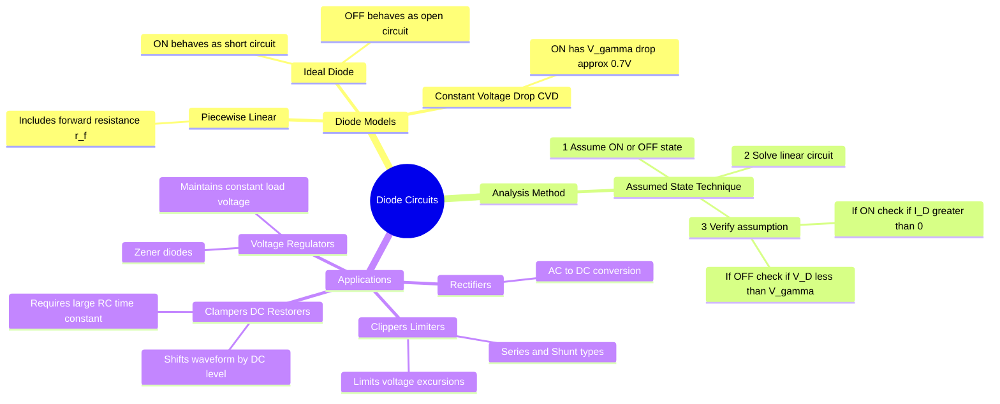

---
tags:
  - analog-electronics
  - diodes
  - circuit-analysis
  - gate
created: 2026-08-04T09:34:37
aliases:
  - Diode Applications
  - Clippers and Clampers
  - Diode Analysis
subject: "[[Analog & Digital Electronics]]"
parent:
  - Semiconductor Physics and Devices
modified: 2026-08-04T09:34:37
---
### Diode Circuits
#analog-electronics/diodes #circuit-analysis 

> **Diode Circuits** utilize the unidirectional current-conducting property of diodes (p-n junctions) to perform nonlinear wave-shaping, rectification, and voltage regulation. Analyzing these circuits requires replacing the nonlinear diode with simplified linear models based on its operating region.

---

#### 1. Diode Models for Circuit Analysis
#diodes/models

The actual V-I characteristic of a diode is exponential: $I_D = I_S \left( e^{V_D / \eta V_T} - 1 \right)$. For hand calculations, we use simplified piecewise linear models:

1.  **Ideal Diode Model:**
    *   **Forward Bias (ON):** Perfect conductor ($V_D = 0$, $I_D > 0$). Acts as a **Short Circuit**.
    *   **Reverse Bias (OFF):** Perfect insulator ($I_D = 0$, $V_D < 0$). Acts as an **Open Circuit**.
2.  **Constant Voltage Drop (CVD) Model:**
    *   **ON:** Acts as a constant voltage source opposing current flow. $V_D = V_\gamma$ (Cut-in voltage, typically $0.7\text{ V}$ for Silicon, $0.3\text{ V}$ for Germanium).
    *   **OFF:** $I_D = 0$ for $V_D < V_\gamma$.
3.  **Piecewise Linear Model:**
    *   Includes a forward dynamic resistance ($r_f$) in series with the cut-in voltage $V_\gamma$.
    *   **ON:** $V_D = V_\gamma + I_D r_f$.

#### 2. Assumed State Analysis Technique (GATE Method)
#circuit-analysis/technique

When a circuit contains multiple diodes, it is difficult to know a priori which are ON and which are OFF.
**Algorithm:**
1.  **Assume** a state (ON or OFF) for every diode in the circuit.
2.  **Replace** each diode with its corresponding model (e.g., Short Circuit for ON, Open Circuit for OFF in the ideal case).
3.  **Solve** the resulting linear circuit for diode currents ($I_D$) and diode voltages ($V_D$).
4.  **Verify** the assumptions:
    *   For a diode assumed **ON**, verify that the calculated $\boxed{\quad I_D > 0 \quad}$.
    *   For a diode assumed **OFF**, verify that the calculated $\boxed{\quad V_D < V_\gamma \quad}$ (or $V_D < 0$ for ideal).
5.  If any assumption fails, choose a new combination of states and repeat.

#### 3. Clipper Circuits (Limiters)
#diodes/clippers

Clippers are used to "clip" or remove a portion of an AC signal waveform above or below a certain reference level without distorting the remaining part.

*   **Series Clipper:** Diode is in series with the load.
*   **Shunt (Parallel) Clipper:** Diode is in parallel with the load.
*   **Biased Clipper:** A DC voltage source ($V_R$) is added in series with the diode to shift the clipping level.
    *   *Example:* A diode with anode at $v_{in}$ and cathode at $V_R$ will conduct and clip the output at $V_{out} = V_R + V_\gamma$ whenever $v_{in} > V_R + V_\gamma$.
*   **Transfer Characteristics:** A plot of $V_{out}$ vs $V_{in}$. It typically consists of linear segments with slope 1 (when diode is OFF and signal passes) and slope 0 (when diode is ON and signal is clipped).

#### 4. Clamper Circuits (DC Restorers)
#diodes/clampers

Clampers shift the entire AC waveform positively or negatively by adding a DC component, without changing the peak-to-peak amplitude or shape of the waveform.

**Basic Components:** A Capacitor ($C$), a Diode ($D$), and a Resistor ($R$).
*   **Operation Principle:** The capacitor charges to the peak voltage of the input signal during the half-cycle when the diode is forward-biased.
*   **Time Constant Constraint:** For proper clamping, the discharge time constant $\tau = RC$ must be much larger than the time period $T$ of the input signal:
    $$\boxed{\quad RC \gg T \quad}$$
*   **Output Voltage:**
    *   **Positive Clamper:** Diode points "up" (cathode to input, anode to ground). Output shifts up. $V_{out(min)} \approx 0$ (or $-V_\gamma$).
    *   **Negative Clamper:** Diode points "down". Output shifts down. $V_{out(max)} \approx 0$ (or $+V_\gamma$).
    $$\boxed{\quad V_{out}(t) = V_{in}(t) + V_C \quad}$$ (Where $V_C$ is the steady-state voltage stored on the capacitor).

#### 5. Voltage Multipliers
#diodes/multipliers

Cascaded clamper and peak-detector (rectifier) stages used to generate a high DC voltage from a lower AC voltage.
*   **Half-Wave Voltage Doubler:** Uses two diodes and two capacitors. Charges $C_1$ to $V_m$ during the negative half-cycle, and charges $C_2$ to $2V_m$ during the positive half-cycle.
*   Output is taken across $C_2$: $V_{out} = 2V_m$.

#### 6. Zener Diode Regulators
#diodes/zener

Zener diodes are operated in the **Reverse Breakdown Region** to maintain a constant voltage ($V_Z$) across a load despite variations in input voltage ($V_S$) or load current ($I_L$).

*   **Model:** In breakdown, a Zener acts as a constant voltage source $V_Z$ in series with a small Zener resistance $r_z$.
*   **Condition for Regulation:** The Zener must be kept in the breakdown region.
    $$\boxed{\quad I_Z > I_{Z(min)} \quad \text{and} \quad I_Z < I_{Z(max)} \quad}$$
*   **Line Regulation:** Ability to maintain $V_L$ despite changes in supply $V_S$.
*   **Load Regulation:** Ability to maintain $V_L$ despite changes in load $R_L$.
*   **Analysis:** Determine the Thevenin voltage across the Zener terminals assuming the Zener is an open circuit. If $V_{th} > V_Z$, the Zener is "ON" (in breakdown).
    $$V_{th} = V_S \frac{R_L}{R_S + R_L} > V_Z$$

---
### Related Concepts
#topic/related-concepts

> [[Semiconductor Physics and Devices]] (Fundamental p-n junction theory)
> [[Half-Wave Rectifier]]
> [[Single Phase Full Wave Rectifier]]

[[BJT Biasing and Operating Point]] (Similar non-linear analysis techniques)
[[Operational Amplifiers]] (Precision Rectifiers using Op-Amps and Diodes)
[[Transient Response Analysis]] (For Clamper RC charging/discharging)
[[Thevenin's Theorem]] (Used in Zener regulator analysis)