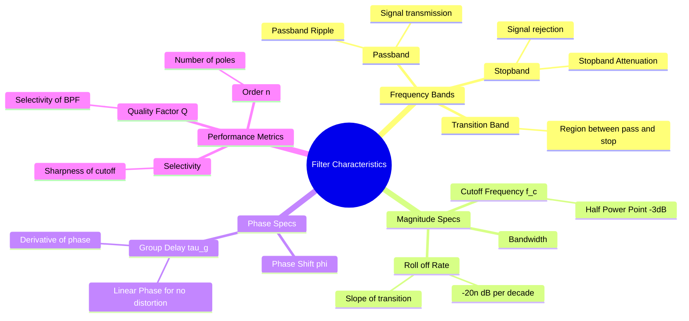

---
tags:
  - analog-electronics
  - filters
  - signals-and-systems
  - gate
  - frequency-domain
created: 2026-08-04T09:41:47
aliases:
  - Filter Parameters
  - Filter Specifications
  - Ideal vs Practical Filters
subject: "[[Analog & Digital Electronics]]"
parent:
  - Filters (Active and Passive)
modified: 2026-08-04T09:41:47
---
### Filter Characteristics
#filters #analog-electronics #frequency-response

> Filter characteristics define the performance metrics used to describe how a filter modifies the magnitude and phase of an input signal. Understanding these parameters is essential for designing filters that meet specific signal processing requirements (e.g., removing noise without distorting the signal).

---
#### Frequency Bands
#filters/bands

A practical filter response is divided into three distinct regions:

1.  **Passband:** The range of frequencies that are allowed to pass to the output with typically near-unity gain ($0 \text{ dB}$).
    *   **Passband Ripple:** In some approximations (like Chebyshev), the gain fluctuates slightly within the passband. In others (Butterworth), it is maximally flat.
2.  **Stopband:** The range of frequencies that are attenuated (rejected).
    *   **Stopband Attenuation:** The minimum amount of loss required in this band.
3.  **Transition Band:** The frequency range between the passband and the stopband. Ideally, this should be zero width (brick-wall), but practically, it has a finite slope.

---
#### Magnitude Response Parameters
#filters/magnitude

##### A. Cutoff Frequency ($\omega_c$ or $f_c$)
The frequency at which the output power drops to half of its maximum passband value.
*   Voltage Gain: $1/\sqrt{2} \approx 0.707$ of max gain.
*   Decibels: $-3 \text{ dB}$.

##### B. Roll-off Rate (Slope)
The rate at which the gain decreases in the transition band/stopband. It depends on the **Order ($n$)** of the filter (number of poles).
$$\boxed{\quad \text{Slope} = -20n \text{ dB/decade} = -6n \text{ dB/octave} \quad}$$
*   1st Order: -20 dB/dec.
*   2nd Order: -40 dB/dec.

##### C. Bandwidth (BW)
For Bandpass filters, the difference between the upper ($\omega_H$) and lower ($\omega_L$) cutoff frequencies.
$$\boxed{\quad BW = \omega_H - \omega_L \quad}$$

---
#### Phase Response and Delay
#filters/phase #group-delay

Filters modify the phase of the signal. The nature of this phase shift determines if the signal shape is preserved in the time domain.

##### A. Phase Shift ($\phi(\omega)$)
The angle by which the output sinusoid lags or leads the input.

##### B. Phase Delay ($\tau_p$)
The time delay experienced by a specific frequency component.
$$\tau_p(\omega) = - \frac{\phi(\omega)}{\omega}$$

##### C. Group Delay ($\tau_g$):
The time delay experienced by the **envelope** of a modulated signal (information). It is the negative derivative of the phase.
$$\boxed{\quad \tau_g(\omega) = - \frac{d\phi(\omega)}{d\omega} \quad}$$
*   **Linear Phase:** If $\phi(\omega) = -k\omega$ (linear), then $\tau_g = k$ (constant).
*   **Significance:** A constant group delay is required for **Distortionless Transmission**. If $\tau_g$ varies with frequency, signal dispersion occurs (pulse spreading).
*   **Bessel Filters** are designed to have maximally flat group delay (linear phase).

---
#### Quality Factor ($Q$) and Selectivity
#filters/quality-factor

Used primarily for Bandpass and Bandstop filters.
$$\boxed{\quad Q = \frac{\omega_0}{BW} = \frac{\text{Center Frequency}}{\text{Bandwidth}} \quad}$$
*   **Selectivity:** A measure of how sharply the filter distinguishes between the passband and stopband. High $Q$ implies high selectivity (narrow bandwidth, sharp peak).
*   **Damping Factor:** For a 2nd order system, $Q = \frac{1}{2\zeta}$.

---
#### Ideal vs. Practical Characteristics
#filters/ideal-vs-practical

| Characteristic | Ideal Filter (Brick-wall) | Practical Filter |
| :--- | :--- | :--- |
| **Passband Gain** | Constant (Flat) | May have ripple or gradual drop |
| **Transition Width** | Zero (Vertical drop) | Finite width (Gradual slope) |
| **Stopband Attenuation** | Infinite | Finite |
| **Phase Response** | Linear (Zero distortion) | Non-linear (Phase distortion) |
| **Realizability** | **Non-Causal** (Physically impossible) | Causal (Realizable) |

**Paley-Wiener Criterion:**
For a filter to be causal (realizable), the magnitude response $|H(j\omega)|$ cannot be zero over a finite band of frequencies. Thus, "infinite attenuation" is theoretically impossible in a real circuit; we can only approximate it.

---
### Related Concepts
#topic/related-concepts

> [[Butterworth Filter]] (Maximally flat magnitude)
> [[Chebyshev Filter]] (Steep roll-off, ripples in passband/stopband)

[[Bessel Filter]] (Linear Phase characteristics)
[[Distortionless Transmission]]
[[Bode Plots]]
[[Group Delay and Phase Delay]]
[[Paley-Wiener Criterion]]
